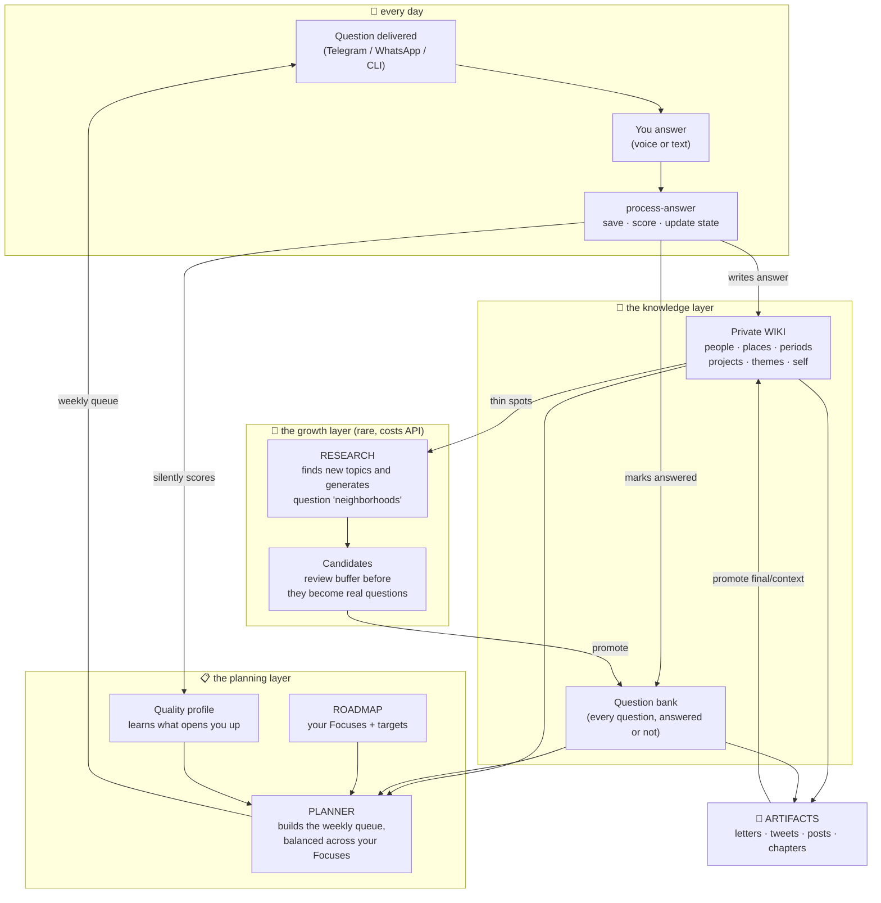
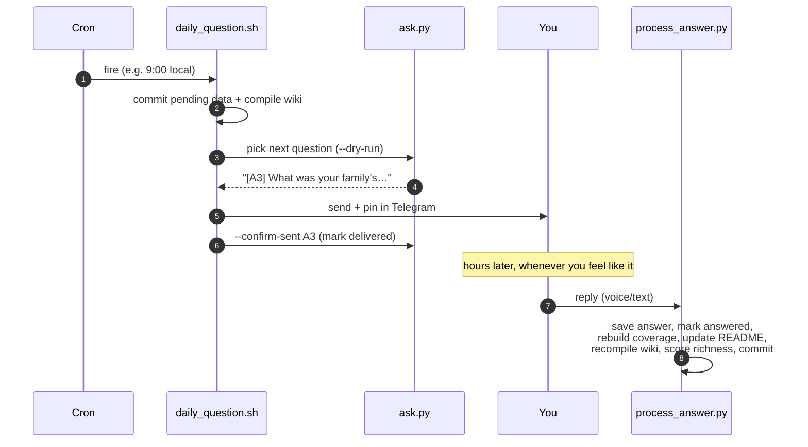
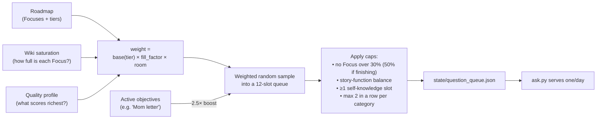
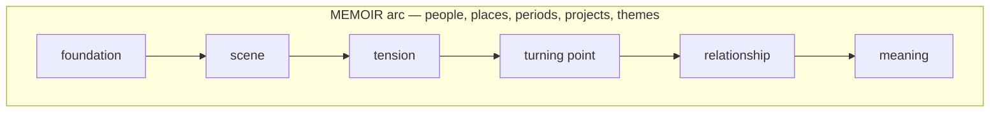
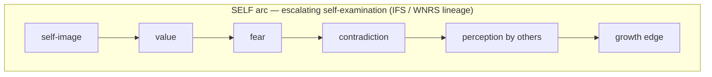
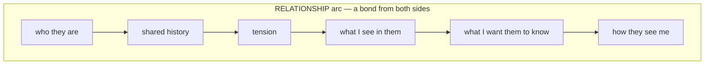
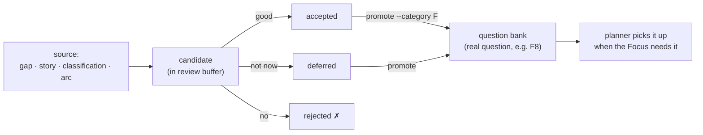
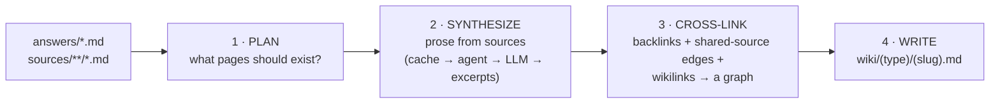
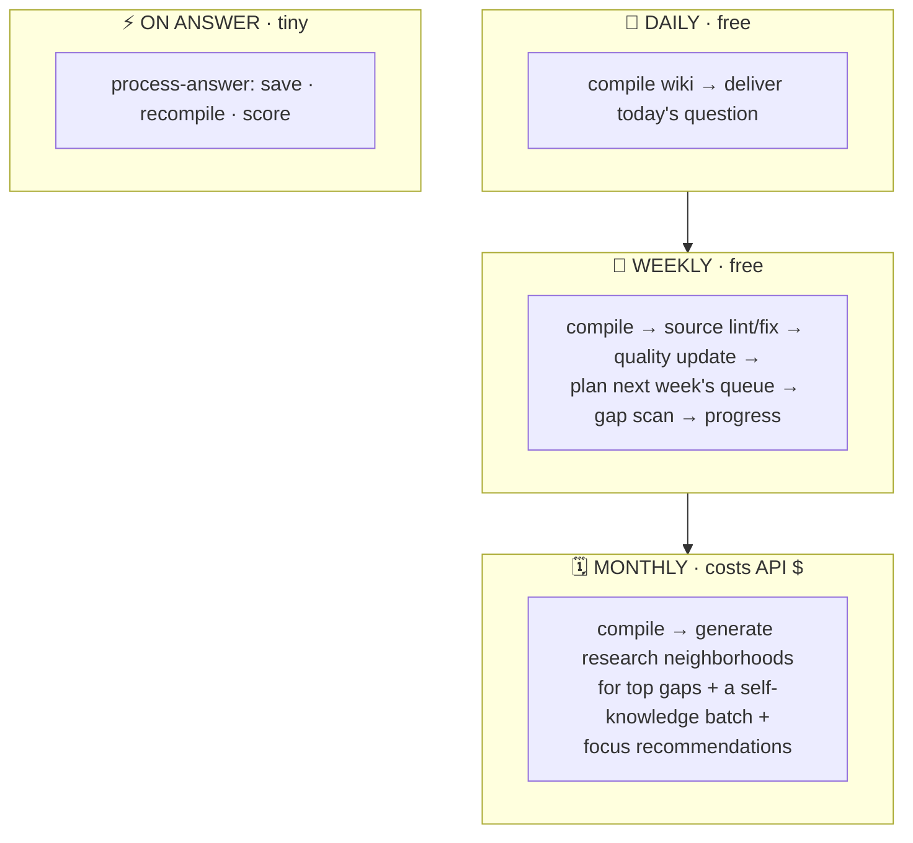

# Lifehug

**Capture, deepen, and connect your life story — one question a day.**

Lifehug is a lifelong AI oral-history system. It asks you one thoughtful question each day, takes your answer by voice or text, and keeps coming back with better follow-ups. Over time it compiles everything into a private, cross-linked **wiki of your life** — and uses that wiki to decide what to ask next. The result is a compounding loop that turns scattered memories into real artifacts: letters, essays, chapters, a memoir, a founder story.

You do one thing: **answer the question.** Every answer becomes a raw source record; everything below is what the system does around that.

---

## Contents

- [The big picture](#the-big-picture) — how the whole thing fits together
- [The daily loop](#the-daily-loop) — what happens every morning
- [Core concepts](#core-concepts) — Focus, Roadmap, Wiki, Neighborhood, Candidate, Artifact, Pass
- [How the planner decides what to ask](#how-the-planner-decides-what-to-ask)
- [Research & neighborhoods: finding new questions](#research--neighborhoods-finding-new-questions)
- [The private wiki](#the-private-wiki)
- [Outputs & artifacts](#outputs--artifacts)
- [The three clocks](#the-three-clocks-scheduling)
- [Every script, holistically](#every-script-holistically)
- [Getting started](#getting-started)
- [Key commands](#key-commands)
- [Repo layout](#repo-layout)
- [Updating](#updating) · [Methodology](#methodology)

---

## The big picture

Lifehug is a **compounding loop**, not a journal. Each answer feeds a private wiki; the wiki feeds a planner; the planner decides the next question; the question pulls out the next answer. The more you answer, the smarter the questions get.



**Read it as four layers:**

1. **Daily** — one question out, one answer in. The only part you touch.
2. **Knowledge** — every answer becomes a wiki page and marks a question done. The wiki is the relational database the rest of the system reads.
3. **Planning** — the planner reads the wiki + roadmap + a quality profile and writes a balanced weekly queue of what to ask.
4. **Growth** — occasionally (and only here does it cost API money), the system inspects the wiki for thin areas and *generates new questions* about people, themes, and periods you haven't covered.

---

## The daily loop

This is what the cron job does every morning. It's all free — no API key needed for the daily run.



No ratings, no streaks, no friction. **The answer itself is the only feedback the system needs** — its length, the people and places it names, the new wiki nodes it creates, the follow-ups it spawns. That gets scored silently and shapes next week's questions.

---

## Core concepts

| Concept | What it is | Where it lives |
|---|---|---|
| **Focus** | Anything you're building toward — a person, a book, a theme, your life's work. A Focus = an *objective* + a *tier* (how deep). | `state/roadmap.json` |
| **Tier** | How much depth a Focus needs: `basic` ≈ a blog post (~8 answers), `standard` ≈ an essay / a person (~20), `extreme` ≈ a book / life's work (~50+). | — |
| **Roadmap** | The full set of Focuses with targets and caps. *Derived* from the question bank — you never hand-edit it. | `state/roadmap.json` |
| **Question bank** | Every question ever created, answered or not, grouped by category (A–E generic, F–J projects, K+ people). Only grows. | `system/question-bank.md` |
| **Neighborhood** | A cluster of 6–12 questions around one topic, arranged on a narrative **arc**, aimed at a deliverable. How new questions are born. | `state/neighborhoods.json` |
| **Candidate** | A proposed question waiting in a review buffer. Becomes a real question only when *promoted* into the bank. | `state/question_candidates.json` |
| **Wiki** | The cross-linked, owner-only encyclopedia of your life, synthesized from your answers. | `wiki/` |
| **Artifact** | A produced letter, post, caption, tweet, or chapter. Drafts live in `outputs/`; approved finals/context can be promoted as sources. | `outputs/`, `sources/artifacts/` |
| **Pass** | A depth cycle over the whole story: skeleton → depth → connections → polish. Each pass deepens what the last one outlined. | `system/rotation.json` |

The key mental model: a **Focus** is the unit of intent. Everything — a person, a memoir, a recurring theme, a relationship, a place, a company story — is a Focus with a tier and an objective.

---

## How the planner decides what to ask

You almost never pick a question by hand. Once a week the **planner** (`question_planner.py`) writes a queue of ~12 questions, and `ask.py` serves one per day from it. If the queue expires or runs out, `ask.py` falls back to simple coverage-based rotation, so a missed week degrades gracefully.

The planner's job is **balance**: pour attention into under-developed Focuses, ease off ones that are nearly done, and never let a single Focus eat your whole week.



**The weight formula** — `weight = base(tier) × fill_factor × room`:

- **`base(tier)`** — bigger Focuses pull harder: `basic 0.8`, `standard 1.0`, `extreme 1.2`.
- **`fill_factor`** — how far a Focus is from its target depth (its *saturation*):
  - under 80% full → **1.0** (full pull)
  - 80–100% full → decays smoothly **1.0 → 0.3**
  - over 100% (target met) → **0.1** (maintenance — it never vanishes, so you can re-promote it later)
- **`room`** — 0 if there are no unanswered questions left in that Focus.

**The guardrails the sampler then enforces:**

- **Per-Focus cap** — no Focus takes more than **30%** of the week (raised to **50%** when you flag it `finishing` to push a deliverable to done).
- **Story-function balance** — questions are tagged by narrative role (foundation, scene, tension, turning point, relationship, meaning…) and each role is capped so a week doesn't become all backstory or all reflection.
- **Self-knowledge floor** — ~1 slot per week is reserved for vulnerable self-examination, even during project-heavy stretches.
- **Objective boost** — if you've set an active objective ("Prepare Mom's letter"), matching questions get a 2.5× weight.
- **Quality multiplier** — once you've answered ~20 questions, the silent quality profile kicks in: question types that historically pull richer answers out of *you* get nudged up. The system learns what opens you up.

The planner also tracks **global fullness**. Once your Focuses cross ~60% full, it raises an *expansion urgency* signal — a hint to the monthly research job that it's time to discover new territory.

---

## Research & neighborhoods: finding new questions

This is how Lifehug grows beyond its starting questions. It's the part that needs an AI model — so it runs rarely (monthly cron, or on demand), and only here does it cost API money.

### What's a neighborhood?

A **neighborhood** is a cluster of 6–12 questions about a single topic — a person, a place, a period, a theme, a project — laid out along a **narrative arc** and aimed at a specific deliverable (a letter, a chapter, an essay). The arc is the spine; the generated questions fill its slots.

Three arc templates, chosen by topic type:





### How new topics (nodes) get discovered

Three ways a neighborhood gets opened:

1. **Gap detection** — `research_expand.py --gaps` scans your answers for thin spots: life periods barely covered (under 30%), people mentioned 3+ times but with no wiki page, emotionally-charged themes with little material. It hands back a list of suggested neighborhoods to open.
2. **Story ingest** — when you share something *not* tied to the daily question (`ingest-story`), it's saved as raw source material and auto-seeds candidate questions to deepen it. External corpora (X, Gmail, Instagram, local files) can be pulled in the same way via `ingest.py` connectors, then classified by `classify_story.py` (which extracts people, places, themes, contradictions, and proposes questions).
3. **You ask for it** — `research_expand.py --topic "Faith" --type theme --output essay` opens a neighborhood directly.

In every case the script: loads your mission + relevant existing answers (so it won't repeat what you've already told it), builds an arc-aware prompt, calls the model, and deposits the generated questions as **candidates** — never directly as daily questions.

### The candidate lifecycle

Generated questions don't go live until you (or the AI on your behalf) promote them. This is the safety valve between raw idea and daily prompt.



Review with `candidates-review`, promote with `candidates-promote <id> --category F` (or bulk-promote a whole neighborhood). Promotion appends an unchecked question to the bank with a provenance comment, so every question can be traced back to where it came from.

### Where the AI comes from (keyless by default)

Generation tries, in order:

1. **Keyless desktop path** — Claude Code (or any `CLAUDE.md`-aware agent) reads an emitted prompt, writes the questions, and the script deposits them. No API key, no gateway. This is the normal desktop flow.
2. **OpenClaw gateway** — if running locally (`~/.openclaw/openclaw.json`), used keylessly. This is what cron uses.
3. **Anthropic SDK** — falls back to `ANTHROPIC_API_KEY` (or `anthropic_api_key` in `config.yaml`).

If none is available, Focuses and stories are still scaffolded — the script just tells you how to seed questions later.

---

## The private wiki

As you answer, `wiki_compile.py` synthesizes your raw answers into an owner-only, cross-linked encyclopedia. It's the relational database everything else reads — and it's rebuilt fresh every morning before the question goes out.



**The surfaces it builds:**

- **people/** — who they are, how they shaped you
- **relationships/** — the bond between you and each person, from both sides
- **places/** — homes, cities, schools, countries
- **periods/** — seasons of life, transitions, hardships
- **projects/** — companies, creative work, missions
- **themes/** — recurring threads (hunger, agency, faith, belonging)
- **self/** — your patterns, values, fears, contradictions

Every page cites the answers it's built from, and links to related pages — so the wiki is a navigable graph, not a flat list. Synthesis is cached and idempotent: re-compiling is cheap, and it runs **keyless on the desktop** (the agent writes each page's prose; the next compile folds it into the graph). Browse it locally with `python3 system/lifehug.py serve`.

### Source integrity

Lifehug treats `answers/` and `sources/` as the source-of-truth layer. The wiki, planner reports, question candidates, and outputs are derived from those sources.

That means the system does not fix a memory by rewriting history. If something was wrong, you add a correction. If your understanding changed, you add a reflection. Both become new source files that the wiki can compile alongside the original memory.

The repair loop is:

1. **Capture** — answer a question or ingest a story
2. **Compile** — rebuild the wiki from source files
3. **Lint** — detect missing metadata, changed source bodies, stale citations, and unresolved repairs
4. **Repair** — auto-fix safe metadata issues, or add correction/reflection sources
5. **Ask better questions** — turn contradictions, thin areas, and uncited sources into future prompts

This is how Lifehug keeps learning: it notices where the life model is weak, asks for what is missing, and preserves how your understanding evolves.

---

## Outputs & artifacts

At any milestone — Mother's Day, a birthday, an anniversary, or whenever you ask — create a real artifact from your accumulated answers: a letter, post, Instagram caption, tweet, or chapter. The artifact workflow creates a context pack, asks the AI/agent to write the piece, saves versioned drafts under `outputs/`, and can promote the final work back into `sources/artifacts/`.

```bash
python3 system/lifehug.py artifact new \
  --subject katie --occasion "anniversary" --format letter --date 2026-07-12

python3 system/lifehug.py artifact prompt outputs/2026-07-12-katie-anniversary-letter
# -> AI writes it -> save it:
printf '%s\n' "$content" | python3 system/lifehug.py artifact save \
  outputs/2026-07-12-katie-anniversary-letter --final

python3 system/lifehug.py artifact promote-source \
  outputs/2026-07-12-katie-anniversary-letter --kind all
```

Formats: `letter`, `tweet`, `instagram`, `chapter`, `post`. Each artifact lives in `outputs/<title>/` with a `context.md`, `artifact.json`, `meta.yaml`, and versioned drafts (`v1.md`, `v2.md`, ...).

Promotion is opt-in. A final artifact is authoritative as **your authored expression at that moment**. It is not treated as independent proof of every underlying event. The compiler reads artifact/context sources as supporting, attributed material so Lifehug can learn from what you produce without circularly turning generated text into primary evidence.

---

## The three clocks (scheduling)

Lifehug runs on three clocks plus per-answer events. The rule: **detect/report jobs are cheap and frequent; generate jobs cost API money and run rarely.** The wiki compiles *before* any planning or research, so everything reads a fresh graph.



The daily and weekly jobs need **no API key**. Only the monthly generation job does. See [`examples/openclaw-cron.md`](examples/openclaw-cron.md) for copy-paste cron commands (Telegram DM/group, WhatsApp, Signal, Discord) and a local dry-run you can try first:

```bash
LIFEHUG_DAILY_DRY_RUN=1 system/daily_question.sh   # see today's question without sending
LIFEHUG_WEEKLY_DRY_RUN=1 system/weekly_maintenance.sh # preview weekly maintenance
LIFEHUG_MONTHLY_DRY_RUN=1 system/monthly_research.sh # preview monthly growth
```

---

## Every script, holistically

Lifehug is **script-first**: the Python scripts *are* the system, and `lifehug.py` is a thin CLI over them. State lives in plain files (Markdown + JSON), never a database, so everything is greppable, diffable, and git-tracked.

### Orchestration & daily flow

| Script | What it does |
|---|---|
| **`lifehug.py`** | The CLI dispatcher (~40 subcommands). A thin router — it just shells out to the focused scripts below with the right working directory. This is the canonical interface; prefer it over calling scripts directly. |
| **`lifehug_core.py`** | Shared library. Parses the question bank, computes coverage, defines all file paths and the question-ID format, and does atomic JSON/text writes. Every other script imports it. |
| **`daily_question.sh`** | The cron entrypoint. Commits pending data, compiles the wiki, asks `ask.py` for today's question, sends + pins it on Telegram, then confirms it as delivered. Handles pass-completion prompts too. |
| **`weekly_maintenance.sh`** | The weekly self-improvement entrypoint. Compiles offline, lints source integrity, applies safe metadata/manifest fixes only when needed, updates the quality profile, builds the next queue, scans for gaps, reports progress, then commits real changes. |
| **`monthly_research.sh`** | The monthly growth entrypoint. Compiles with AI if available, detects thin areas, opens a small capped set of new research neighborhoods, refreshes self-knowledge candidates, recommends new Focuses, reports progress, then commits real changes. |
| **`ask.py`** | The question picker. Serves the next question from the weekly queue if one's valid; otherwise falls back to coverage rotation (lowest-coverage category first, with group alternation and focus interleaving). Also marks questions sent/answered and flags pass completion. |
| **`process_answer.py`** | The answer pipeline. Saves the answer to `answers/<id>.md`, marks the question done, rebuilds coverage, updates rotation, refreshes the README, recompiles the wiki, and silently scores the answer's richness. The one command that runs after every reply. |
| **`rebuild_state.py`** | Repair tool. Reconstructs derived state (rotation counts, README) from the source-of-truth files. Run it if state ever drifts. |

### Planning & roadmap

| Script | What it does |
|---|---|
| **`roadmap.py`** | Owns Focuses. *Derives* the roadmap from the question bank (categories → Focuses), infers tiers from size, computes live saturation per Focus, and exposes the `focus-*` management commands. The JSON is config, not source-of-truth, so renumbering questions never breaks it. |
| **`question_planner.py`** | The brain of question selection. Builds the weekly queue by Focus-weighted random sampling under caps (see [the planner section](#how-the-planner-decides-what-to-ask)). Also computes the expansion-urgency signal that tells the research job when to find new territory. |
| **`quality_profile.py`** | The feedback loop. Scores each answer's richness (length, entity diversity, wiki nodes added, follow-ups spawned) and, after ~20 answers, aggregates a profile that biases the planner toward question types that pull the deepest answers out of you. Zero friction — no ratings. |
| **`progress.py`** | The deliverables dashboard. For each Focus, shows fill-vs-target and a readiness verdict (EARLY → DEVELOPING → READY → SATURATED), and nudges you to compose when something's ready to draft. |

### Research & question generation

| Script | What it does |
|---|---|
| **`research_expand.py`** | The growth engine. Opens question **neighborhoods** along memoir/self/relationship arcs, detects coverage **gaps**, and generates new questions as **candidates** (keyless desktop → OpenClaw → Anthropic). The biggest script — see [research & neighborhoods](#research--neighborhoods-finding-new-questions). |
| **`question_candidates.py`** | The review buffer. Manages the candidate lifecycle (list / review / update / promote), quality-checks each candidate (flags yes/no wording, vagueness, duplicates), and promotes accepted ones into the bank with provenance. |
| **`gen_followups.py`** | The pass engine. At the end of a rotation pass it builds a prompt over the pass's answers, takes back AI-written follow-ups, appends them to the bank, and advances to the next, deeper pass. |
| **`ingest_story.py`** | Captures unprompted stories. Saves a story you share (that isn't an answer) as owner-only source material and seeds candidate questions to deepen it. |
| **`ingest.py`** | Bulk source import. Pluggable connectors (X/Twitter, Gmail, Instagram, local files) normalize external writing into source records + candidates. |
| **`classify_story.py`** | The source analyzer. AI-extracts people, places, periods, themes, contradictions, and possible outputs from any source file, and proposes targeted follow-up questions. |
| **`recommend_focuses.py`** | The pattern-watcher. Scores recurring people/places/periods/themes by how often and how emotionally they show up, and recommends which deserve their own Focus. |

### Wiki, outputs & maintenance

| Script | What it does |
|---|---|
| **`wiki_compile.py`** | The graph builder. Plan → synthesize → cross-link → write. Turns answers into cross-linked wiki pages with cached, idempotent synthesis and a keyless desktop path (`--emit-tasks`). See [the wiki](#the-private-wiki). |
| **`source_integrity.py`** | The source contract enforcer. Scans raw sources, maintains `state/source_manifest.json`, writes source lint findings, and creates additive correction/reflection source files instead of rewriting old memories. |
| **`serve_wiki.py`** | The local reader. A read-only HTTP server that renders the wiki as HTML and resolves `[[wikilinks]]` into real page navigation. No AI, no writes. |
| **`artifact.py`** | The artifact workflow. Creates occasion tasks, writes context packs, saves versioned outputs, marks finals, and promotes context/final versions into `sources/artifacts/` with provenance. |
| **`compose.py`** | The low-level output composer. Assembles a prompt (template + the right answers), then versions the AI's result under `outputs/`. `artifact.py` is the preferred milestone workflow. |
| **`update_readme.py`** | Keeps the README's coverage section and progress bullets in sync with current state. |
| **`update.py`** + **`version.json`** | The framework updater. Pulls tagged framework releases from upstream and applies them — **never touching your data** (answers, outputs, sources, config, question bank). Runs version migrations and protects locally-edited files. |

### Reference docs (not executable)

- **`research.md`** — the question-design methodology (StoryCorps, memoir frameworks, 36 Questions, WNRS, narrative therapy, IFS).
- **`mission.md`** — the author's mission, used to set the wiki's prose tone.

---

## Getting started

### With OpenClaw (recommended)

```bash
git clone https://github.com/lifehug/lifehug.git ~/Workspace/lifehug
cd ~/Workspace/lifehug && ./setup.sh
```

Then tell your AI: **"Set up Lifehug in ~/Workspace/lifehug."** It walks you through a short interview (what do you want to write? who matters? what episodes?), generates your question bank and Focuses, writes your personalized `README.md`, and configures daily delivery.

### With other AI tools

Clone, run `./setup.sh`, and open the repo with any AI that reads `CLAUDE.md` (Claude Code, Cursor, etc.). It guides you through the same setup. For schedulers without OpenClaw, it prints a crontab line:

```cron
0 9 * * * cd /path/to/lifehug && system/daily_question.sh
```

---

## Key commands

```bash
# Where things stand
python3 system/lifehug.py status        # coverage by category
python3 system/lifehug.py roadmap       # Focuses, tiers, saturation bars
python3 system/lifehug.py progress      # are we graduating toward deliverables?
python3 system/lifehug.py quality-stats # what kinds of questions open you up

# The daily cycle (usually run by cron)
python3 system/lifehug.py next                      # preview today's question
LIFEHUG_DAILY_DRY_RUN=1 system/daily_question.sh    # full dry run, nothing sent
LIFEHUG_WEEKLY_DRY_RUN=1 system/weekly_maintenance.sh # preview weekly loop
LIFEHUG_MONTHLY_DRY_RUN=1 system/monthly_research.sh # preview monthly growth

# Process an answer
printf '%s\n' "$ANSWER" | python3 system/lifehug.py process-answer A14 --source "voice (transcribed)"

# Capture an unprompted story
printf '%s\n' "$STORY" | python3 system/lifehug.py ingest-story --source telegram --title "memory"

# Plan & grow
python3 system/lifehug.py weekly-maintenance        # lint/fix, update profile, plan queue
python3 system/lifehug.py monthly-research          # open new neighborhoods + focuses
python3 system/lifehug.py planner-queue             # build next week's queue
python3 system/research_expand.py --gaps            # where is the story thin?
python3 system/research_expand.py --topic "Dad" --type relationship --output letter

# Questions
python3 system/lifehug.py candidates-review
python3 system/lifehug.py candidates-promote <id> --category A

# Focuses & wiki
python3 system/lifehug.py focus-new                 # guided: add a Focus
python3 system/lifehug.py compile                   # rebuild the wiki
python3 system/lifehug.py serve                     # browse it locally

# Source integrity
python3 system/lifehug.py source-scan
python3 system/lifehug.py source-lint
python3 system/lifehug.py source-lint --fix
python3 system/lifehug.py source-findings
printf '%s\n' "$CORRECTION" | python3 system/lifehug.py correct-source answers/A14.md --kind factual
printf '%s\n' "$REFLECTION" | python3 system/lifehug.py reflect-source answers/A14.md

# Full list
python3 system/lifehug.py --help
```

---

## Repo layout

```
lifehug/
├── answers/          # prompted answers; raw source-of-truth
├── sources/          # unprompted stories, imports, corrections, reflections, artifact sources
├── wiki/             # the compiled private wiki (people, places, themes, self…)
├── outputs/          # artifact tasks and drafts (letters, posts, chapters)
├── state/            # roadmap, weekly queue, candidates, quality profile, source manifest
├── system/           # all the scripts (the system is script-first)
├── templates/        # output format templates
├── skills/           # Claude Code skills (/focus, /compile, /artifact)
├── config.yaml       # your preferences (name, timezone, channel)
└── CLAUDE.md         # operating instructions for the AI
```

---

## Updating

```bash
python3 system/update.py --check
python3 system/update.py --apply
```

Updates only touch framework files. Your answers, source files, question bank, config, wiki, and outputs are never modified.

---

## Methodology

Lifehug draws on StoryCorps oral history, professional ghostwriting frameworks, We're Not Really Strangers, the 36 Questions, narrative therapy, and Internal Family Systems. The core insight: the best stories aren't told chronologically — they're organized around turning points and themes, and built in passes, from skeleton to polish. The full methodology lives in [`system/research.md`](system/research.md).

---

*Lifehug — because every life is a story worth telling.*
