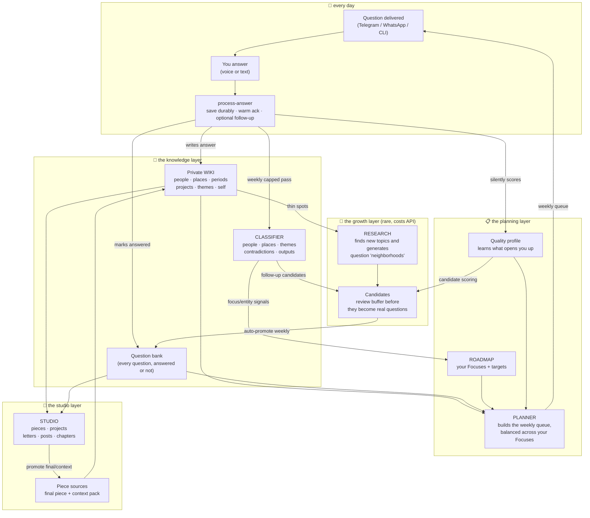
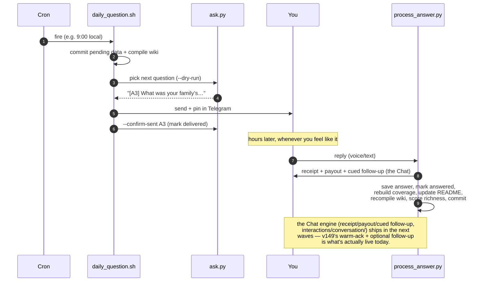
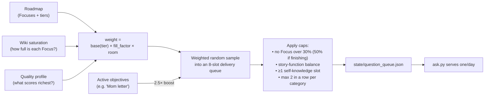
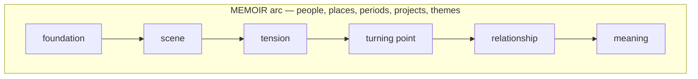
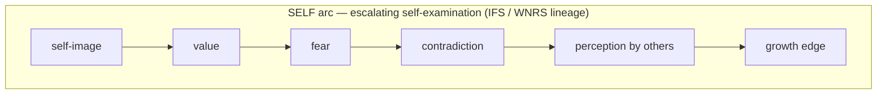
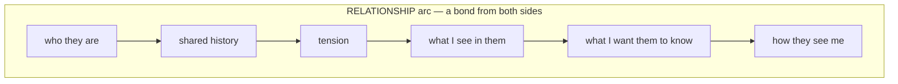
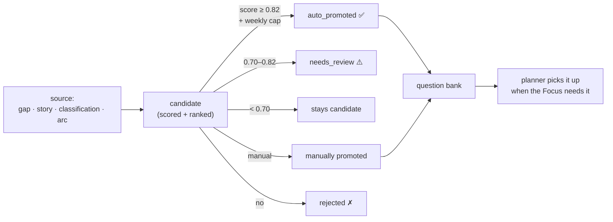
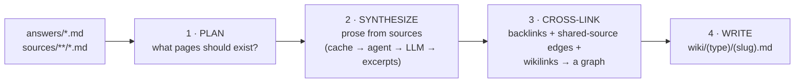
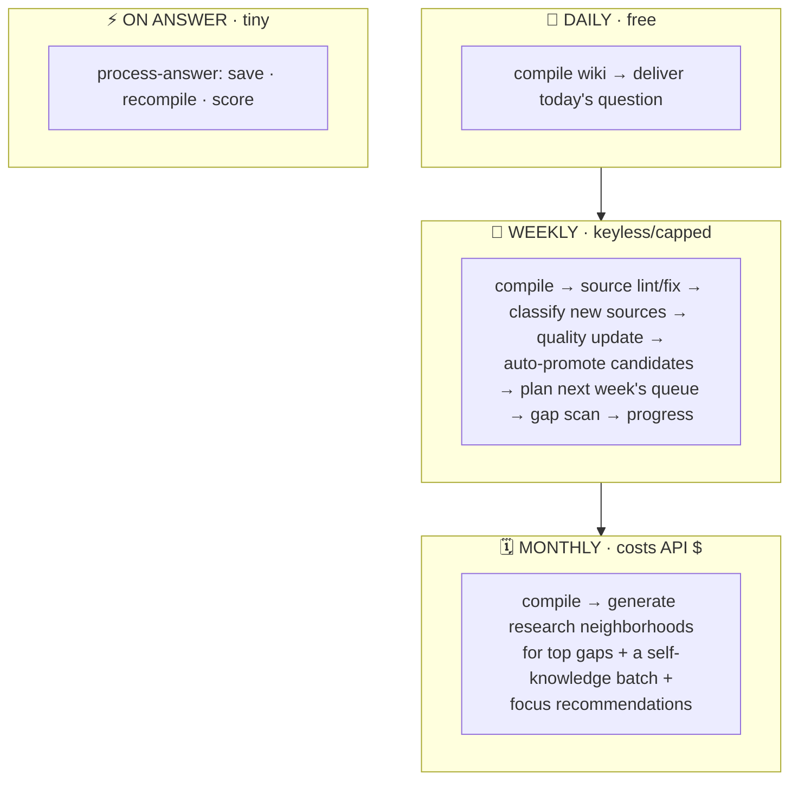

# Lifehug

**Capture your life, deepen it with AI, and turn it into pieces that matter.**

Lifehug is a lifelong AI oral-history system organized around **the Loop**: the self-improving flow where daily answers become durable sources, sources become a private wiki and structured signals, signals become better questions, and better questions deepen the life story. The Studio turns that accumulated memory into things you can actually use: letters, posts, chapters, speeches, and — assembled over time — a memoir or founder story; finished pieces can feed back into the same Loop as source material.

You usually do one thing: **answer the question.** When an occasion arrives, you do a second thing: **ask Lifehug to make a piece in the Studio.** Both become part of the same compounding memory system.

## Nomenclature

The wiki is a **graph of your life**, and these are the standard terms used throughout:

- **Node** — a graph vertex: a durable subject in your life that can be compiled into a wiki page. People, places, periods, objects, themes, projects, and *you* are nodes.
- **Node Type** — graph vocabulary for the kind of node, such as person, place, period, object, theme, project, or life. Most current `Entity Type` values are node types; `relationship` is the exception because it represents an edge page.
- **Entity** — the current product/code term for a node-worthy subject; usually one wiki page. Keep using Entity in code and product flows where the system already does.
- **Entity Type** — the current product/code and frontmatter term for a wiki page kind: `person`, `place`, `period`, `object`, `theme`, `project`, `relationship`, and `life` (you). Most entity types are node types; `relationship` remains the compatibility page type for an edge page.
- **Edge** — a meaningful connection between nodes/entities. An edge can carry evidence, tension, change over time, and artifact relevance.
- **Relationship Edge** — a human bond edge, usually between you and another person. The page in `wiki/relationships/` is an edge page: it answers what the bond is, not merely who the other person is.
- **Focus** — an entity you're deliberately building toward a deliverable (book, letter, …), with a tier and target. **You are the primary Focus** — your own life story is the biggest one and gets the largest share of questions; self-knowledge (values, fears, contradictions, growth) is a built-in dimension of it, not a separate track.
- **Project** — a Focus whose deliverable is a composite piece built up over time. Today that's the book: your categories become chapters. A project is virtual while you're planning it — readiness is computed live from the roadmap and answered material — and becomes a concrete, versioned piece once `book-assemble` stitches the latest chapter drafts together.
- **Piece** — a single versioned work in the Studio: a letter, tweet, essay, or chapter draft. Lives under `outputs/<slug>/` as `v1.md`, `v2.md`, ... revisions, with AI-assisted revise, mark-final, and promote-back-to-source. The code/CLI term is unchanged: **artifact** (`system/lifehug.py artifact ...`, `sources/artifacts/`).
- **Studio** — the single workspace for making pieces and projects: grouped by Focus, project cards expand into a chapter table, piece cards keep their version/revision history, and a create form starts new pieces.
- **Entity graduation / node graduation** — the wiki grows itself: entities mentioned across your answers are detected, **AI-curated** into a roster (`lifehug.py entity-roster --type <t>`), and graduated into node pages built from those mentions. Places and periods graduate on a low bar (a few mentions); **objects** graduate on AI-judged symbolic meaning (e.g. *The Cleats*), not frequency; people on score; **themes** via an AI-curated keyword roster (v97) — new themes like *Parenting* emerge from opinions, essays, and classifier extractions. Relationship edges use a dyadic path: Focus relationships can graduate from dedicated answers or enough cross-story mentions about the person. Rosters refresh monthly; compile graduates the current roster entries into pages — no manual work.
- **The Loop** — the canonical continuous-learning cycle: capture source → compile wiki → lint/repair source truth → classify/score signals → promote candidates and plan the queue → ask a better question → create artifacts → feed final artifacts back as source. When we ask whether a feature "works in the Loop," we mean this path.
- **In the Loop** — code, state, or docs reached by the daily, weekly, monthly, or artifact flows without a human manually stitching it together, and whose output can affect future questions, wiki pages, relationship understanding, or artifacts.
- **Loop-adjacent** — useful manual, dry-run, inspection, setup, or repair surfaces. They support the Loop but do not change future behavior until their output is promoted into a Loop surface.
- **Out of the Loop** — code or data that exists but is not called by scheduled/manual Loop entrypoints and is not read by downstream Loop state. Mission-critical work should not stay here; wire it in or document it as experimental.
- **Interaction** — a role definition for the AI in one situation: purpose, behavior contract, context recipe, scope, and evals, packaged as files any qualified model can execute. The definition lives in the framework (`interactions/<name>/`); each runtime loads it; a model is "seated" in it only after passing its eval harness. Out-of-scope input is politely deflected. First: the conversation interaction.
- **Chat** — the short exchange around the daily question: system-initiated, ~3 exchanges, arc-carded, graceful third-turn exit, closing takeaway.
- **Conversation** — a long user-initiated session (a story, "something on your mind", or a thread the system offered); runs the full interviewer arc; closes with a narrative takeaway.
- **Arc card** — the pre-planned skeleton for a chat/conversation: opening framing + 2–4 follow-up *intents* (not scripted text), planned by the loops, executed live per turn.
- **Session** — one bounded run: open → turns → close; the durable record is the session document.

---

## Contents

- [The big picture](#the-big-picture) — how the whole thing fits together
- [The daily loop](#the-daily-loop) — what happens every morning
- [Core concepts](#core-concepts) — Focus, Roadmap, Wiki, Neighborhood, Candidate, Piece, Project, Pass
- [How the planner decides what to ask](#how-the-planner-decides-what-to-ask)
- [Research & neighborhoods: finding new questions](#research--neighborhoods-finding-new-questions)
- [The private wiki](#the-private-wiki)
- [Studio: Projects & Pieces](#studio-projects--pieces)
- [The three clocks](#the-three-clocks-scheduling)
- [Every script, holistically](#every-script-holistically)
- [Getting started](#getting-started)
- [Framework and vault layouts](#framework-and-vault-layouts)
- [Key commands](#key-commands)
- [Repo layout](#repo-layout)
- [Updating](#updating) · [Methodology](#methodology)

---

## The big picture

Lifehug is a **compounding system**, not a journal. The Loop is the clutch: each answer feeds a private wiki and a classifier; the classifier turns raw stories into structured people, places, themes, contradictions, possible outputs, and follow-up candidates; the wiki, roadmap, quality profile, and planner decide the next question; the question pulls out the next answer. When you need something real — a Mother's Day letter, a birthday post, a chapter, a speech — the artifact workflow turns that memory into a finished piece, and the finished piece can feed back into the source layer.


```mermaid
flowchart TB
    subgraph daily["🌅 every day"]
        Q["Question delivered<br/>(Telegram / WhatsApp / CLI)"]
        A["You answer<br/>(voice or text)"]
        P["process-answer<br/>save durably · warm ack · optional follow-up"]
        Q --> A --> P
    end

    subgraph brain["🧠 the knowledge layer"]
        W["Private WIKI<br/>people · places · periods<br/>projects · themes · self"]
        CL["CLASSIFIER<br/>people · places · themes<br/>contradictions · outputs"]
        QB["Question bank<br/>(every question, answered or not)"]
    end

    subgraph think["📋 the planning layer"]
        PL["PLANNER<br/>builds the weekly queue,<br/>balanced across your Focuses"]
        RM["ROADMAP<br/>your Focuses + targets"]
        QP["Quality profile<br/>learns what opens you up"]
    end

    subgraph grow["🔬 the growth layer (rare, costs API)"]
        RE["RESEARCH<br/>finds new topics and generates<br/>question 'neighborhoods'"]
        CA["Candidates<br/>review buffer before<br/>they become real questions"]
    end

    subgraph make["🎨 the studio layer"]
        OUT["STUDIO<br/>pieces · projects<br/>letters · posts · chapters"]
        SRC["Piece sources<br/>final piece + context pack"]
    end

    P -->|writes answer| W
    P -->|weekly capped pass| CL
    P -->|marks answered| QB
    P -->|silently scores| QP
    CL -->|follow-up candidates| CA
    CL -->|focus/entity signals| RM
    W --> PL
    QB --> PL
    RM --> PL
    QP --> PL
    PL -->|weekly queue| Q
    W -->|thin spots| RE
    RE --> CA
    CA -->|auto-promote weekly| QB

    W --> OUT
    QB --> OUT
    OUT -->|promote final/context| SRC
    SRC --> W
    QP -->|candidate scoring| CA
```

**Read it as five layers:**

1. **Daily** — one question out, one answer in, then a warm acknowledgment before any optional follow-up. The only part you touch.
2. **Knowledge** — every answer becomes wiki input, a completed question, and, during the weekly capped classifier pass, a structured classification record: people, places, periods, themes, contradictions, possible outputs, and follow-up candidates.
3. **Planning** — the planner reads the wiki + roadmap + a quality profile and writes a balanced weekly delivery queue. It applies quality multipliers so question types that have historically pulled richer answers score higher.
4. **Growth** — classification runs in small weekly batches; broader research runs rarely. Together they inspect the wiki and source layer for thin areas, extract structured meaning, and *generate new questions* about people, themes, periods, and contradictions you haven't covered. The best candidates are automatically promoted into the bank each week under a dynamic cap; once promoted, bank questions stay available until answered or manually edited.
5. **Studio** — when there is an occasion or deliverable, Lifehug gathers the right context, helps write the piece, versions it, and can store the final piece back as source material.

---

## The daily loop

This is what the cron job does every morning. It's all free — no API key needed for the daily run.


```mermaid
sequenceDiagram
    autonumber
    participant Cron
    participant DQ as daily_question.sh
    participant Ask as ask.py
    participant You
    participant PA as process_answer.py

    Cron->>DQ: fire (e.g. 9:00 local)
    DQ->>DQ: commit pending data + compile wiki
    DQ->>Ask: pick next question (--dry-run)
    Ask-->>DQ: "[A3] What was your family's…"
    DQ->>You: send + pin in Telegram
    DQ->>Ask: --confirm-sent A3 (mark delivered)
    Note over You: hours later, whenever you feel like it
    You->>PA: reply (voice/text)
    PA->>You: receipt + payout + cued follow-up (the Chat)
    PA->>PA: save answer, mark answered,<br/>rebuild coverage, update README,<br/>recompile wiki, score richness, commit
    Note over PA,You: the Chat engine (receipt/payout/cued follow-up,<br/>interactions/conversation/) ships in the next<br/>waves — v149's warm-ack + optional follow-up<br/>is what's actually live today.
```

No ratings, no streaks, no friction. **The answer itself is the only feedback the system needs** — its length, the people and places it names, the new wiki nodes it creates, the follow-ups it spawns. That gets scored silently and shapes next week's questions.

---

## Core concepts

| Concept | What it is | Where it lives |
|---|---|---|
| **Focus** | Anything you're building toward — a person, a book, a theme, your life's work. A Focus = an *objective* + a *tier* (how deep). | `state/roadmap.json` |
| **Tier** | How much depth a Focus needs: `basic` ≈ a blog post (~8 answers), `standard` ≈ an essay / a person (~20), `extreme` ≈ a book / life's work (~50+). | — |
| **Roadmap** | The full set of Focuses with targets and caps. *Derived* from the question bank — you never hand-edit it. | `state/roadmap.json` |
| **Question bank** | Every question ever created, answered or not, grouped by category (A–E generic, F–J projects, K+ people). Only grows. | `system/question-bank.md` embedded; `question-bank.md` external |
| **Neighborhood** | A cluster of 6–12 questions around one topic, arranged on a narrative **arc**, aimed at a deliverable. It tracks generated, promoted, and answered readiness separately; only answered material makes it draft-ready. | `state/neighborhoods.json` |
| **Candidate** | A proposed question waiting in a review buffer. Becomes a real question only when *promoted* into the bank. | `state/question_candidates.json` |
| **Wiki** | The cross-linked, owner-only encyclopedia of your life, synthesized from your answers. | `wiki/` |
| **Piece** | The product payoff: a single versioned work — a produced letter, post, caption, tweet, chapter, speech, or other deliverable. Drafts live in `outputs/`; approved finals/context can be promoted as sources. Code/CLI term: **artifact**. | `outputs/`, `sources/artifacts/` |
| **Project** | A composite piece built over time — today, the book: a Focus with a book-class deliverable whose categories are chapters. Virtual while planning; becomes a concrete piece once assembled. | `state/roadmap.json`, `outputs/` |
| **Pass** | A depth cycle over the whole story: skeleton → depth → connections → polish. Each pass deepens what the last one outlined. | `system/rotation.json` embedded; `state/rotation.json` external |
| **Interaction** | A role definition for the AI in one situation: behavior contract, context recipe, scope, and evals, packaged as files any qualified model can execute. First: the conversation interaction (chats + conversations). | `interactions/` |

The key mental model: a **Focus** is the unit of intent. Everything — a person, a memoir, a recurring theme, a relationship, a place, a company story — is a Focus with a tier and an objective.

---

## How the planner decides what to ask

You almost never pick a question by hand. Once a week the **planner** (`question_planner.py`) writes a delivery queue of about 8 questions, matching the horizon before the queue expires, and `ask.py` serves one per day from it. If the queue expires or runs out, `ask.py` falls back to simple coverage-based rotation, so a missed week degrades gracefully.

The planner's job is **balance**: pour attention into under-developed Focuses, ease off ones that are nearly done, and never let a single Focus eat your whole week.


```mermaid
flowchart LR
    RM["Roadmap<br/>(Focuses + tiers)"] --> W
    WIKI["Wiki saturation<br/>(how full is each Focus?)"] --> W
    QP["Quality profile<br/>(what scores richest?)"] --> W
    W["weight =<br/>base(tier) × fill_factor × room"] --> SAMPLE
    OBJ["Active objectives<br/>(e.g. 'Mom letter')"] -->|2.5× boost| SAMPLE
    SAMPLE["Weighted random sample<br/>into an 8-slot delivery queue"] --> CAPS
    CAPS["Apply caps:<br/>• no Focus over 30% (50% if finishing)<br/>• story-function balance<br/>• ≥1 self-knowledge slot<br/>• max 2 in a row per category"] --> QUEUE["state/question_queue.json"]
    QUEUE --> ASK["ask.py serves one/day"]
```

**The weight formula** — `weight = base(tier) × fill_factor × room`:

- **`base(tier)`** — bigger Focuses pull harder: `basic 0.8`, `standard 1.0`, `extreme 1.2`.
- **`fill_factor`** — how far a Focus is from its target depth (its *saturation*):
  - under 80% full → **1.0** (full pull)
  - 80–100% full → decays smoothly **1.0 → 0.3**
  - over 100% (target met) → **0.1** (maintenance — it never vanishes, so you can re-promote it later)
- **`room`** — 0 if there are no unanswered questions left in that Focus.

**The guardrails the sampler then enforces:**

- **Per-Focus cap** — no Focus takes more than **30%** of the week (raised to **50%** when you flag it `finishing` to push a deliverable to done).
- **Story-function balance** — questions are tagged by narrative role (foundation, scene, tension, turning point, relationship, meaning…) and each role is capped so a week doesn't become all backstory or all reflection.
- **Self-knowledge floor** — ~1 slot per week is reserved for vulnerable self-examination, even during project-heavy stretches.
- **Objective boost** — if you've set an active objective ("Prepare Mom's letter"), matching questions get a 2.5× weight.
- **Quality multiplier** — once you've answered ~20 questions, the silent quality profile kicks in: question types that historically pull richer answers out of *you* get nudged up. The system learns what opens you up.

The planner also tracks **global fullness**. Once your Focuses cross ~60% full, it raises an *expansion urgency* signal — a hint to the monthly research job that it's time to discover new territory.

---

## Research & neighborhoods: finding new questions

This is how Lifehug grows beyond its starting questions. It's the part that needs an AI model — so it runs rarely (monthly cron, or on demand), and only here does it cost API money.

### What's a neighborhood?

A **neighborhood** is a cluster of 6–12 questions about a single topic — a person, a place, a period, a theme, a project — laid out along a **narrative arc** and aimed at a specific deliverable (a letter, a chapter, an essay). The arc is the spine; generated questions fill its slots, promoted questions enter the bank, and answered questions become the source material that can actually support an artifact.

Three arc templates, chosen by topic type:


```mermaid
flowchart LR
    subgraph memoir["MEMOIR arc — people, places, periods, projects, themes"]
        direction LR
        m1[foundation] --> m2[scene] --> m3[tension] --> m4[turning point] --> m5[relationship] --> m6[meaning]
    end
```

```mermaid
flowchart LR
    subgraph self["SELF arc — escalating self-examination (IFS / WNRS lineage)"]
        direction LR
        s1[self-image] --> s2[value] --> s3[fear] --> s4[contradiction] --> s5[perception by others] --> s6[growth edge]
    end
```

```mermaid
flowchart LR
    subgraph rel["RELATIONSHIP arc — a bond from both sides"]
        direction LR
        r1[who they are] --> r2[shared history] --> r3[tension] --> r4[what I see in them] --> r5[what I want them to know] --> r6[how they see me]
    end
```

### How new topics (nodes) get discovered

Three ways a neighborhood gets opened:

1. **Gap detection** — `research_expand.py --gaps` scans your answers for thin spots: life periods barely covered (under 30%), people mentioned 3+ times but with no wiki page, emotionally-charged themes with little material. It hands back a list of suggested neighborhoods to open.
2. **Story ingest** — when you share something *not* tied to the daily question (`ingest-story`), it's saved as raw source material and auto-seeds candidate questions to deepen it. External corpora (Gmail today; Drive, Instagram, X next) come in through the **connector framework** (`connectors/` — calibrated, threshold-driven ingestion; see *Connectors* below). The weekly classifier then works through unclassified sources in small batches, extracting people, places, themes, contradictions, possible outputs, and targeted follow-up questions.
3. **You ask for it** — `research_expand.py --topic "Faith" --type theme --output essay` opens a neighborhood directly.

In every case the script: loads your mission + relevant existing answers (so it won't repeat what you've already told it), builds an arc-aware prompt, calls the model, and deposits the generated questions as **candidates** — never directly as daily questions. The neighborhood can be **question-ready** before it is **answer-ready**; `progress` only calls it ready to draft after enough arc slots have captured answers.

### The candidate lifecycle

Generated questions don't go live until they pass an automated quality gate — or you promote them manually. This is the safety valve between raw idea and daily prompt. Neighborhood readiness follows the same lifecycle: `candidate → promoted question → answered source`.


```mermaid
flowchart LR
    SRC["source:<br/>gap · story · classification · arc"] --> C["candidate<br/>(scored + ranked)"] 
    C -->|"score ≥ 0.82\n+ weekly cap"| AUTO["auto_promoted ✅"]
    C -->|"0.70–0.82"| REV["needs_review ⚠️"]
    C -->|"< 0.70"| LOW["stays candidate"]
    C -->|manual| MAN["manually promoted"]
    C -->|no| REJ["rejected ✗"]
    AUTO --> BANK["question bank"]
    MAN --> BANK
    BANK --> PLAN["planner picks it up<br/>when the Focus needs it"]
```

Each week, `weekly_maintenance.sh` automatically promotes the highest-scoring candidates into the bank. The weekly cap is dynamic — it scales with how full the bank is (1 promotion when >120 unanswered, up to 4 when <40), so the bank self-regulates around a healthy level. Each promotion includes a full audit trail: candidate id, source, quality score, and `promoted_by: auto`. Weekly dry-run previews this promotion gate before the real job mutates the candidate store or question bank.

You can still review with `candidates-review`, inspect `needs_review` items, update candidate status with `candidates-update`, and promote manually with `candidates-promote <id> --category F`. Manual promotion always overrides automated decisions.

### Source classification: turning raw stories into structured insight

`classify_story.py` is the structured-understanding pass. It reads answer/source files and extracts:

- people, places, time periods, themes, projects
- contradictions and self-understanding insights
- possible outputs such as letters, chapters, essays, posts, or speeches
- Focus opportunities and candidate follow-up questions

Weekly maintenance classifies a capped number of unclassified sources (`LIFEHUG_WEEKLY_CLASSIFY_LIMIT`, default `5`) before candidate auto-promotion runs. The source file stays immutable; the derived record is written under `state/classifications/` using a repo-relative key, and any follow-up questions are added to the reviewable candidate store. That keeps the system improving without letting a large archive import dominate the week. You can also run it manually:

```bash
python3 system/lifehug.py classify-story --classify answers/A14.md
python3 system/lifehug.py classify-story --classify-all --unclassified --limit 5
```

### Where the AI comes from (keyless by default)

All model-backed surfaces — wiki compile, classification, research, entity
rosters, the Mirror, artifact revision, connector dossiers, and future web
acknowledgments — use one provider router. Run
`python3 system/lifehug.py ai-status` to see its provider, model, and
non-mutating readiness result.

Generation can use:

1. **Keyless desktop path** — any `CLAUDE.md`-aware agent reads an emitted prompt, writes the questions, and the script deposits them. No API key, no gateway. This remains the fallback when an unattended provider is not ready.
2. **Direct on-machine model** — set `ai_provider: local`,
   `local_ai_base_url`, `local_ai_model`, and `local_ai_timeout_seconds` in
   gitignored `config.yaml` for Ollama, LM Studio, llama.cpp, or equivalent.
   Loopback is enforced by default; every loopback transport (including
   OpenClaw) ignores proxy environment variables and refuses redirects. If the server is absent, Lifehug returns
   to keyless agent-task mode; it never spills the prompt to a cloud fallback.
3. **OpenClaw gateway** — selected automatically when locally configured, or deliberately with `ai_provider: openclaw`. Its fixed localhost destination and port are validated before any request.
4. **Kimi** — selected deliberately by a `kimi*`, `moonshot*`, or `k3*` model (or `ai_provider: kimi`) plus `KIMI_API_KEY`.
5. **Anthropic SDK** — selected by a configured key in backward-compatible auto mode, or deliberately with `ai_provider: anthropic`. The SDK is optional; if absent, status stays keyless without terminating the process.

If none is available, Focuses and stories are still scaffolded — the script just tells you how to seed questions later.
Provider configuration errors fail closed, chat and readiness bodies are size-bounded,
and operational failure records contain only bounded metadata — never prompts,
source bodies, response excerpts, URLs, or tokens.
AI-routing entries use the documented flat `key: value` syntax; malformed or
unknown routing keys are rejected instead of being ignored into automatic cloud routing.

---

## The private wiki

As you answer, `wiki_compile.py` synthesizes your raw answers into an owner-only, cross-linked encyclopedia. It's the relational database everything else reads — and it's rebuilt fresh every morning before the question goes out.


```mermaid
flowchart LR
    A["answers/*.md<br/>sources/**/*.md"] --> PLAN["1 · PLAN<br/>what pages should exist?"]
    PLAN --> SYN["2 · SYNTHESIZE<br/>prose from sources<br/>(cache → agent → LLM → excerpts)"]
    SYN --> XL["3 · CROSS-LINK<br/>backlinks + shared-source edges +<br/>wikilinks → a graph"]
    XL --> WRITE["4 · WRITE<br/>wiki/(type)/(slug).md"]
```

**The surfaces it builds:**

- **life/** — your own life story, the heart of the wiki: a self-portrait hub plus a page per arc (Origins → Reflection)
- **people/** — who they are, how they shaped you
- **relationships/** — the bond between you and each Focus person, from both sides; can compile from dedicated Focus answers or enough cross-story mentions
- **places/** — homes, cities, schools, countries
- **periods/** — seasons of life, transitions, hardships (listed in chronological order, earliest first)
- **projects/** — companies, creative work, missions
- **themes/** — recurring threads (hunger, agency, faith, belonging)
- **objects/** — objects that carry meaning (the cleats, the orange shorts)
- **self/** — your patterns, values, fears, contradictions

Most of these grow on their own through **entity graduation** — the system detects people, places, periods, and symbolic objects mentioned across your answers and builds a page for each, no setup required. Relationship pages grow through a relationship-specific path so the page can focus on the bond, tension, gratitude, grief, repair, and what went unsaid rather than merely duplicating a person page.

Every page cites the answers it's built from, and links to related pages — so the wiki is a navigable graph, not a flat list. Synthesis is cached and idempotent: re-compiling is cheap, and it runs **keyless on the desktop** (the agent writes each page's prose; the next compile folds it into the graph). Browse it locally with `python3 system/lifehug.py serve`. Source Integrity also opens each manifested answer or source as a read-only rendered body, with one-click links back to its integrity row and additive reflection/correction/retraction actions. Raw-body GETs stay loopback-only, never write, never cache, and fail closed on traversal, untracked files, directories, or any symlink.

### Source integrity

Lifehug treats `answers/` and `sources/` as the source-of-truth layer. The wiki, planner reports, question candidates, and artifact drafts are derived from those sources. Approved artifact finals can re-enter the source layer under `sources/artifacts/`.

That means the system does not fix a memory by rewriting history. If something was wrong, you add a correction. If your understanding changed, you add a reflection. Both become new source files that the wiki can compile alongside the original memory.

The source-integrity segment of the Loop is:

1. **Capture** — answer a question or ingest a story
2. **Compile** — rebuild the wiki from source files
3. **Lint** — detect missing metadata, changed source bodies, stale citations, and unresolved repairs
4. **Repair** — auto-fix safe metadata issues, or add correction/reflection sources
5. **Classify** — derive entities, themes, contradictions, possible outputs, Focus opportunities, and follow-up candidates from new source files
6. **Ask better questions** — promote the best candidates under weekly caps and turn contradictions, thin areas, and uncited sources into future prompts

This is how Lifehug keeps learning: it notices where the life model is weak, classifies new source material into structured meaning, asks for what is missing, and preserves how your understanding evolves.

### Connectors: calibrated external evidence ingestion

A **connector** pulls an external corpus (Gmail today; Drive, Instagram, Twitter next) into the source layer as a **selective evidence and discovery source** — never a bulk import, and never a per-item review queue. The owner calibrates the rules once; the machine applies them forever, across quarterly/yearly **excavations**.

The pattern, in five commitments:

- **The ledger is permanent; relevance is recomputed.** `connector-fetch` appends metadata-only lines (no bodies) to `state/connectors/<name>_ledger.jsonl`; `connector-excavate` re-scores the *entire* ledger against the *current* wiki, rosters, and sources on every run. Scores are never trusted beyond the run that computed them — a thread that is noise today crosses the threshold the day its correspondent gains a wiki page. Nothing is ever discarded from the ledger, so coverage is guaranteed by re-evaluation, not by getting scoring right once.
- **Threshold trust, signed off once.** Six deterministic axes (`date_anchor`, `relationship_signal`, `discovery_signal`, `narrative_density`, `novelty`, `reciprocity`) feed a weighted total. The owner calibrates weights and the promote threshold once against a shadow run (`connector-calibrate` → `state/reports/<name>_calibration.md`), versioned in `state/connectors/weights.json`. Bands: noise → evidence → near-band → promote.
- **Three products.** *Corroborate*: date evidence from institutional records (`state/connectors/<name>_date_evidence.json` — the utility-bill rule: content ignored, date+place kept) → timeline corroboration badges and `date_contradiction` candidates. *Discover*: unknown significant people, untold threads, and unknown institutions mined into `question_candidates.json` (provenance `connector-mined`) — weak signals, resolved in normal candidate review. *Source*: the rare above-threshold thread becomes an immutable `sources/<name>/` record (`source_trust: external_record`, `authority: third_party_record`) — corroborating record, never first-person memory.
- **AI dossiers auto-apply; the owner declares VIPs.** A dossier pass asks the model (any provider — `dossier_model` in config) to classify top unknown correspondents from small redacted samples; `family` verdicts act as VIPs automatically. Hand-declared `vip_correspondents` in `weights.json` always win, `vip_blocklist` vetoes, and roster entities may carry email addresses in `aliases` to bind people to exact addresses. Verdicts persist in `state/connectors/<name>_dossiers.json`; bodies cache (committed) so future passes re-read without re-fetching.
- **Bounded automation.** Per-run promotion cap (default 25), `--dry-run`, `connector-audit` listing, idempotency by item id, and the existing retraction flow as the escape hatch. Rare excavation by design — not a sync service.

**The Gmail connector (shipped, v106–v113).** OAuth desktop flow with `gmail.readonly` scope only (token gitignored at `state/connectors/gmail_token.json`; client secrets at `gmail_client_secrets.json`). `connector-auth` → `connector-fetch` (cursor-incremental headers) → `connector-calibrate` (owner picks the threshold) → `connector-excavate` (dossier + re-score + delta-promote + evidence + candidates). Artifacts: `gmail_ledger.jsonl`, `gmail_date_evidence.json`, `gmail_dossiers.json`, `gmail_body_cache/`, `weights.json`, and `sources/gmail/` promoted threads.

**Building a new connector.** Three pieces:

1. **`system/connectors/<name>.py`** subclassing `BaseConnector` — implement `fetch()` (API pages or an export file → normalized ledger entries: stable `message_id`, `thread_id`, `timestamp`, `date`, `from_email`/`from_name`, `to`, `subject`, `labels`, automation flags, `sent_by_owner`), plus `extract_date_evidence()` and `mine_discovery()`. For an Instagram export, a photo is an entry: the account is `from`, the caption is `subject`, the photo date is `timestamp` — a Takeout zip replaces the API in `fetch()`.
2. **Registration** — add the connector to `CONNECTORS` in `system/connector.py` and a thin wrapper in `system/lifehug.py`; all six `connector-*` commands then work for it.
3. **Tests** — fake the network client (never the real API) and pin: ledger dedupe, scoring determinism, the relevance-flip invariant, promotion idempotency.

Everything else comes free: six-axis scoring, threshold promotion with cap/`--dry-run`/idempotency, the calibration shadow report, discovery mining into candidates, dossier auto-VIPs, date evidence feeding timeline corroboration, and the re-excavation relevance-flip. Planned: Google Drive (API; file metadata as date/era evidence), Instagram/Twitter (export-file importers sharing the same machinery).

---

## Studio: Projects & Pieces

The Studio is the reason the system is more than a private archive — the place where memory turns into something useful outside it: a letter to your mom, an anniversary note, a birthday Instagram caption, a chapter draft, a speech, a post about your company, a piece your kids might read years later. It holds two kinds of work:

- **Pieces** — single versioned works: a letter, tweet, essay, post, or chapter draft.
- **Projects** — composite pieces built up over time. Today that's the book: a Focus with a book-class deliverable whose chapters are its categories. A project is virtual while you're planning it — readiness (chapter verdicts, computed live from the roadmap and answered material) tells you when it's worth drafting — and becomes a concrete, versioned piece once `book-assemble` stitches the latest chapter drafts into one. (Per-format slot readiness like "4 of 5 letter slots covered for Mom" is the same idea applied to single pieces.)

The Studio workflow does four things:

1. **Gathers context** — pulls relevant answers, wiki pages, prior pieces, and Focus material into a context pack.
2. **Creates the piece** — gives the AI/agent the right prompt and template for the format (its **format framework**, researched in `templates/<format>.json`).
3. **Versions the work** — saves drafts under `outputs/<artifact>/` so revision is part of the record.
4. **Learns from the result** — when you approve the final, Lifehug can promote both the final piece and its context pack into `sources/artifacts/`.

That last step matters. A Mother's Day letter is not just an export; it is evidence of what you chose to say, how you understood the relationship, and which memories mattered at that moment.

```bash
python3 system/lifehug.py artifact new \
  --subject katie --occasion "anniversary" --format letter --date 2026-07-12

python3 system/lifehug.py artifact prompt outputs/2026-07-12-katie-anniversary-letter
# -> AI writes it -> save it:
printf '%s\n' "$content" | python3 system/lifehug.py artifact save \
  outputs/2026-07-12-katie-anniversary-letter --final

python3 system/lifehug.py artifact promote-source \
  outputs/2026-07-12-katie-anniversary-letter --kind all
```

The CLI/code-level name for a piece is still **artifact** — the `artifact` command, `outputs/`, and `sources/artifacts/` are unchanged. Formats: `letter`, `tweet`, `instagram`, `chapter`, `post`, `essay`, `unsent_letter`, `legacy_letter`. Each piece lives in `outputs/<title>/` with a `context.md`, `artifact.json`, `meta.yaml`, and versioned drafts (`v1.md`, `v2.md`, ...).

**Opinions → essays (v95).** A stated position — a philosophical take, a lens on life — is its own lane: capture it with `ingest-story --kind opinion` (it gets Socratic follow-up candidates: origin, counterexample, evolution, dissent, stakes), then develop it with `artifact new --format essay --seed <opinion-source>`. The seed is the thesis, injected verbatim into the context pack; revise with `artifact save --feedback` until it's done, then promote. Every revision stays browsable: the Studio gives each piece a revision footer (numbered versions, ★ final, Δ word-level diffs), and subjectless essays group under **Thoughts**. The promoted essay becomes source material that influences the wiki — it never directly creates a page. From the phone, start the message with `opinion:`.

Promotion is opt-in. A final piece is authoritative as **your authored expression at that moment**. It is not treated as independent proof of every underlying event. The compiler reads piece/context sources as supporting, attributed material so Lifehug can learn from what you produce without circularly turning generated text into primary evidence.

The same workflow works from a desktop skill or from your phone. In Telegram/OpenClaw, start with `/artifact` or `artifact:` and the agent should gather missing details, run the same script path, draft the piece, and ask before promoting it as source material.

---

## The three clocks (scheduling)

Lifehug runs on three clocks plus per-answer events. The rule: **detect/report jobs are cheap and frequent; generate jobs cost API money and run rarely.** The wiki compiles *before* any planning or research, so everything reads a fresh graph.

All real local mutations meet at one restart-safe writer. Browser actions,
answer filing, artifact changes, compiles, and the daily/weekly/monthly scripts
enqueue typed jobs under `state/jobs/`; a kernel lock lets only one worker (or
one explicitly locked canonical CLI mutation) write the vault at a time. Job
records contain operational metadata only. Private inputs live in mode-0600
sidecars, successful sidecars are deleted, and failed/ambiguous sidecars are
retained until the owner runs `python3 system/jobs.py purge <job-id>`. A crash
without a completion receipt never blindly replays a possibly completed
non-idempotent action. macOS users can install the worker and schedules from
[`examples/launchd/`](examples/launchd/README.md); OpenClaw can keep using the
same canonical scripts. Queue administration is intentionally exposed through
`system/jobs.py` (`worker`, `show`, `retry`, `purge`, and `cleanup`); canonical
vault mutations remain commands of `system/lifehug.py`.

Embedded hosts that create disposable vault workspaces can set
`LIFEHUG_JOBS_NO_KICK=1`. In that mode, queued-and-waited mutations drain in
the foreground instead of spawning the detached fallback worker, so the command
returns only after Lifehug has stopped touching the checkout. Local companion
behavior stays unchanged when the variable is unset.


```mermaid
flowchart TB
    subgraph d["🌅 DAILY · free"]
        D1["compile wiki → deliver today's question"]
    end
    subgraph w["📅 WEEKLY · keyless/capped"]
        W1["compile → source lint/fix → classify new sources → quality update →<br/>auto-promote candidates → plan next week's queue → gap scan → progress"]
    end
    subgraph m["🗓️ MONTHLY · costs API $"]
        M1["compile → generate research neighborhoods<br/>for top gaps + a self-knowledge batch +<br/>focus recommendations"]
    end
    subgraph e["⚡ ON ANSWER · tiny"]
        E1["process-answer: save · recompile · score"]
    end
    d --> w --> m
```

The daily job needs **no model call**. Weekly maintenance is capped and can run unattended through a ready local model, OpenClaw, Kimi, or Anthropic; if none is ready, the rest of the weekly Loop segment still runs and emits agent tasks for its AI work. The optional Anthropic SDK is not required for keyless agent-task workflows. Monthly generation is the bigger model-backed growth pass. See [`examples/openclaw-cron.md`](examples/openclaw-cron.md) for copy-paste cron commands (Telegram DM/group, WhatsApp, Signal, Discord) and a local dry-run you can try first:

```bash
LIFEHUG_DAILY_DRY_RUN=1 system/daily_question.sh   # see today's question without sending
LIFEHUG_WEEKLY_DRY_RUN=1 system/weekly_maintenance.sh # preview weekly maintenance, including candidate promotion
LIFEHUG_MONTHLY_DRY_RUN=1 system/monthly_research.sh # preview monthly growth
```

---

## Every script, holistically

Lifehug is **script-first**: the Python scripts *are* the system, and `lifehug.py` is a thin CLI over them. State lives in plain files (Markdown + JSON), never a database, so everything is greppable, diffable, and git-tracked.

### Orchestration & daily flow

| Script | What it does |
|---|---|
| **`lifehug.py`** | The CLI dispatcher (~40 subcommands). A thin router — it just shells out to the focused scripts below with the right working directory. This is the canonical interface; prefer it over calling scripts directly. |
| **`lifehug_core.py`** | Shared library. Parses the question bank, computes coverage, defines all file paths and the question-ID format, and does atomic JSON/text writes. Every other script imports it. |
| **`jobs.py`** + **`job_execute.py`** | Durable metadata-only queue and single-writer worker. Typed payloads stay in private sidecars and cross the child boundary through stdin, never process argv. Explicit schedule/provider identities deduplicate; ordinary repeated actions create fresh jobs. |
| **`vault_paths.py`** | One authority for keeping installed framework assets separate from the active user vault (`--vault-root` → `LIFEHUG_VAULT_ROOT` → embedded layout), with process binding, no-follow file operations, deterministic tree preflight, and an exportable versioned contract. |
| **`daily_question.sh`** | The cron entrypoint. Commits pending data, compiles the wiki, asks `ask.py` for today's question, sends + pins it on Telegram, then confirms it as delivered. Handles pass-completion prompts too. |
| **`weekly_maintenance.sh`** | The weekly self-improvement entrypoint. Compiles offline, lints source integrity, applies safe metadata/manifest fixes only when needed, classifies a capped batch of unclassified sources, updates the quality profile, **auto-promotes the highest-scoring candidates into the bank** (dynamic cap based on bank fullness), builds the next queue, scans for gaps, reports progress, then commits and sends a Telegram summary. Dry-run previews the same candidate promotion gate without writing. |
| **`monthly_research.sh`** | The monthly growth entrypoint. Compiles with AI if available, detects thin areas, opens a small capped set of new research neighborhoods, refreshes self-knowledge candidates, recommends new Focuses, refreshes entity rosters, reports progress, then commits real changes. |
| **`ask.py`** | The question picker. Serves the next question from the weekly queue if one's valid; otherwise falls back to coverage rotation (lowest-coverage category first, with group alternation and focus interleaving). Also marks questions sent/answered and flags pass completion. |
| **`process_answer.py`** | The answer pipeline. Saves the answer to `answers/<id>.md`, marks the question done, rebuilds coverage, updates rotation, refreshes the README, recompiles the wiki, silently scores richness, then best-effort sends a warm Telegram acknowledgment before any adaptive follow-up. A repeated identical answer is an idempotent no-op; a different later answer appends as a dated/provenanced addendum so the source gains depth without overwriting the first telling. The one command that runs after every reply. |
| **`rebuild_state.py`** | Repair tool. Reconstructs derived state (rotation counts, README) from the source-of-truth files. Run it if state ever drifts. |

### Planning & roadmap

| Script | What it does |
|---|---|
| **`roadmap.py`** | Owns Focuses. *Derives* the roadmap from the question bank (categories → Focuses), infers tiers from size, computes live saturation per Focus, and exposes the `focus-*` management commands. The JSON is config, not source-of-truth, so renumbering questions never breaks it. |
| **`question_planner.py`** | The brain of question selection. Builds the weekly delivery queue by Focus-weighted random sampling under caps (see [the planner section](#how-the-planner-decides-what-to-ask)). Applies quality-profile multipliers so question types that historically pull richer answers score higher. Also computes the expansion-urgency signal that tells the research job when to find new territory. |
| **`quality_profile.py`** | The feedback loop. Scores each answer's richness (length, entity diversity, wiki nodes added, follow-ups spawned) and, after ~20 answers, aggregates a profile that biases the planner toward question types that pull the deepest answers out of you. Zero friction — no ratings. Also feeds the candidate auto-promotion scorer: candidates matching your richest-answer story functions score higher and promote sooner. |
| **`progress.py`** | The deliverables dashboard. For each Focus, shows fill-vs-target and a readiness verdict (EARLY → DEVELOPING → READY → SATURATED), and nudges you to create an artifact when something is ready. |

### Research & question generation

| Script | What it does |
|---|---|
| **`ai_provider.py`** | The single privacy-aware provider/router shared by every model-backed surface. Supports fail-closed on-machine OpenAI-compatible models plus deliberate OpenClaw, Kimi, Anthropic, and keyless agent-task routes. |
| **`research_expand.py`** | The growth engine. Opens question **neighborhoods** along memoir/self/relationship arcs, detects coverage **gaps**, and generates new questions as **candidates** through the shared provider. The biggest script — see [research & neighborhoods](#research--neighborhoods-finding-new-questions). |
| **`question_candidates.py`** | The review buffer. Manages the candidate lifecycle (list / review / update / promote), quality-checks each candidate (flags yes/no wording, vagueness, duplicates), and promotes accepted ones into the bank with provenance. |
| **`gen_followups.py`** | The pass engine. At the end of a rotation pass it builds a prompt over the pass's answers, takes back AI-written follow-ups, appends them to the bank, and advances to the next, deeper pass. |
| **`ingest_story.py`** | Captures unprompted stories. Saves a story you share (that isn't an answer) as owner-only source material and seeds candidate questions to deepen it. |
| **`ingest.py`** | Bulk source import. Pluggable connectors (X/Twitter, Gmail, Instagram, local files) normalize external writing into source records + candidates. |
| **`connector.py`** + **`connectors/`** | Calibrated external-evidence ingestion (Gmail first). Permanent metadata ledger + six-axis scoring + threshold promotion: `connector-fetch` appends new metadata; `connector-excavate` re-scores the whole ledger against the current wiki and delta-promotes above-threshold threads into immutable `sources/gmail/` records; `connector-calibrate` is the one-time shadow run where the owner picks the threshold; `connector-dossier` classifies top unknown correspondents with AI (family auto-applies as VIPs). Bodies are fetched only for promotions/dossier samples and cached (committed) so nothing re-fetches. |
| **`classify_story.py`** | The source analyzer. Uses the shared provider to AI-extract people, places, periods, themes, contradictions, possible outputs, self-understanding insights, Focus opportunities, and targeted follow-up questions from any answer/source file. Weekly maintenance runs it over a capped batch of unclassified files. |
| **`recommend_focuses.py`** | The pattern-watcher. Scores recurring people/places/periods/themes by how often and how emotionally they show up, and recommends which deserve their own Focus. |

### Wiki, Studio & maintenance

| Script | What it does |
|---|---|
| **`wiki_compile.py`** | The graph builder. Plan → synthesize → cross-link → write. Turns answers into cross-linked wiki pages with cached, idempotent synthesis and a keyless desktop path (`--emit-tasks`). See [the wiki](#the-private-wiki). |
| **`source_integrity.py`** | The source contract enforcer. Scans raw sources, maintains `state/source_manifest.json`, writes source lint findings, and creates additive correction/reflection source files instead of rewriting old memories. |
| **`serve_wiki.py`** | The local viewer and studio. An owner-only HTTP server (`python3 system/serve_wiki.py`, http://127.0.0.1:8765) that renders the wiki as HTML and resolves `[[wikilinks]]` into real page navigation. It binds only to loopback, rejects non-loopback peers, and sends private no-store response headers; it is not a hosted/private-web deployment mechanism. The home page is an **action hub** (v99): up to five calm invitation cards, in priority order — a chapter ready to draft, one classifier-noticed tension or insight to sit with, the week's next question, review counts, a perennial due, a second-voice offer, and (lowest priority, v133) a framework update available when the vault is behind — plus the standing resurfaced-old-answer slot, always last — over a small stats strip. Invitations, never guilt metrics: maintenance never displaces a content card or the memory slot. The header's hamburger menu groups the dashboard views into **Do** (Queue, Review, Studio), **Reflect** (Mirror, Timeline, Graph), **Library** (Foundation, Sources, Privacy), and **System** (The Loop, Reports); the compiled wiki stays in the left sidebar with the index one click away. **The Loop** view (v135) also shows installed/latest framework version, releases behind, the update command, any tag-lapse diagnostic, and a "what changed" line for the most recent update — all read from `update.py`'s cache, never a live git call. **Review** is where the system's own growth waits for your eye: question candidates (auto-promoted past a quality bar, the rest held for you), focus ideas (never created without you), and entities about to graduate into wiki pages. Source Integrity opens exact manifested `answers/` and `sources/` Markdown records as rendered, read-only bodies through a loopback-only, no-store, no-follow reader, linked bidirectionally to the existing source actions (v120). Write actions require a session token plus exact loopback Host/Origin checks and return immediately after durable enqueue; the status pill converges through queued/running/succeeded/failed metadata without exposing private payloads. |
| **`artifact.py`** | The artifact workflow. Creates occasion tasks, writes context packs, saves versioned outputs, marks finals, and promotes context/final versions into `sources/artifacts/` with provenance. |
| **`compose.py`** | The low-level output composer. Assembles a prompt (template + the right answers), then versions the AI's result under `outputs/`. `artifact.py` is the preferred milestone workflow. |
| **`update_readme.py`** | Keeps the README's coverage section and progress bullets in sync with current state. |
| **`update.py`** + **`version.json`** | The framework updater. Pulls tagged framework releases from upstream and applies them — **never touching your data** (answers, outputs, sources, config, question bank). Runs version migrations and protects locally-edited files. `--check` compares tags AND origin/main's `version.json` (a lapsed tag flow is diagnosed, not hidden) and caches its result for the viewer; `--apply` caches the changelogs it crosses for the Loop view's "what changed" line. |

### Reference docs (not executable)

- **`research.md`** — the question-design methodology (StoryCorps, memoir frameworks, 36 Questions, WNRS, narrative therapy, IFS).
- **`mission.md`** — the author's mission, used to set the wiki's prose tone.

---

## Getting started

### With OpenClaw (recommended)

```bash
git clone https://github.com/lifehug/lifehug.git ~/Workspace/lifehug
cd ~/Workspace/lifehug && ./setup.sh
```

Then tell your AI: **"Set up Lifehug in ~/Workspace/lifehug."** It walks you through a short interview (what do you want to write? who matters? what episodes?), generates your question bank and Focuses, writes your personalized `README.md`, and configures daily delivery.

### With other AI tools

Clone, run `./setup.sh`, and open the repo with any AI that reads `CLAUDE.md` (Claude Code, Cursor, etc.). It guides you through the same setup. For schedulers without OpenClaw, it prints a crontab line:

```cron
0 9 * * * cd /path/to/lifehug && system/daily_question.sh
```

### Framework and vault layouts

The normal clone remains the zero-configuration **embedded layout**: executable framework files and private vault data share one checkout. Existing commands and paths remain unchanged.

```text
lifehug/
├── system/                 # framework code + embedded question/rotation/coverage files
├── templates/              # framework assets
├── answers/ sources/ wiki/ outputs/
└── state/                  # durable vault state
```

An installed framework can instead operate on a separate **data-only vault**. The vault must not contain `system/` or framework templates. Its minimum shape is the versioned contract in [`system/vault_contract.json`](system/vault_contract.json):

```text
my-private-vault/
├── question-bank.md
└── state/
    ├── rotation.json       # schema version 1
    └── coverage.json       # schema version 1
```

Optional `answers/`, `sources/`, `wiki/`, `outputs/`, profile/config files, and additional `state/` records are created or read under that vault as their workflows require. Code, templates, mission text, and connector implementations always stay in the framework install.

Select the vault for one command with the global flag (before or after the
subcommand), or for a process/scheduler with the environment variable:

```bash
python3 /opt/lifehug/system/lifehug.py --vault-root ~/Documents/my-private-vault status
python3 /opt/lifehug/system/lifehug.py status --vault-root ~/Documents/my-private-vault
LIFEHUG_VAULT_ROOT=~/Documents/my-private-vault \
  python3 /opt/lifehug/system/lifehug.py compile --no-ai
```

Resolution is explicit `--vault-root`, then `LIFEHUG_VAULT_ROOT`, then the
embedded framework checkout. Selection is process-scoped; start a new CLI
invocation to switch vaults. Runtime reads and writes walk from a pinned vault
directory without following symlinks, and reject a root, parent, or destination
that changes during the operation. Missing minimum files, unsupported state
schemas, a vault containing `system/`, symlinks, or other special files fail
before mutation. `state/hosted.json` has no stand-down meaning in the open-source
runtime.

This applies equally to a durable path assembled from the selected vault root
at runtime (for example, a user-selected source path): those descendants retain
the same no-follow authority after process binding rather than falling back to
ordinary `pathlib` I/O.

Integrations should consume the normalized contract rather than infer paths:

```bash
python3 /opt/lifehug/system/vault_paths.py contract
python3 /opt/lifehug/system/vault_paths.py walk --vault-root ~/Documents/my-private-vault
python3 /opt/lifehug/system/vault_paths.py classify state/rotation.json --authority vault
```

The `contract` output has a stable identity digest, explicit embedded/external
data mappings, framework classifications, required shape, JSON validation
policy, and special-file policy. It never includes a machine-local absolute
path.

---

## Key commands

```bash
# Where things stand
python3 system/lifehug.py status        # coverage by category
python3 system/lifehug.py roadmap       # Focuses, tiers, saturation bars
python3 system/lifehug.py progress      # are we graduating toward deliverables?
python3 system/lifehug.py quality-stats # what kinds of questions open you up

# The daily cycle (usually run by cron)
python3 system/lifehug.py next                      # preview today's question
LIFEHUG_DAILY_DRY_RUN=1 system/daily_question.sh    # full dry run, nothing sent
LIFEHUG_WEEKLY_DRY_RUN=1 system/weekly_maintenance.sh # preview weekly Loop segment
LIFEHUG_MONTHLY_DRY_RUN=1 system/monthly_research.sh # preview monthly growth

# Process an answer
printf '%s\n' "$ANSWER" | python3 system/lifehug.py process-answer A14 --source "voice (transcribed)"

# Capture an unprompted story
printf '%s\n' "$STORY" | python3 system/lifehug.py ingest-story --source telegram --title "memory"

# Plan & grow
python3 system/lifehug.py weekly-maintenance        # lint/fix, classify, update profile, plan queue
python3 system/lifehug.py monthly-research          # open new neighborhoods + focuses
python3 system/lifehug.py classify-story --classify-all --unclassified --limit 5
python3 system/lifehug.py planner-queue             # build next week's queue
python3 system/research_expand.py --gaps            # where is the story thin?
python3 system/research_expand.py --topic "Dad" --type relationship --output letter

# Questions
python3 system/lifehug.py candidates-review
python3 system/lifehug.py candidates-promote <id> --category A

# Studio (pieces & projects)
python3 system/lifehug.py artifact new --subject Mom --occasion "Mother's Day" --format letter
python3 system/lifehug.py artifact prompt outputs/<artifact>
printf '%s\n' "$CONTENT" | python3 system/lifehug.py artifact save outputs/<artifact> --final
python3 system/lifehug.py artifact promote-source outputs/<artifact> --kind all

# Focuses & wiki
python3 system/lifehug.py focus-new                 # guided: add a Focus
python3 system/lifehug.py compile                   # rebuild the wiki
python3 system/lifehug.py serve                     # browse it locally

# Source integrity
python3 system/lifehug.py source-scan
python3 system/lifehug.py source-lint
python3 system/lifehug.py source-lint --fix
python3 system/lifehug.py source-findings
python3 system/lifehug.py source-filenames-repair --dry-run  # legacy correction/retraction names
printf '%s\n' "$CORRECTION" | python3 system/lifehug.py correct-source answers/A14.md --kind factual
printf '%s\n' "$REFLECTION" | python3 system/lifehug.py reflect-source answers/A14.md

# Connectors (rare excavation — quarterly/yearly)
python3 system/lifehug.py connector-excavate gmail --dry-run   # preview promotions, write nothing
python3 system/lifehug.py connector-excavate gmail             # re-score whole ledger, delta-promote
python3 system/lifehug.py connector-report gmail               # ledger summary
python3 system/lifehug.py connector-audit gmail                # what got auto-promoted, with scores
python3 system/lifehug.py connector-calibrate gmail            # shadow run: pick the threshold once

# Full list
python3 system/lifehug.py --help
```

---

## Repo layout

The tree below is the embedded layout. See [Framework and vault layouts](#framework-and-vault-layouts) for a separate data-only vault.

```
lifehug/
├── answers/          # prompted answers; raw source-of-truth
├── sources/          # unprompted stories, imports, corrections, reflections, artifact sources
├── wiki/             # the compiled private wiki (people, places, themes, self…)
├── outputs/          # artifact tasks and drafts (letters, posts, chapters)
├── state/            # roadmap, weekly queue, candidates, classifications, quality profile, source manifest
├── system/           # all the scripts (the system is script-first)
├── templates/        # output format templates
├── skills/           # Claude Code skills (/focus, /compile, /artifact)
├── config.yaml       # your preferences (name, timezone, channel)
└── CLAUDE.md         # operating instructions for the AI
```

---

## Updating

```bash
python3 system/update.py --check
python3 system/update.py --apply
```

Updates only touch framework files. Your answers, source files, question bank, config, wiki, and outputs are never modified.

---

## Methodology

Lifehug draws on StoryCorps oral history, professional ghostwriting frameworks, We're Not Really Strangers, the 36 Questions, narrative therapy, and Internal Family Systems. The core insight: the best stories aren't told chronologically — they're organized around turning points and themes, and built in passes, from skeleton to polish. The full methodology lives in [`system/research.md`](system/research.md).

---

*Lifehug — because every life is a story worth telling.*


## Hosted platform

Lifehug Cloud — the hosted, multi-user platform built on this framework — lives at [lifehug/lifehug-platform](https://github.com/lifehug/lifehug-platform). Its delivery method (contracts-first, tiered agent waves, evidence-embedded PRs, owner closeouts) is documented in its [docs/BUILDING.md](https://github.com/lifehug/lifehug-platform/blob/main/docs/BUILDING.md); this repo follows a right-sized adaptation of the same method — see [docs/BUILDING.md](https://github.com/lifehug/lifehug/blob/main/docs/BUILDING.md) here.

The local wiki viewer in this repo is deliberately not that hosted surface. It is an owner-only loopback tool for a checked-out vault; future audience builds must be separate reviewed exports or platform-hosted experiences with real access control.
