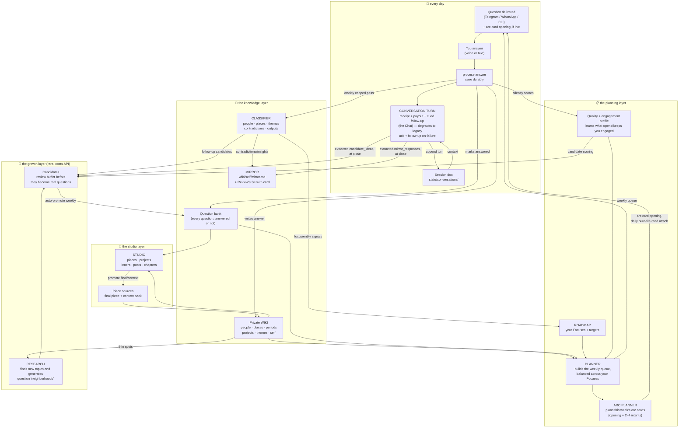
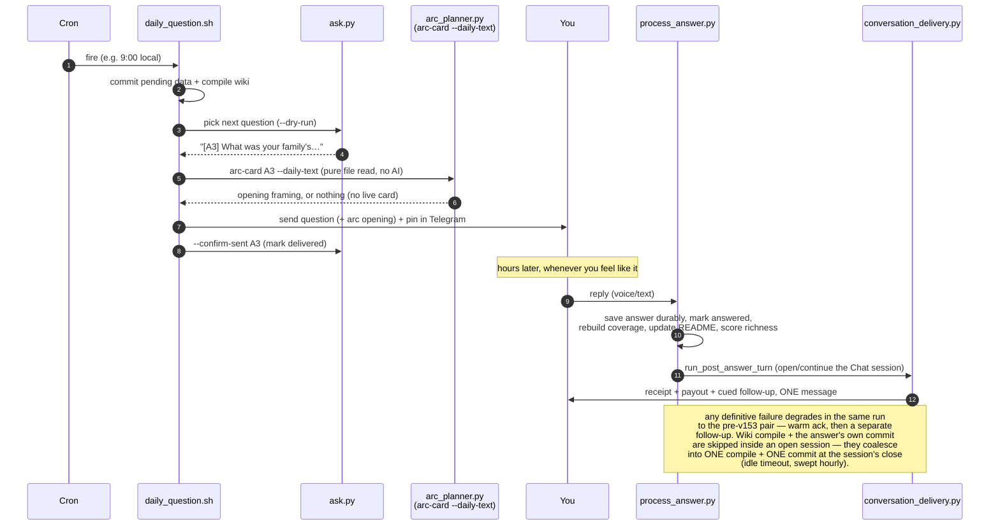
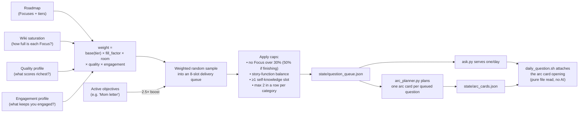
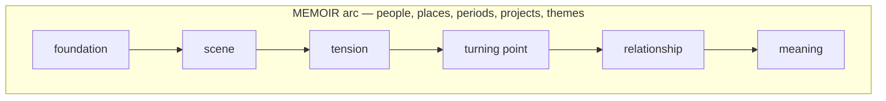
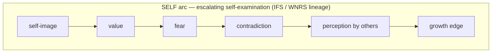
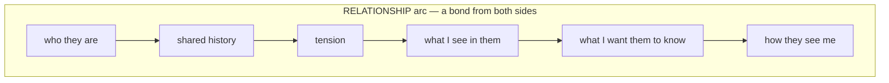
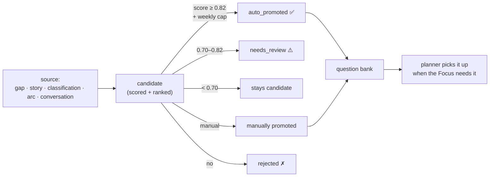
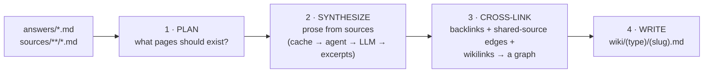
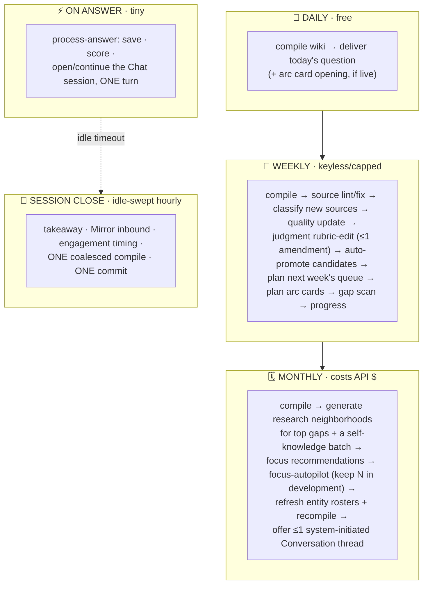

# Lifehug

**Capture your life, deepen it with AI, and turn it into pieces that matter.**

Lifehug is a lifelong AI oral-history system organized around **the Loop**: the self-improving flow where daily answers become durable sources, sources become a private wiki and structured signals, signals become better questions, and better questions deepen the life story. The Studio turns that accumulated memory into things you can actually use: letters, posts, chapters, speeches, and — assembled over time — a memoir or founder story; finished pieces can feed back into the same Loop as source material.

You usually do one thing: **answer the question.** When an occasion arrives, you do a second thing: **ask Lifehug to make a piece in the Studio.** Both become part of the same compounding memory system.

## The mental model, in one paragraph

Everything you type is kept forever, exactly as you typed it, in a **source**
file under `answers/` or `sources/`. Nothing above that layer is ever edited in
place: it is **derived**. A model reads a source and writes one durable
**claim** per assertion it can quote — *this happened*, *this was in 1996*, *I
was 18* — into an append-only **receipt**. A pure function called **the fold**
reads every receipt on every publish and groups the claims into **nodes**, the
dated moments you see on the Timeline. Where the fold cannot date a node it
publishes a **work item** — a card asking the one question that would settle
it — and the **resolver** tries to answer that card from the rest of the vault
before it ever reaches you. Because the fold is a pure function of the
receipts, a correction is never a rewrite: you add a new source, and the whole
drawing is recomputed from scratch on the next publish. That is the whole
system: *immutable sources, derived everything, one fold, one drawing.*

Follow one answer end to end in
[How a memory becomes a dated moment](#how-a-memory-becomes-a-dated-moment).

## Two users, one Loop

**If you do the minimum, it still works.** Answer one quick question a day —
that is the whole obligation — and over time you get a full life story:
answers become durable sources, sources compile into a private wiki, the wiki
and the signals under it decide a better next question. Nothing in the system
needs a decision from you to converge (ADR 0006, the Convergence Principle).

**If you want more, there is more.** Answer several questions in a sitting,
hold a longer conversation instead of a short one, and look at how your life
is being built — the wiki graph, the Timeline, the Mirror. Anything you
approve, dismiss, or correct is consumed as accelerator signal (ADR 0009),
never as a dependency the floor needs.

**Three loops run underneath both**, and they are the whole schedule
(each transcribed step-by-step in [The three clocks](#the-three-clocks-scheduling)):

| Loop | Entrypoint | For |
|---|---|---|
| **Daily** | `system/daily_question.sh` | deliver one question (free, no model call) and take the answer. |
| **Weekly** | `system/weekly_maintenance.sh` | learn from the week and rebuild the queue: compile → source-lint → classify-story → quality-update → judgment-update → timeline-retire → wiki harvest → mirror-compile → candidates-auto-promote → planner-queue → arc-plan → report + notify. |
| **Monthly** | `system/monthly_research.sh` | grow: research-expand gaps → recommend-focuses → focus-autopilot → entity-roster per type → compile → perennials → thread offers → resurfacing → report + notify. |

Four surfaces, four jobs:

| Surface | What it is |
|---|---|
| **Queue** | the cache of the most effective next questions — the planner's weekly queue, plus promoted candidates and the gaps Mirror and Timeline expose. |
| **Foundation** | the approved question bank: every question that exists, by focus and category. |
| **Review** | what the system grew on its own — question candidates, focus ideas, entities about to become pages, duplicate focuses — waiting for your eye. |
| **Studio** | where you make things: pieces and projects, drafted from everything above. |

**Play** on any of those rows means the same thing everywhere: it *approves*
the row and *starts* the conversation about it, immediately — the approving
write happens in the background (platform ADR 0020; OSS
[ADR 0018](docs/adr/0018-candidate-placement.md),
[0021](docs/adr/0021-focus-candidate-interaction.md),
[0022](docs/adr/0022-entity-candidate-interaction.md) hold the three child
Interactions that conduct it). See `interactions/README.md` §
"The child-interaction paradigm".

---

## Nomenclature

The wiki is a **graph of your life**, and these are the standard terms used throughout:

- **Node** — a graph vertex: a durable subject in your life that can be compiled into a wiki page. People, places, periods, objects, themes, projects, and *you* are nodes.
- **Node Type** — graph vocabulary for the kind of node, such as person, place, period, object, theme, project, or life. Most current `Entity Type` values are node types; `relationship` is the exception because it represents an edge page.
- **Entity** — the current product/code term for a node-worthy subject; usually one wiki page. Keep using Entity in code and product flows where the system already does.
- **Entity Type** — the current product/code and frontmatter term for a wiki page kind: `person`, `place`, `period`, `object`, `theme`, `project`, `relationship`, and `life` (you). Most entity types are node types; `relationship` remains the compatibility page type for an edge page.
- **Edge** — a meaningful connection between nodes/entities. An edge can carry evidence, tension, change over time, and artifact relevance.
- **Relationship Edge** — a human bond edge, usually between you and another person. The page in `wiki/relationships/` is an edge page: it answers what the bond is, not merely who the other person is.
- **Focus** — an entity you're deliberately building toward a deliverable (book, letter, …), with a tier and target. **You are the primary Focus** — your own life story is the biggest one and gets the largest share of questions; self-knowledge (values, fears, contradictions, growth) is a built-in dimension of it, not a separate track.
- **Project** — a Focus whose deliverable is a composite piece built up over time. Today that's the book: your categories become chapters. A project is virtual while you're planning it — readiness is computed live from the roadmap and answered material — and becomes a concrete, versioned piece once `book-assemble` stitches the latest chapter drafts together.
- **Piece** — a single versioned work in the Studio: a letter, tweet, essay, or chapter draft. Lives under `outputs/<slug>/` as `v1.md`, `v2.md`, ... revisions, with AI-assisted revise, mark-final, and promote-back-to-source. The code/CLI term is unchanged: **artifact** (`system/lifehug.py artifact ...`, `sources/artifacts/`).
- **Studio** — the single workspace for making pieces and projects: grouped by Focus, project cards expand into a chapter table, piece cards keep their version/revision history, and a create form starts new pieces.
- **Entity graduation / node graduation** — the wiki grows itself: entities mentioned across your answers are detected, **AI-curated** into a roster (`lifehug.py entity-roster --type <t>`), and graduated into node pages built from those mentions. Places and periods graduate on a low bar (a few mentions); **objects** graduate on AI-judged symbolic meaning (e.g. *The Cleats*), not frequency; people on score; **themes** via an AI-curated keyword roster (v97) — new themes like *Parenting* emerge from opinions, essays, and classifier extractions. Relationship edges use a dyadic path: Focus relationships can graduate from dedicated answers or enough cross-story mentions about the person. Rosters refresh monthly; compile graduates the current roster entries into pages — no manual work. You can also override any entity directly (v173, ADR 0013): `lifehug.py entity-verdict <type> <slug> graduate` fast-forwards one you already know matters, `... never` permanently vetoes a page for it (identity stays, only the page is suppressed), `... clear` returns it to automatic — both settled verdicts survive every future refresh. Since v190 the same verb also carries what you told the conversation: `--alias "Jo"` (repeatable), `--relationship parent`, `--living`/`--not-living`, and `--maps-to <slug>` when the entity is really an existing page (the mapping wins over `graduate` — a mapped entity already has a home — and the loser's names fold into the survivor's aliases so the surviving page finds their material). Relationship and living survive a refresh too. A yes to the conversation's optional "want me to start a focus?" goes through `lifehug.py focus-recommend-from-entity <type> <slug>`, which adds one pending Focus idea and creates no Focus.
- **The Loop** — the canonical continuous-learning cycle: capture source → compile wiki → lint/repair source truth → classify/score signals → promote candidates and plan the queue → ask a better question → create artifacts → feed final artifacts back as source. When we ask whether a feature "works in the Loop," we mean this path.
- **The three loops** — the whole schedule the Loop runs on: **Daily** (`system/daily_question.sh`) delivers one question and takes the answer, free and model-free; **Weekly** (`system/weekly_maintenance.sh`) learns from the week and rebuilds the queue (compile → source-lint → classify-story → quality-update → judgment-update → timeline-retire → wiki harvest → mirror-compile → candidates-auto-promote → planner-queue → arc-plan → report); **Monthly** (`system/monthly_research.sh`) grows (research-expand → recommend-focuses → focus-autopilot → entity-roster per type → compile → perennials → thread offers → resurfacing → report). Per-answer events run continuously and are not a fourth clock.
- **Question queue** — the cache of the most effective next questions: `planner-queue`'s weekly output, expiring with the week. It is an **aggregation with a formula** (`question_planner.build_queue`, `system/question_planner.py:672`), not a hand-written list — pending bank questions weighted by dynamic Focus allocation and group caps (main 0.50 / project 0.35 / focus 0.25), least-covered category first, ×2.5 objective boost, 0.15 chapter-gap fraction, story-function caps (scene 0.45 … output_gap 0.20), rumination cooldown ×0.25, the escalation gate, and `--arc-max` 2. Questions enter the bank by promotion, or — since v288 (Cut 5b, owner ruling R2) — from the Timeline's own measured gain: a landmark opportunity or a keystone whose `leverage` clears `timeline_leverage_per_story` (6) is minted as a `timeline`-group bank row with provenance `timeline-gain`, weighted `leverage / timeline_leverage_per_story`, at most one landmark question per build and one asked question a week by group cap. Everything below the bar stays a Timeline invitation and feeds arc cards and curation surfaces, not the bank.
- **In the Loop** — code, state, or docs reached by the daily, weekly, monthly, or artifact flows without a human manually stitching it together, and whose output can affect future questions, wiki pages, relationship understanding, or artifacts.
- **Loop-adjacent** — useful manual, dry-run, inspection, setup, or repair surfaces. They support the Loop but do not change future behavior until their output is promoted into a Loop surface.
- **Out of the Loop** — code or data that exists but is not called by scheduled/manual Loop entrypoints and is not read by downstream Loop state. Mission-critical work should not stay here; wire it in or document it as experimental.
- **Interaction** — a role definition for the AI in one situation: purpose, behavior contract, context recipe, scope, and evals, packaged as files any qualified model can execute. The definition lives in the framework (`interactions/<name>/`); each runtime loads it; a model is "seated" in it only after passing its eval harness. Out-of-scope input is politely deflected. **Nine are registered** in `interactions/registry.json`: **conversation** (chats + longer sessions), **question judgment** (which follow-up candidates deserve to exist, and how urgently — ADR 0007), **focus curation** (judging first-encounter Focus/idea duplicate name variants the deterministic layers can't resolve — ADR 0010), and six *children* of conversation — **question candidate** (placement, ADR 0018), **focus candidate** (onboarding, ADR 0021), **entity candidate** (identity, ADR 0022), **arc walk** (working a Play target's open questions in resumable episodes, v193), **timeline** (placing a moment without ever opening on a calendar year, v195), and **landmarks** (the universal dating set, plus its own recorder and general-listener leaves, v199/v212/v218).
- **Child interaction** — an Interaction that `extends` Conversation by exact version and adds exactly ONE goal: a stage-keyed `prompt/turn-instructions.md` leaf the host substitutes into, ONE optional additive structured-output field gated on a `TurnShape` flag, its own lints/goldens/evals harness, and its own seat. Six exist (placement, onboarding, identity, arc walking, placement-in-time, landmarks). The paradigm is written once in `interactions/README.md`.
- **Play** — one verb: it **approves** the thing and **starts** its conversation. The approving write (promote the candidate, scaffold the focus, graduate the entity) runs in the host's background job; the conversation opens immediately and never waits on it, so the model states the act once as an aside and takes a correction as a *move*. "Play is read-only" is retired vocabulary (platform ADR 0020).
- **Play target** *(proposed — platform issue #570)* — what a Play is pointed at: `{kind, ref, goal, question_ids[], context}` for a candidate, focus, entity, question, chapter, book, or the whole queue. One endpoint, one tab renderer; the daily loop becomes a *scheduled* Play.
- **Whisper** — information woven into a conversation that fits naturally, drawn from an arc that has developed, and serving a **second agenda beyond the conversation's primary one**. A whisper is never a change of subject and never an interrogation: it is raised only where it fits, at most once per conversation, and it is not a cost the loop trades off — a whisper that lands is a gift, not a debt. Owner-set, 2026-08-23: *"a whisper is information woven into a conversation that fits naturally from an arc that's developed and solves some other agenda."* Whispers are a general mechanism; each kind names its own agenda.
- **Timeline whisper** — the first kind of whisper: the same natural-conversation move applied to **placing moments in time**. The week's arc card carries a timeline keystone's real probe, its identity (`tl:<anchor-slug>`), and the person's own landmarks; the conversation raises it where it fits, accepts any precision (a range places things), never presses, and never opens with a calendar year. The answer files through `timeline-place` and the next compile re-derives the timeline.
- **Placement aside** — the question-candidate child's one goal: the first reply names, in one plain sentence, the focus the answered question was filed under, and accepts a different place as a move (`placement` output field, v188).
- **Onboarding context** — the focus-candidate child's one goal: establishing what a just-started Focus covers and how far it reaches, so the questions seeded for it are worth asking (`focus_setup` output field, v189).
- **Identity context** — the entity-candidate child's one goal: the names someone goes by, how they are related, whether they are living, and whether the roster already holds them under another name (`entity_setup` output field, v190).
- **Episode / plan** *(proposed — platform issue #570 §3)* — the arc-walking child's nouns: a **plan** is the ordered set of open questions for a Play target plus bridging intents, recomputed at every Play (never persisted); an **episode** is one session walking a slice of it (~4–8 questions), closing warmly with what was covered and what waits. Never a checklist, never a streak.
- **Current** — the version of a Piece you would hand someone today; the star the CLI still calls `final` (`artifact save --final`). An artifact is never *done*, so the UI word is "current" (platform issue #566 ruling).
- **Foundation** — the approved question bank, browsable by focus and category: the questions that exist. **Review** is its counterpart — what the system grew on its own and is waiting for your eye. **Queue** is the cache of the most effective next questions.
- **Chat** — the short exchange around the daily question: system-initiated, ~3 exchanges, arc-carded, graceful third-turn exit, closing takeaway.
- **Conversation** — a long user-initiated session (a story, "something on your mind", or a thread the system offered); runs the full interviewer arc; closes with a narrative takeaway.
- **Arc card** — the pre-planned skeleton for a chat/conversation: opening framing + 2–4 follow-up *intents* (not scripted text), planned by the loops, executed live per turn.
- **Session** — one bounded run: open → turns → close; the durable record is the session document.

---

### Timeline

The timeline's vocabulary is one named set — three terms that only make sense
together (owner-set, 2026-08-23).

- **Landmarks** — the **universal** set of dating questions everyone gets: birth, **the family you came from**, the places lived, schooling, partnerships, children, jobs, military, losses. They are the same for every person, and they are the skeleton that makes everything else placeable by arithmetic — knowing a birthday and a stated age *is* a year; knowing when you lived somewhere dates every moment that happened there. **Landmarks** is the product word (owner-set, 2026-08-23) and the package name — one name from the surface down to the file on disk. Shipped v199 as the sixth child interaction (`interactions/landmarks/`). Onboarding asks five of them in **generalities**; the rest sit under the Timeline as always-open rows with Play; a landmark question enters the daily queue or a whisper when it passes the shared value threshold and only then (owner ruling R2, 2026-09-03, `lifehug-platform docs/decisions/2026-09-03-timeline-unification/decision-record.md`; shipped v288, Cut 5b, closing #573/#586 — `system/timeline_candidates.py`, provenance `timeline-gain`); it is never a reminder and never nags. Each domain has a **specificity ladder** (residence: city → address → span → household), so a vague answer is an *answer* and a row stays open only because more would unlock more. In code the *dated results* become **anchors** — the derived index every probe hangs on (`timeline.anchor_index`, `chronology.from_age` / `from_anchor`). A landmark is the question and the answer; an anchor is what the answer turns into. Filling that index is the whole point: before v199 `birth_date` was a parameter no caller passed. v202 added **Family** as the ninth domain and the second in order: siblings, parents and grandparents, one entry per person. A sibling's birth year may be asked outright — the year-opener carve-out is about the KIND of fact, not whose — and it anchors childhood; the living elders become **witnesses** for the ask-the-living thread. The *people* reach the entity roster as PERSON entries with the relationship fact, never a parallel store. The set is data: `interactions/landmarks/questions.yaml`. Research: `system/research/landmarks.md`. Contracts: `docs/pr-specs/landmarks.md`, `docs/pr-specs/family-landmark.md`.
- **Keystone** — the anchor that, once known, places the most moments, computed from the dependency graph (`timeline.dependency_index` → `timeline.keystones`, at most two starred). The starred set is a **greedy plan over the residual graph**, not a top-two leverage list: ranking independently by leverage double-counts, so each star is chosen for its marginal gain against what is still unknown, and a plan that runs out of gain stops short of the cap. It carries its own identity, `tl:<anchor-slug>`, and its own question, and it becomes the day's question when its value clears the bar (`timeline_leverage_per_story`) — a real bank row in the `timeline` group since v288 (Cut 5b), minted from the CALCULATED projection's `keystones` beside Cut 5a's `landmark_opportunities` (`lo:<24 hex>`) through one door, `system/timeline_candidates.py`.
- **Whisper** — information woven into a conversation that fits naturally, drawn from an arc that has developed, and serving a **second agenda beyond the conversation's primary one**. Whispers are general; the **timeline whisper** is the first kind — a keystone's or a landmark opportunity's real probe and the person's own landmarks, raised only where it fits, at most once per conversation, any precision accepted, never pressed. Since v288 the whisper carries the SAME candidate identity (`tl:` / `lo:`) the daily queue is choosing from, so the two are one thing and answering either closes both.

- **Spine** — the dated facts every "when?" is read against: the person's birth and the **age table** it implies (every age → a date range, for any birthday), their stays, tenures and schooling as intervals, the dated points (births, deaths, weddings, graduations, foundings), and the people around them. It starts **generic** — the shape of any lifetime, filled from birth alone — and the person's **landmarks** and **keystone** answers make it specific. `resolver.spine` builds it from the published projection on every run; nothing in it is invented.
- **Resolver** — the model reading each undated moment against the spine and the whole vault (`system/resolver.py`, v314). It indexes every story, answer, landmark and fact, answers *when* with citations, has every citation verified mechanically, files the answer as a dated claim on the moment's own node, and records the rest in `state/resolver/resolutions.json` as the one question that would settle it — asked once, never twice. It is the intended loop: **a model resolving and calculating placement against a spine**, not a chain of join rules; see [ADR 0037](docs/adr/0037-the-spine-and-the-resolver.md).

**How they relate:** landmarks are the universal skeleton; keystones are the
per-person gaps that skeleton leaves; whispers and keystone questions are the
two ways the loop asks.

Add Landmark (`landmark-offer`) can retain a house nickname for future stories
independently of its city and of separate stays at that address — a **house** is
a place below its city, and a **residence** is one stay there. Name evidence is
occurrence-specific; unrelated prose and ambiguous aliases stay visible rather
than being folded in. Identities and aliases survive a roster refresh; an
existing city-alias conflict needs an explicit decision. See
[ADR 0033](docs/adr/0033-add-landmark-offer-mode.md) for filing and
compatibility.

### The substrate — the nouns the timeline is actually made of

These are the artifacts every timeline answer passes through, named once and
used with these meanings everywhere in the code, the handbook and the ADRs.
Reading down the table is reading the pipeline in order.

| Noun | What it is | Where it lives |
|---|---|---|
| **Source** | A file of raw text: a prompted answer, an unprompted story, a pasted record, a correction, a reflection, a promoted piece. **Immutable** — never rewritten, only added to. Every derived thing cites one. | `answers/*.md`, `sources/**/*.md` |
| **Telling** | One *account of one event inside one source*. A source can hold several; the same event told twice is two tellings. The telling is what the identity layer binds, and its identity plus its supersession history is the **telling manifest**. | `state/temporal_claims/` (manifest) |
| **Claim** | One assertion a telling makes, with an EDTF interval, a basis, a confidence and a quote. Seven `claim_type`s: `date`, `range`, `age`, `duration`, `relative_order`, `identity`, `occurrence`. `identity` and `occurrence` carry no `temporal_value` at all — `occurrence` is *"it happened; when is not known"*, which is how an undated story is still on the page. A claim's status is `active`, `superseded`, `retracted` or `disputed`; a losing claim is **never deleted**. | `state/temporal_claims/receipts/` |
| **Receipt** | The append-only file a filing writes: the claims, their quotes, the extractor and its rule version, the source revision it read. The receipts *are* the substrate; everything else is a function of them. | `state/temporal_claims/receipts/` |
| **Node** | A group of claims the fold decided are about one event — *a dated moment on the Timeline*. Its id is derived (`node_kind`, event kind, subject keys, discriminator), never assigned, so the same facts always draw the same node. | `state/temporal_claims/calculated-timeline.json` |
| **Episode** | The identity layer's answer to *"are these two tellings the same event?"* — a set of tellings decided to be one. An episode has its own id, and a node id is derived from it, so absorbing a telling moves the node. | `state/temporal_claims/identities/bindings/` (machine, rebuildable) and `sources/identity/bindings/` (a person's own decision — Law 7: human decisions are sources, not state) |
| **Binding envelope** | The record of one identity act: which tellings it binds, under which relation (`same` / `not_same`), which prior bindings it **supersedes**, which ids it aliases. Written whole and validated against the store, so an apply is never half-applied. | `state/temporal_claims/identities/operations/`, or `sources/identity/operations/` for a human one |
| **Alias** | A published redirect from an id that has moved to the id that now draws it: `node_aliases`, `episode_aliases`, `work_item_aliases`. An alias is **followed**, not merely published (v342). | the projection envelope |
| **Landmark entry** | One answer in the universal dating set, under a **domain** (`birth`, `family`, `residences`, `schools`, `partnerships`, `children`, `work`, `military`, `losses`). Each domain has a **specificity ladder** — residences climb city → address → span → household — so a vague answer is still an answer and a row stays open only because more would unlock more. The entries in `state/landmarks.json` are a *drawing*; the filed `sources/landmarks/entry-*.md` records are the truth, which is why un-drawing an entry never loses it. | `sources/landmarks/`, `state/landmarks.json` |
| **Work item** (a **card**) | The published question about one gap: its kind, the field it is missing, the claims involved, the sentence to ask, and a score. Ten kinds — `precision_gap` (*when did this happen?*), `contradiction` (*which of these two dates is right?*), `identity_uncertain` (*which James is this?*), `missing_anchor` (*you named something undated — when was it?*), `place_ambiguous`, plus `tenure_ambiguous`, `residence_overlap`, `chain_gap`, `same_event` and `possible_overmerge`. States: `open`, `offered`, `answered`, `resolved`, `dismissed`, `obsolete` — `obsolete` is how answering elsewhere closes a card without anybody answering it twice. | `state/temporal_claims/work-items.json` |
| **Frame** | A **calculated** period: Childhood (0–13), Teen years (13–20), then every reached decade. Pure arithmetic over the birthday, regenerated every publish, with no maximum age to forget. Frames are the permanent coordinate system. | the projection, `node_kind: "period"` |
| **Era** | A **person-created** period — College, the Mission. Immutable identity (`era_id`), dated only by what the person said, never by what happened to fall inside it. Its label and its kind are separate decision records — and, like every human decision, they are **sources**: `sources/eras/` (identity, label, kind), with membership and display filed beside them. | `sources/eras/`, the projection |
| **Axis membership** | The fold's answer to *"does this moment belong on the owner's own timeline?"* — `owner` \| `family` \| `none`, with a reason: `lived`, `immediate_family_in_lifetime`, `pre_birth`, `not_family`, `relationship_unknown`, `subject_unresolved`. One pure function, `system/axis_membership.py`. | every node |
| **The spine** | The dated facts every *"when?"* is read against: birth and the age table it implies, stays, tenures and schooling as intervals, dated points, and the people around the owner. **Generic first** — any lifetime has this shape and a birthday alone fills the age table — and the person's landmarks and keystone answers are what make it theirs. Built from the published projection on every run; nothing in it is invented. | `resolver.spine`, in memory |
| **The resolver** | The model reading each undated node against the spine and a full-text index of the whole vault, answering *when* with citations that are then verified mechanically. A verified answer becomes an ordinary dated claim; an unanswerable one becomes the one question that would settle it, asked once. | `system/resolver.py`, `state/resolver/` |
| **The fold** | The pure function from *every receipt* to *the drawing*: group claims into nodes, reconcile their dates, compute frames and memberships and axis membership, and mint the work items for what is still missing. It is recomputed from the receipts on every publish and stores no intermediate opinion, which is why a correction needs no migration. | `system/temporal_timeline.py`, `system/episode_fold.py` |

Two artifacts hold the fold's output: the **projection**
(`state/temporal_claims/calculated-timeline.json` — nodes, memberships,
aliases, frames, keystones, diagnostics, stamped with a generation number) and
the **work items** file beside it. Both are derived; deleting them costs one
rebuild and changes no answer.

## How a memory becomes a dated moment

One answer, end to end, naming the artifact each step writes. You type:

> *"I went bankrupt at 26. It was the worst year of my life."*

| # | Step | Who does it | What it writes |
|---|---|---|---|
| 1 | **Capture** | `process-answer` (or `ingest-story`) | the **source** file, verbatim, under `answers/` or `sources/manual/`, plus a row in `state/source_manifest.json`. Nothing above this is authoritative. |
| 2 | **Classify** | `classify-story` — a model, reading one source | a **classification** under `state/classifications/`: the events it found, each with a subject, an event mention, and any date, age or landmark relation it can quote. It records what the text *says*; it never converts and never guesses. |
| 3 | **File claims** | `migrate-classifier-moments` (and the classify path itself) | a **receipt** under `state/temporal_claims/receipts/`: here one **telling** with an `age` claim (band 26–26, basis `age`, quote *"bankrupt at 26"*) and an `occurrence` claim. The classification stays on disk; the receipt is what the fold reads. |
| 4 | **Bind** | `bind-episodes [--apply]` | a **binding envelope** under `state/temporal_claims/identities/`, if some other telling is the same event. Nothing to bind writes nothing at all. |
| 5 | **Fold and publish** | `publish` (`system/temporal_publication.py`) | the **projection** and the **work items**. The age claim meets the owner's birth anchor — 1981-07-11 — and `chronology.from_age_band` returns 2007-07-11/2008-07-10, basis `age`. A **node** is drawn there, inside the *My 20s* **frame**, with `axis_membership: owner / lived`. |
| 6 | **Resolve what is still open** | `resolve --execute` | a dated **claim** on the node, under extractor `resolver/rule:3`, for anything the vault could already answer — or a row in `state/resolver/resolutions.json` holding the one question that would settle it, plus a `probable_window` estimate the page can draw. |
| 7 | **Ask, only if a person could answer** | the fold, at publish | a **work item** — here none, because the age placed it. Had the story said only *"I went bankrupt"*, a `precision_gap` card would carry the resolver's own sentence, and only if narrowing it would actually change something. |

Then the ordinary loop takes over: the card can become an arc-card **whisper**
or a bank question, your answer is a new source, and step 1 begins again. The
drawing is never patched — it is recomputed.

## How the timeline is computed

### Where a placement comes from

The fold reconciles every claim about one node into one interval. Each claim
carries a **basis** — *how* the interval was arrived at — and the bases are
ranked, so a stronger warrant wins a disagreement rather than the later filing
winning it (`chronology.BASIS_WEIGHT`):

| Basis | Weight | What it means |
|---|---|---|
| `document` | 7.0 | a date printed on paper, read off it |
| `stated` | 6.0 | the person said it |
| `relative` | 5.5 | somebody else's memory, relayed, witness named |
| `age` | 5.0 | their age against a birthday — arithmetic |
| `photo` | 4.5 | a contextual date, a *window* by construction |
| `anchor` | 4.0 | a landmark plus a before/after, or containment in a stay |
| `public_event` | 3.0 | the living-in-history route |
| `connector` | 2.0 | institutional evidence from a connector |
| `order` | 1.0 | relative sequence only |

Confidence is a second, independent axis (`certain` → `approximate` →
`inferred` → `conjectural`), and additional independent provenance for the same
claim adds a capped consilience bonus. The four bases that carry most real
vaults are `stated`, `anchor`, `age` and `document`.

Four routes put a date on a node that never stated one:

- **Containment inside a stay.** A moment whose place resolves to exactly one
  dated residence or tenure episode inherits that episode's bounds — copied,
  never narrowed — as basis `anchor`, reported `participation_span_applied`.
  The episode's own provenance is dropped and one clause naming the episode
  takes its place, so the page never attributes to the person a sentence they
  did not say. The member's precision question survives: better anchored, not
  suppressed. **One slot is one tenure** (v312) — a job recorded under several
  back-to-back stays folds into a single episode spanning the whole run.
- **Age arithmetic, from the subject's own birth.** `chronology.from_age_band`
  takes a birth and a band and does arithmetic; it is subject-agnostic, and the
  only question is *which* birth it is handed. `BIRTH_ANCHOR_TIERS` (v346)
  answers that in order: (1) a `birth`-kinded node whose resolved subject is
  that person, read at its best-supported value; (2) that person's roster row's
  `born`; (3) a `family` or `children` landmark entry's own date — the two
  domains whose ladder declares `date_semantics: ["birth"]`, pinned by a parity
  test so a ladder that changes its semantics fails the build. The first tier
  that answers for a person answers for **every key that person goes by**, so a
  lower tier can add a birth nobody has drawn and can never contradict one
  already on the page. A name several roster people bear is never one of those
  keys. When none of the three exists the node reports
  `age_without_birth_anchor`, which now means exactly what it says.
- **Recency as a placement** (v336). *"Recent"* with a known capture date is a
  placement, not an absence: the person is the one saying it was recent.
  `chronology.RECENCY_RUNGS` is the one vocabulary, six rungs narrowest-first —
  *yesterday* / *the other day* / *this week* → 2 weeks, *last week* → 1 month,
  *last month* / *a few weeks ago* → 2 months, *recently* / *lately* / *a
  recent …* → 6 months, *a few months ago* → 9 months, *this year* → 1 January
  of the capture year. It files a **`stated`** range whose provenance reads
  *"you said recent, told 2026-07-14"* — never `date_derived`, never
  calculated. Two refusals keep it honest, both in the cheap direction: a text
  naming a four-digit year dates itself and supplies no cue, and
  `RECENCY_VETO_RES` refuses a recency word used to mean the opposite (*"I
  remember it like it was yesterday"*, *"in recent decades"*). A cue wrongly
  refused leaves a visible, still-asked `occurrence`; a cue wrongly fired would
  file a wrong date that hides itself.
- **The resolver**, for everything else — see
  [ADR 0037](docs/adr/0037-the-spine-and-the-resolver.md).

### The binder — deciding two tellings are one event

`bind-episodes` is the identity layer. `R1` is a similarity rung with a floor;
beside it sit the **R2 rungs**, swept in order of certainty, each keyed on an
**exact** key two tellings either share or do not, binding on arithmetic rather
than on a score:

| Rung | Keys on | Example |
|---|---|---|
| **R2a** | a derived reading naming exactly one node — every claim `system_derived`, a bare `<name>:<24 hex>` ref | the resolver's own answer, bound to the node it answered |
| **R2b** | one subject's one **once-per-life** milestone (`ONCE_PER_SUBJECT_EVENT_KINDS`: `birth`, `child_born`, `death`, `loss`, `married`) — and, since v345, one **couple's** one wedding (`ONCE_PER_COUPLE_EVENT_KINDS`: `married`, keyed by `couple_key`) | eleven tellings of one child's birth, folded into one node |
| **R2c** | an identical normalized label about the same named people | *"Family moved to Yucaipa"* said twice |
| **R2d** | one moment restated in other words — three shared significant label tokens, at least one not a name | the seven *"Isaac's first check"* nodes |

`R2a` chains freely because its key is arithmetic. Every other rung must form a
**clique**: non-transitivity at group scale, and the reason a 104-telling
transitive closure was cut back to the births it was actually about. A rung is
refused by an active or entailed `not_same`, so a person's own *Different*
always wins, and no rung may move an adopted or human-authority episode. A
**couple key is read from a telling's own subjects** (v350), not from any
person token anywhere in it — the owner's own subject names the owner's couple,
so *"our wedding"* can never reach his parents'; and a **compound relationship
word is never the simple word inside it**, so *mother-in-law* does not resolve
to *mother*.

### The five laws that protect the drawing

Each is one named constant with one seat, and each exists because a real vault
lost something real:

1. **`A_MERGE_NEVER_MOVES_A_DATED_MOMENT`** (v340, `episode_binder`). `R2c` and
   `R2d` — the two rungs whose key is *words* — refuse a pair whose stated
   dates contradict **and** a pair whose dates *the fold already has them at*
   contradict. Two *"Family moved to Yucaipa"* 32 years apart are two moves.
   `R2a`/`R2b` are deliberately **not** governed: their key is the identity of
   one fact, and two readings of one fact that disagree about its date are
   exactly the contradiction a fold exists to surface, as a `contradiction`
   card naming both dates with the loser kept as an alternate.
2. **`AN_ALIAS_NEVER_NAMES_A_NODE_THE_DRAWING_PUBLISHES`** (v342,
   `episode_fold`). Checkable in one line: no key of `node_aliases` is the id
   of a node the drawing publishes. A claim **follows** the node it folds under
   — when a bind re-keys that node, every remaining claim goes along unless its
   own date contradicts the merge; a key some claim still holds is not
   redirected at all, because a redirect to one of the two things an id means
   is worse than no redirect (`identity_node_alias_contested`).
3. **`A_STATED_ENTRY_IS_NEVER_RETIRED_BY_SHAPE`** (v349,
   `landmarks_interaction`). An entry the person stated is retired only by
   something the person **said** — a `none` that ends the domain, or a
   substantive answer standing where a terminal stood — never because of the
   fields it happens to carry, unless those fields are demonstrable evidence of
   a machine-collapsed aggregate; an entry with a promoted source of its own is
   never retired by shape at all; and **one answer is one entry**, so a single
   record that would retire more than one prior entry retires *nothing* and
   says so. The record itself always files: a rule that cannot decide what it
   retires is no reason to drop what the person said.
4. **`NOTHING_TO_BIND_COSTS_NOTHING`** (v348, `episode_binder`). A pass whose
   cheap signature matches the last successful `--apply`'s receipt derives
   nothing at all and returns that apply's summary with `reason: "nothing_new"`.
   The signature is `BINDER_RECEIPT_SIGNATURE_FIELDS` — three content digests
   (`telling_digest`, `bindings_digest`, `landmark_digest`) and three versions
   (`rule_version`, `calculation_rule_version`, `framework_version`) — over a
   receipt of the matching schema version. Any difference is the full pass. A
   vault with no telling manifest yet has no cheap signature and always takes
   the full pass: a missing manifest is *unknown*, never *nothing new*. Measured
   on the owner's vault: 169s → 1.05s.
5. **Whose moments ride the owner's axis** (`timeline-rules:10`, v334/v338,
   `axis_membership.py`) — the one deterministic rule, at fold time, from the
   roster's `relationship` field and the birth date. It is a law in the same
   sense: it is what keeps the drawing from silently gaining or losing rows.
   See [the owner's rulings](#the-owners-rulings-as-rules) below.

### The five ways a node id moves

A node id is **derived**, never assigned — from the episode, the event kind and
the subject — so a reading that changes any of those moves the id while every
work item, session and URL still names the old one. All five publish a redirect
under law 2, and all five report it:

| # | Cause | Reported | Release |
|---|---|---|---|
| 1 | a **bind** re-keys the node a telling folds under | `node_aliases` (Law 5) | v342 |
| 2 | the fold **minted** an id for a telling the contract cannot see | `identity_node_alias_followed` | v342 |
| 3 | an episode **absorbed** by a merge takes a new episode id, and a node id is derived from it | `episode_aliases` composed through `node_aliases` | v342 |
| 4 | a **landmark redraw** changes what an entry's date dates — a couple's wedding is not a birth | `landmark_date_kind_redrawn` | v345 |
| 5 | an **identity re-key** — a subject that newly resolves, so the derived key moves | `identity_subject_rekeyed` | v350 |

Three refusals are shared by all of them: a claim carrying its own `event_ref`
never moved (its id was never derived), a former id two claims disagree about
the destination of is dropped whole, and a map that would be a chain drops both
ends. The identity layer's own tables win a collision with a redraw, because a
person's decision outranks arithmetic.

## The owner's rulings, as rules

These are rules with seats in the code, not anecdotes. Each was a reading of a
real page on a real vault.

- **A card is asked only when a person could answer it** (v343/v350,
  `timeline-rules:13`/`:17`). A claim whose only label is a pronoun or a
  placeholder **and** whose confidence is exactly `0.0` mints no node and no
  card — both signals, never either alone, because `0.0` is also the default
  for *"never stated"*. A bare gerund phrase reads *"When was Harvey
  arriving?"*, not the ungrammatical *"When did Harvey arriving happen?"*. An
  `identity_uncertain` candidate set drops roster alias rows and collective/role
  rows before it is offered, and never offers the owner as a candidate for the
  owner's own given name; fewer than two real candidates mints nothing. And **a
  card never shows a node id as its label** — the rung mints nothing for a
  handle that names an internal id (reporting
  `anchor_without_a_human_label`, which loses nothing because each of those
  nodes already carries a card of its own), while a lint refuses any composed
  sentence carrying one, so no template can emit an id even by accident. The
  shape is derived from the minter's own `ID_RE`, not from a hand list of
  prefixes.
- **Whose moments ride the owner's axis** (`timeline-rules:10`, v334, amended
  v338). One deterministic rule at fold time: *he lived it* → his timeline,
  whoever else it is about. An **immediate family** member's own event during
  his lifetime (spouse/partner, parents, siblings, grandparents, children,
  grandchildren) → his timeline, drawn as a moment about them. Anyone else's
  own event — a friend's divorce, a colleague's move, and in-laws, aunts,
  uncles and cousins with them → not on his axis; it stays in the substrate and
  on that person's page. **Anything wholly before his birth is family history
  and never lived**, whoever it turns out to be about. And an **unknown
  relationship is undecided, not "not family"** (v338): `not_family` is a
  decision about a relationship *known* to be outside the immediate set, so a
  roster row with no relationship recorded, or a name the roster has never
  heard of, keeps its `precision_gap` and its identity question exactly as it
  had them. The suppressions read only the two *decided* off-axis reasons. The
  one exception, kept deliberately: an occurrence whose subject **is** the
  owner stays `owner`/`lived` even before his birth, because that is a
  contradiction Mirror owns and hiding it would delete the question.
- **A date card only when narrowing changes something** (v336,
  `temporal_work_items.date_card_changes_something`). A card is minted only
  when narrowing would change an ordering constraint or surface a
  contradiction, cross a frame or decade boundary, unblock another placement,
  or concern a real life event. A freestanding anecdote already placed inside
  about a year gets **no** card: higher fidelity can happen later, ideally not
  at all. The predicate reads the fold's own milestone vocabulary rather than a
  seventh table, and runs twice — in the fold, and again at publication where
  the resolver's own probable window is finally known.
- **A dated birthday of a named person is that person's birth** (v346,
  `A_DATED_BIRTHDAY_IS_A_BIRTH`). A claim extractor can say *when* and cannot
  say what *kind* of event a birthday is, so a `date` claim whose event mention
  names a person's birth, at day, month or year grain, with a named non-owner
  subject, **is** that person's `birth`. It is a reading taken at fold time, so
  a vault that already holds the claim heals on its next redraw and the receipt
  still says exactly what the extractor said. Compared whole and never as a
  substring, so *"Mary Born"* is still a name and *"Harvey's birthday party"* is
  still a party. Its corollary: **a birth belongs to the person born** — a
  birth group naming exactly one non-owner person is that person's birth
  whatever else it mentions, so *"Two dates are claimed for your birth"* is
  never asked about a child's birthday.
- **An introduction names one person in one clause** (v347,
  `AN_INTRODUCTION_NAMES_ONE_PERSON_IN_ONE_CLAUSE`). A relationship phrase the
  owner used — *"Dave's mom"*, *"my mother"*, *"(wife)"* — introduces a person
  the roster has never heard of, with that relationship, through
  `entity-roster --ensure-introduced`. The phrase and the name must sit in the
  **same clause**; a relationship word carrying a possessive `'s` is a
  possessor and not the name's relation, so *"my dad's dad"* introduces nobody
  as a father; a clause giving one name two relationships states neither; and a
  name a pasted vital record merely *lists* is introduced by nothing. A
  relation the vault already **records** for that spelling — a correction, a
  `family` landmark entry's `relation`, a roster row's `relationship` —
  outranks the one a phrase would file, and a contradiction refuses the whole
  row out loud. A generational suffix is a generation: `Sr.` is one step up,
  `Jr.` one step down.
- **An age and a date corroborate** (v345, `AN_AGE_AND_A_DATE_CORROBORATE`).
  An age is the age of the person the **claim** is about, not the node's
  subject. An age window that *contains* the date a node is placed at joins
  that placement's provenance as agreeing evidence and is never published as a
  rival (`age_corroborates_placement`); one that *excludes* it stays a rival,
  is scored, and the contradiction card names both dates
  (`age_contradicts_placement`). The arithmetic is the package's own and there
  is exactly one of it.
- **A landmark is drawn as what it is** (v345,
  `A_LANDMARK_IS_DRAWN_AS_WHAT_IT_IS`). `family` is the one domain whose
  entries are not all the same shape — a sibling entry dates a birth, a couple
  entry dates a wedding, and a couple is never born. A declared `birth` is
  refined exactly three ways: an entry that *states* a birth stays one; an
  entry whose own words name a marriage, or whose subject is exactly one
  couple, is `married`; a collective that is not one couple is a `transition`,
  *"a date whose event the record does not say"*. Read at three seats, so a
  vault that already holds the record heals on redraw with no migration.
- **The `birth` landmark is the owner's own** (v339, amended v341). `birth` is
  the one domain with no identity rung, so a relative's pasted vital record
  must never merge into it: a record naming somebody who is not the owner, or
  carrying a year fifteen or more from the year the owner **stated**, is routed
  to `family` at filing and skipped at draw. The year bound is disarmed when
  no stated birth is on file. And a birth record whose subject field holds the
  domain's own vocabulary — `Born`, `birthday`, `date of birth` — names
  **nobody**: it says which domain this is, not whose birth it is.

## `CALCULATION_RULE_VERSION` — the fold's contract version

Every node the fold draws is stamped `calculation_rule_version`, and the value
is folded into every input fingerprint. It reads `timeline-rules:N`, and it
lives in exactly one place, `temporal_timeline.CALCULATION_RULE_VERSION`
(**`timeline-rules:17`** at v350).

`N` is not a release number and not a schema version. It is the **fold's own
contract**: the promise that the same receipts, folded by these rules, produce
the same drawing. It is bumped whenever a rule in the fold changes *what the
same claims calculate to* — a different node set, placement set, alternates set
or work-item set for claims nobody edited — and that is what makes a stale
projection **detectable** rather than merely wrong. It deliberately does **not**
move for a better question, a nicer sentence, a faster path or a display
decision: v318's incremental fold, v328's owner-identity digest, v336's card
gate, v348's fast binder path and v349's landmark repair all left it alone, and
each of those releases says so and proves it.

The bump-by-bump table, `:8` through `:17` with the release that took each
slot, is in the eras handbook:
[The fold's contract version](docs/handbook/eras.md#the-folds-contract-version).
`:6` and `:7` predate it (v301 cross-dating context, v312 one-slot-one-tenure),
and `:1`–`:5` belong to the Eras and event-identity programs, narrated in the
same section.

## The verbs a person or an operator runs

Checked against `python3 system/lifehug.py --help` (134 subcommands at v350).
**Dry-run by default** means the bare verb writes nothing and prints what it
would do.

| Verb | What it writes | Dry-run by default? |
|---|---|---|
| `python3 system/temporal_publication.py` (**publish**) | the projection and the work items (`state/temporal_claims/calculated-timeline.json`, `work-items.json`) — the drawing, refolded from the receipts. `--rebuild` deletes both first and folds from nothing, the correctness oracle; `--check` verifies the standing generation still reproduces and writes nothing. Also runs implicitly wherever the loop republishes. | **no** — it publishes (`--check` is the read-only leg) |
| `bind-episodes [--apply]` | binding envelopes and proposals under `state/temporal_claims/identities/{bindings,operations}/`, plus the binder receipt under `state/temporal_claims/binder_receipt.json`. `--apply` files; `--dry-run` prints every pair's reasons and wins if both flags are given. | **yes** |
| `resolve --execute` | dated claims on nodes (extractor `resolver/rule:3`), supersession corrections for the raw handles they replace, and `state/resolver/resolutions.json`. The two legs for hosts: `resolve --plan --out <path>` writes exactly the prompts it would buy and touches **nothing** in the vault (an `--out` inside the vault root is refused), and `resolve --from-response <envelope>` files what came back, re-verifying every citation against the vault *as it is now* — so a stale story, an already-placed moment or a replayed envelope is refused rather than filed. | **yes** — the bare verb plans, `--execute` files |
| `entity-roster [--type <t>]` | the AI-curated roster under `state/entity_rosters/<type>.json`. | no |
| `entity-roster --ensure-introduced [--dry-run]` | one person row per relative a source introduces with a relationship phrase, through `entity_verdict.apply_verdict(..., ensure=True)`. Deterministic, no AI, additive, one atomic per-row write, never a rewrite of the file. | no — pass `--dry-run` |
| `landmark-record <domain> …` | one filed landmark source under `sources/landmarks/entry-*.md`, the redrawn `state/landmarks.json`, and the entry's claims as receipts. Refuses at filing what cannot improve the spine: an unnamed organization, and a `birth` record that names somebody who is not the owner. | no |
| `landmark-reinstate --domain <d> [--since <ts>] --apply` | **one** `retract` correction under `sources/corrections/`, naming every supersession that stops standing, plus `state/`. Nothing writes an entry — the entries come back because `state/landmarks.json` is a *drawing* and the sources behind it were never touched. Deterministic and idempotent twice over. You need it when a landmark answer wrongly retired a domain's standing entries — the v349 incident, where one bare `residences` answer superseded thirty stays and every moment they had placed by containment fell to unplaced. `--since` is what keeps the repair surgical. | **yes** — bare prints the plan |
| `migrate-classifier-moments [--dry-run]` | a source-backed temporal claim for every current classifier moment — the bridge from `state/classifications/` into the receipts. `--source PATH` restricts it. | no — pass `--dry-run` |
| `compile` (the **wiki compile**) | the private wiki under `wiki/`, including `wiki/timeline.md`. `--no-ai` for deterministic excerpts only; `--emit-tasks PATH` for the keyless agent path. | no |

Two notes a reader will trip on. The CLI verb is **`resolve`**, not
`resolver` — `resolver` is the module and the concept. And **`publish`** is not
a `lifehug.py` subcommand: it is `system/temporal_publication.py`'s own
entrypoint and the function every write path calls, which is why the changelogs
name it as a step rather than as a command.

## Contents

- [The mental model, in one paragraph](#the-mental-model-in-one-paragraph) — immutable sources, derived everything, one fold
- [Two users, one Loop](#two-users-one-loop) — the minimum, the maximum, and the four surfaces
- [Nomenclature](#nomenclature) · [Timeline](#timeline) · [The substrate](#the-substrate--the-nouns-the-timeline-is-actually-made-of)
- [How a memory becomes a dated moment](#how-a-memory-becomes-a-dated-moment) — one answer, end to end
- [How the timeline is computed](#how-the-timeline-is-computed) — bases, containment, ages, the binder, the five laws
- [The owner's rulings, as rules](#the-owners-rulings-as-rules)
- [`CALCULATION_RULE_VERSION`](#calculation_rule_version--the-folds-contract-version) — the fold's contract version
- [The verbs a person or an operator runs](#the-verbs-a-person-or-an-operator-runs)
- [The big picture](#the-big-picture) — how the whole thing fits together
- [The daily loop](#the-daily-loop) — what happens every morning
- [Core concepts](#core-concepts) — Focus, Roadmap, Wiki, Neighborhood, Candidate, Piece, Project, Pass
- [How the planner decides what to ask](#how-the-planner-decides-what-to-ask)
- [Research & neighborhoods: finding new questions](#research--neighborhoods-finding-new-questions)
- [The private wiki](#the-private-wiki)
- [Studio: Projects & Pieces](#studio-projects--pieces)
- [The three clocks](#the-three-clocks-scheduling)
- [Every script, holistically](#every-script-holistically)
- [Getting started](#getting-started)
- [Framework and vault layouts](#framework-and-vault-layouts)
- [Key commands](#key-commands)
- [Repo layout](#repo-layout)
- [Updating](#updating) · [Methodology](#methodology)

---

## The big picture

Lifehug is a **compounding system**, not a journal. The Loop is the clutch: each answer feeds a private wiki and a classifier; the classifier turns raw stories into structured people, places, themes, contradictions, possible outputs, and follow-up candidates; the wiki, roadmap, quality profile, and planner decide the next question; the question pulls out the next answer. When you need something real — a Mother's Day letter, a birthday post, a chapter, a speech — the artifact workflow turns that memory into a finished piece, and the finished piece can feed back into the source layer.


```mermaid
flowchart TB
    subgraph daily["🌅 every day"]
        Q["Question delivered<br/>(Telegram / WhatsApp / CLI)<br/>+ arc card opening, if live"]
        A["You answer<br/>(voice or text)"]
        P["process-answer<br/>save durably"]
        T["CONVERSATION TURN<br/>receipt + payout + cued follow-up<br/>(the Chat) — degrades to legacy<br/>ack + follow-up on failure"]
        S["Session doc<br/>state/conversations/"]
        Q --> A --> P --> T
        T -->|append turn| S
        S -->|context| T
    end

    subgraph brain["🧠 the knowledge layer"]
        W["Private WIKI<br/>people · places · periods<br/>projects · themes · self"]
        CL["CLASSIFIER<br/>people · places · themes<br/>contradictions · outputs"]
        QB["Question bank<br/>(every question, answered or not)"]
        MIR["MIRROR<br/>wiki/self/mirror.md<br/>+ Review's Sit-with card"]
    end

    subgraph think["📋 the planning layer"]
        PL["PLANNER<br/>builds the weekly queue,<br/>balanced across your Focuses"]
        RM["ROADMAP<br/>your Focuses + targets"]
        QP["Quality + engagement profile<br/>learns what opens/keeps you engaged"]
        AP["ARC PLANNER<br/>plans this week's arc cards<br/>(opening + 2–4 intents)"]
    end

    subgraph grow["🔬 the growth layer (rare, costs API)"]
        RE["RESEARCH<br/>finds new topics and generates<br/>question 'neighborhoods'"]
        CA["Candidates<br/>review buffer before<br/>they become real questions"]
    end

    subgraph make["🎨 the studio layer"]
        OUT["STUDIO<br/>pieces · projects<br/>letters · posts · chapters"]
        SRC["Piece sources<br/>final piece + context pack"]
    end

    P -->|writes answer| W
    P -->|weekly capped pass| CL
    P -->|marks answered| QB
    P -->|silently scores| QP
    T -->|extracted.candidate_ideas, at close| CA
    T -->|extracted.mirror_responses, at close| MIR
    CL -->|follow-up candidates| CA
    CL -->|focus/entity signals| RM
    CL -->|contradictions/insights| MIR
    W --> PL
    QB --> PL
    RM --> PL
    QP --> PL
    PL -->|weekly queue| Q
    PL --> AP
    AP -->|arc card opening,<br/>daily pure-file-read attach| Q
    W -->|thin spots| RE
    RE --> CA
    CA -->|auto-promote weekly| QB

    W --> OUT
    QB --> OUT
    OUT -->|promote final/context| SRC
    SRC --> W
    QP -->|candidate scoring| CA
```

*`extracted.facts` and `extracted.entities` are captured per turn into the session document but have no downstream consumer yet — `entities` surfaces as `close.entity_hints` for a future weekly-classification hint surface that doesn't exist today; `facts` is stored and otherwise inert. Not drawn above so the diagram never implies a consumer that isn't wired.*

**Read it as five layers:**

1. **Daily** — one question out, one answer in, then ONE conversation turn that receives it, pays it out, and cues the next question in your own words (falls back to a warm acknowledgment + separate follow-up on any definitive failure). The only part you touch.
2. **Knowledge** — every answer becomes wiki input, a completed question, and, during the weekly capped classifier pass, a structured classification record: people, places, periods, themes, contradictions, possible outputs, and follow-up candidates.
3. **Planning** — the planner reads the wiki + roadmap + a quality profile and writes a balanced weekly delivery queue. It applies quality multipliers so question types that have historically pulled richer answers score higher.
4. **Growth** — classification runs in small weekly batches; broader research runs rarely. Together they inspect the wiki and source layer for thin areas, extract structured meaning, and *generate new questions* about people, themes, periods, and contradictions you haven't covered. The best candidates are automatically promoted into the bank each week under a dynamic cap; once promoted, bank questions stay available until answered or manually edited.
5. **Studio** — when there is an occasion or deliverable, Lifehug gathers the right context, helps write the piece, versions it, and can store the final piece back as source material.

---

## The daily loop

This is what the cron job does every morning. It's all free — no API key needed for the daily run.


```mermaid
sequenceDiagram
    autonumber
    participant Cron
    participant DQ as daily_question.sh
    participant Ask as ask.py
    participant AC as arc_planner.py<br/>(arc-card --daily-text)
    participant You
    participant PA as process_answer.py
    participant CD as conversation_delivery.py

    Cron->>DQ: fire (e.g. 9:00 local)
    DQ->>DQ: commit pending data + compile wiki
    DQ->>Ask: pick next question (--dry-run)
    Ask-->>DQ: "[A3] What was your family's…"
    DQ->>AC: arc-card A3 --daily-text (pure file read, no AI)
    AC-->>DQ: opening framing, or nothing (no live card)
    DQ->>You: send question (+ arc opening) + pin in Telegram
    DQ->>Ask: --confirm-sent A3 (mark delivered)
    Note over You: hours later, whenever you feel like it
    You->>PA: reply (voice/text)
    PA->>PA: save answer durably, mark answered,<br/>rebuild coverage, update README, score richness
    PA->>CD: run_post_answer_turn (open/continue the Chat session)
    CD->>You: receipt + payout + cued follow-up, ONE message
    Note over PA,CD: any definitive failure degrades in the same run<br/>to the pre-v153 pair — warm ack, then a separate<br/>follow-up. Wiki compile + the answer's own commit<br/>are skipped inside an open session — they coalesce<br/>into ONE compile + ONE commit at the session's close<br/>(idle timeout, swept hourly).
```

No ratings, no streaks, no friction. **The answer itself is the only feedback the system needs** — its length, the people and places it names, the new wiki nodes it creates, the follow-ups it spawns. That gets scored silently and shapes next week's questions. This is `system/mission.md`'s Convergence Principle (ADR 0006) in miniature: answering alone is the *floor* every autonomous stage must converge on with no human required; if you do promote, dismiss, or defer something, that decision becomes optional, multiplicative *accelerator* signal the loop actually consumes (ADR 0009) — never a dependency the floor needs to work.

---

## Core concepts

| Concept | What it is | Where it lives |
|---|---|---|
| **Focus** | Anything you're building toward — a person, a book, a theme, your life's work. A Focus = an *objective* + a *tier* (how deep). | `state/roadmap.json` |
| **Tier** | How much depth a Focus needs: `basic` ≈ a blog post (~8 answers), `standard` ≈ an essay / a person (~20), `extreme` ≈ a book / life's work (~50+). | — |
| **Roadmap** | The full set of Focuses with targets and caps. *Derived* from the question bank — you never hand-edit it. | `state/roadmap.json` |
| **Question bank** | Every question ever created, answered or not, grouped by category (A–E generic, F–J projects, K+ people). Only grows. | `system/question-bank.md` embedded; `question-bank.md` external |
| **Neighborhood** | A cluster of 6–12 questions around one topic, arranged on a narrative **arc**, aimed at a deliverable. It tracks generated, promoted, and answered readiness separately; only answered material makes it draft-ready. | `state/neighborhoods.json` |
| **Candidate** | A proposed question waiting in a review buffer. Becomes a real question only when *promoted* into the bank. | `state/question_candidates.json` |
| **Wiki** | The cross-linked, owner-only encyclopedia of your life, synthesized from your answers. | `wiki/` |
| **Piece** | The product payoff: a single versioned work — a produced letter, post, caption, tweet, chapter, speech, or other deliverable. Drafts live in `outputs/`; approved finals/context can be promoted as sources. Code/CLI term: **artifact**. | `outputs/`, `sources/artifacts/` |
| **Project** | A composite piece built over time — today, the book: a Focus with a book-class deliverable whose categories are chapters. Virtual while planning; becomes a concrete piece once assembled. | `state/roadmap.json`, `outputs/` |
| **Pass** | A depth cycle over the whole story: skeleton → depth → connections → polish. Each pass deepens what the last one outlined. | `system/rotation.json` embedded; `state/rotation.json` external |
| **Interaction** | A role definition for the AI in one situation: behavior contract, context recipe, scope, and evals, packaged as files any qualified model can execute. Nine registered: **conversation** (chats + conversations), **question judgment** (ADR 0007), **focus curation** (ADR 0010), plus six *children* of conversation, each adding exactly one goal — **question candidate** (placement, ADR 0018), **focus candidate** (onboarding, ADR 0021), **entity candidate** (identity, ADR 0022), **arc walk** (v193), **timeline** (v195), **landmarks** (v199). | `interactions/`, `interactions/registry.json` |
| **Chat** | The short exchange around the daily question: system-initiated, ~3 exchanges, arc-carded, graceful third-turn exit, closing takeaway. | `state/conversations/<session_id>.json` |
| **Conversation** | A long user-initiated session (a story, "something on your mind", or a thread the system offered); runs the full interviewer arc; closes with a narrative takeaway. | `state/conversations/<session_id>.json` |
| **Arc card** | The pre-planned skeleton for a chat/conversation: opening framing + 2–4 follow-up intents (not scripted text), planned weekly, executed live per turn. | `state/arc_cards.json` |
| **Session** | One bounded run: open → turns → close; the durable record is the session document. | `state/conversations/<session_id>.json` |

The key mental model: a **Focus** is the unit of intent. Everything — a person, a memoir, a recurring theme, a relationship, a place, a company story — is a Focus with a tier and an objective.

---

## How the planner decides what to ask

You almost never pick a question by hand. Once a week the **planner** (`question_planner.py`) writes a delivery queue of about 8 questions, matching the horizon before the queue expires, and `ask.py` serves its first unanswered queued item each day, including after a quiet stretch. The planner's order is authoritative ([ADR 0034](docs/adr/0034-planned-questions-before-reengagement.md)). If the queue is missing, expired, exhausted, or otherwise has no usable item, quiet re-engagement gets the next choice after `reengage_after_days`; without that silence trigger, ordinary fallback rotation does. Re-engagement first forms its light/non-focus pool, then gives the last question one turn off when another exists, prefers the least-delivered cohort, and finally compares wording length. Ordinary fallback gives the last question one turn off, then prefers the least-delivered cohort before applying category rotation. A missed week therefore keeps offering alternatives instead of getting stuck on one unanswered row. Delivery never counts as an answer, and a sole remaining unanswered question stays available.

The planner's job is **balance**: pour attention into under-developed Focuses, ease off ones that are nearly done, and never let a single Focus eat your whole week.

**The queue is an aggregation, not a list.** `question_planner.build_queue`
(`system/question_planner.py:672`) samples pending bank questions under a
stack of weights and caps, all verifiable in that file:

| Rule | Value | Where |
|---|---|---|
| Dynamic Focus weight | `base(tier) × fill_factor × room`; `TIER_BASE` basic 0.8 / standard 1.0 / extreme 1.2; primary Focus `PRIMARY_BASE` 1.5 | `:377`, `:57`, `:58` |
| Group caps | main 0.50 · project 0.35 · focus 0.25 of the week | `GROUP_CAPS`, `:78` |
| Least-covered category first | pool sorted by objective, then `category_ratio` ascending | `:649–654`, `:333` |
| Objective boost | ×2.5 on a question matching an active objective | `DEFAULT_LANE_POLICY`, `:73` (applied `:770`) |
| Chapter-gap fraction | 0.15 of slots reserved for a nearly-READY chapter's top gap | `:72`, `:799` |
| Story-function caps | scene 0.45 · foundation/relationship 0.35 · tension/turning_point/meaning 0.30 · contradiction/output_gap 0.20 · self_image/value/growth_edge 0.15 | `STORY_FUNCTION_CAPS`, `:101` |
| Rumination cooldown | ×0.25 on a category the quality profile marks as ruminated (the only back-off) | `:607`, `:612` |
| Escalation gate | late-arc relational questions wait for ≥2 answers in that focus | `:543`, `:544`, `:754` |
| Queue size / arc cap / expiry | `--limit` 8 · `--arc-max` 2 · `--expires-days` 8 | `system/weekly_maintenance.sh:15–17` |

Selection among the survivors is weighted-random, seeded per week (`_week_seed`, `:664`), so the sequence varies instead of marching. Research expansion is deliberately not a queue slot — it surfaces as an `expansion` urgency number for the monthly clock (`:827`).

**What fills the pool.** New questions reach the bank only by promotion (`candidates-auto-promote`, weekly). Candidates come from story classification follow-ups, research neighborhoods (`system/research_expand.py`), conversation closes, the weekly wiki harvest (`question_candidates.harvest_wiki_questions`, cap 3/run — `system/question_candidates.py:659`), and perennial re-asks. Timeline/Mirror gap findings are a *different* lane: only `no_events`, `all_undated`, and `unplaced_events` are consumed, as arc-card intents (`system/arc_planner.py:92`); `no_chrono`, `thin_lineup`, `unplaced_entities`, and `date_contradiction` are display-only curation chores (`system/arc_planner.py:89–91`). They shape how a question is asked and what the viewer nudges you to fix. What DOES reach the bank, since v288 (Cut 5b, owner ruling R2, `lifehug-platform docs/decisions/2026-09-03-timeline-unification/decision-record.md`, closing #573/#586), is the calculated projection's measured gain: `system/timeline_candidates.py` mints the published `landmark_opportunities` and `keystones` whose `leverage` clears `timeline_leverage_per_story` as `timeline`-group bank rows with provenance `timeline-gain` — one landmark question per queue build, one asked question a week by group cap, `offer_only` never, an owner dismissal honoured across rebuilds, and an answered landmark retiring its row through `timeline.save_landmark`. Everything below the bar stays where it was — never as a reminder.


```mermaid
flowchart LR
    RM["Roadmap<br/>(Focuses + tiers)"] --> W
    WIKI["Wiki saturation<br/>(how full is each Focus?)"] --> W
    QP["Quality profile<br/>(what scores richest?)"] --> W
    EP["Engagement profile<br/>(what keeps you engaged?)"] --> W
    W["weight =<br/>base(tier) × fill_factor × room<br/>× quality × engagement"] --> SAMPLE
    OBJ["Active objectives<br/>(e.g. 'Mom letter')"] -->|2.5× boost| SAMPLE
    SAMPLE["Weighted random sample<br/>into an 8-slot delivery queue"] --> CAPS
    CAPS["Apply caps:<br/>• no Focus over 30% (50% if finishing)<br/>• story-function balance<br/>• ≥1 self-knowledge slot<br/>• max 2 in a row per category"] --> QUEUE["state/question_queue.json"]
    QUEUE --> ASK["ask.py serves one/day"]
    QUEUE --> ARCPLAN["arc_planner.py plans<br/>one arc card per queued question"]
    ARCPLAN --> ARCCARDS["state/arc_cards.json"]
    ASK --> ATTACH["daily_question.sh attaches<br/>the arc card opening<br/>(pure file read, no AI)"]
    ARCCARDS --> ATTACH
```

**The weight formula** — `weight = base(tier) × fill_factor × room`:

- **`base(tier)`** — bigger Focuses pull harder: `basic 0.8`, `standard 1.0`, `extreme 1.2`.
- **`fill_factor`** — how far a Focus is from its target depth (its *saturation*):
  - under 80% full → **1.0** (full pull)
  - 80–100% full → decays smoothly **1.0 → 0.3**
  - over 100% (target met) → **0.1** (maintenance — it never vanishes, so you can re-promote it later)
- **`room`** — 0 if there are no unanswered questions left in that Focus.

**The guardrails the sampler then enforces:**

- **Per-Focus cap** — no Focus takes more than **30%** of the week (raised to **50%** when you flag it `finishing` to push a deliverable to done).
- **Story-function balance** — questions are tagged by narrative role (foundation, scene, tension, turning point, relationship, meaning…) and each role is capped so a week doesn't become all backstory or all reflection.
- **Self-knowledge floor** — ~1 slot per week is reserved for vulnerable self-examination, even during project-heavy stretches.
- **Objective boost** — if you've set an active objective ("Prepare Mom's letter"), matching questions get a 2.5× weight.
- **Quality multiplier** — once you've answered ~20 questions, the silent quality profile kicks in: question types that historically pull richer answers out of *you* get nudged up. The system learns what opens you up.
- **Engagement multiplier** — a second, structurally parallel signal (issue #119) reads how conversationally engaged each story function has kept you (time-to-answer, unprompted follow-through, whether you kept going past a chat's exchange budget). It biases pacing/framing only, alongside the quality multiplier — never the self-knowledge floor, the escalation gate, or the rumination cooldown. Drain is not negative: a hard, heavy thread can score as engaged as a light one; only rumination (going in circles) backs off.

Once a week the arc planner (`arc_planner.py`, issue #118) also plans one **arc card** per queued question — an opening framing plus 2–4 typed follow-up intents drawn from timeline gaps, neighborhood siblings, Studio slots, sit-with material, and demonstrated-knowledge summaries — so the daily loop can ATTACH a plan instead of improvising three unrelated questions. The daily attach (`arc-card --daily-text`) is a pure file read: no AI runs on the daily path, and a stale/expired card just means today's message reverts to the plain queued question.

The planner also tracks **global fullness**. Once your Focuses cross ~60% full, it raises an *expansion urgency* signal — a hint to the monthly research job that it's time to discover new territory.

---

## Research & neighborhoods: finding new questions

This is how Lifehug grows beyond its starting questions. It's the part that needs an AI model — so it runs rarely (monthly cron, or on demand), and only here does it cost API money.

### What's a neighborhood?

A **neighborhood** is a cluster of 6–12 questions about a single topic — a person, a place, a period, a theme, a project — laid out along a **narrative arc** and aimed at a specific deliverable (a letter, a chapter, an essay). The arc is the spine; generated questions fill its slots, promoted questions enter the bank, and answered questions become the source material that can actually support an artifact.

Three arc templates, chosen by topic type:


```mermaid
flowchart LR
    subgraph memoir["MEMOIR arc — people, places, periods, projects, themes"]
        direction LR
        m1[foundation] --> m2[scene] --> m3[tension] --> m4[turning point] --> m5[relationship] --> m6[meaning]
    end
```

```mermaid
flowchart LR
    subgraph self["SELF arc — escalating self-examination (IFS / WNRS lineage)"]
        direction LR
        s1[self-image] --> s2[value] --> s3[fear] --> s4[contradiction] --> s5[perception by others] --> s6[growth edge]
    end
```

```mermaid
flowchart LR
    subgraph rel["RELATIONSHIP arc — a bond from both sides"]
        direction LR
        r1[who they are] --> r2[shared history] --> r3[tension] --> r4[what I see in them] --> r5[what I want them to know] --> r6[how they see me]
    end
```

*These three arc templates (`system/research_expand.py`'s `MEMOIR_ARC`/`SELF_ARC`/`RELATIONSHIP_ARC`) shape multi-question **neighborhoods** — an older, still-live, and unrelated mechanism. A neighborhood's `arc` list is one *input* the weekly arc planner can pull a `neighborhood_sibling` intent from; it is not the same object as a Chat/Conversation **Arc card** (`interactions/conversation/plan/arc-templates.md`, `state/arc_cards.json`), which skeletons a single question's opening + follow-up intents rather than a whole multi-question research thread.*

### How new topics (nodes) get discovered

Three ways a neighborhood gets opened:

1. **Gap detection** — `research_expand.py --gaps` scans your answers for thin spots: life periods barely covered (under 30%), people mentioned 3+ times but with no wiki page, emotionally-charged themes with little material. It hands back a list of suggested neighborhoods to open.
2. **Story ingest** — when you share something *not* tied to the daily question (`ingest-story`), it's saved as raw source material and auto-seeds template candidate questions to deepen it — and (issue #117) opens or continues a **Conversation** for one immediate turn: a receipt quoting your words, register matched to the source, at most one cued follow-up invitation. This is best-effort and never blocks the save; with no unattended provider, or on any definitive failure, behavior is exactly the filed templates above with no session created. When the session later closes with a classifier-grade extraction, the matching template candidates flip to `superseded` (never deleted). External corpora (Gmail today; Drive, Instagram, X next) come in through the **connector framework** (`connectors/` — calibrated, threshold-driven ingestion; see *Connectors* below). The weekly classifier then works through unclassified sources in small batches, extracting people, places, themes, contradictions, possible outputs, and targeted follow-up questions.
3. **You ask for it** — `research_expand.py --topic "Faith" --type theme --output essay` opens a neighborhood directly. Add `--context-file PATH` (v189) to ground the generated questions in what you said when you started the focus — its objective, the relationship, whether the person is living, and your own first words about it.

In every case the script: loads your mission + relevant existing answers (so it won't repeat what you've already told it), builds an arc-aware prompt, calls the model, and deposits the generated questions as **candidates** — never directly as daily questions. The neighborhood can be **question-ready** before it is **answer-ready**; `progress` only calls it ready to draft after enough arc slots have captured answers.

### The candidate lifecycle

Generated questions don't go live until they clear the auto-promote quality bar — or you promote them manually. This is the safety valve between raw idea and daily prompt. The bar is ONE unified quality score (ADR 0008): `priority × story-function multiplier`, with craft flaws (yes/no wording, vagueness, near-dupes, missing scene/stakes) dragging that same score down instead of tripping a separate gate. Neighborhood readiness follows the same lifecycle: `candidate → promoted question → answered source`.


```mermaid
flowchart LR
    SRC["source:<br/>gap · story · classification · arc · conversation"] --> C["candidate<br/>(scored + ranked)"] 
    C -->|"score ≥ 0.82\n+ weekly cap"| AUTO["auto_promoted ✅"]
    C -->|"0.70–0.82"| REV["needs_review ⚠️"]
    C -->|"< 0.70"| LOW["stays candidate"]
    C -->|manual| MAN["manually promoted"]
    C -->|no| REJ["rejected ✗"]
    AUTO --> BANK["question bank"]
    MAN --> BANK
    BANK --> PLAN["planner picks it up<br/>when the Focus needs it"]
```

Each week, `weekly_maintenance.sh` automatically promotes the highest-scoring candidates into the bank. The weekly cap is dynamic — it scales with how full the bank is (1 promotion when >120 unanswered, up to 4 when <40), so the bank self-regulates around a healthy level. Each promotion includes a full audit trail: candidate id, source, quality score, and `promoted_by: auto`. Every auto-promote run stamps `quality: {score, components, computed_at}` on every candidate it scores — not just the ones it promotes — additively and idempotently, so an unchanged replay never re-timestamps; the viewer's Review lane shows this one stored Quality column (falling back to a live computation for anything no run has touched yet) instead of the old separate Priority/Quality pair. Weekly dry-run previews this promotion gate before the real job mutates the candidate store or question bank.

You can still review with `candidates-review`, inspect `needs_review` items, update candidate status with `candidates-update`, and promote manually with `candidates-promote <id> --category F`. Manual promotion always overrides automated decisions.

### Source classification: turning raw stories into structured insight

`classify_story.py` is the structured-understanding pass. It reads answer/source files and extracts:

- people, places, time periods, themes, projects
- contradictions and self-understanding insights
- possible outputs such as letters, chapters, essays, posts, or speeches
- Focus opportunities and candidate follow-up questions
- direct event dates plus source-grounded `within`/`before`/`after` relations
  to a bounded set of canonical dated landmarks and participation episodes

Weekly maintenance classifies a capped number of new or source/context-stale sources (`LIFEHUG_WEEKLY_CLASSIFY_LIMIT`, default `5`), migrates accepted events into temporal claims, runs the **resolver** over the stories it just filed (below), and then runs candidate auto-promotion. A response echoes the source revision and stable context digest it saw; changed source/context rejects the response before any write, so the previous accepted classification and claims remain intact. Context is limited to independently grounded dated landmarks/episodes, includes competing stays and human identity decisions, and accepts only supplied IDs plus an exact unique source quote. The source file stays immutable; the derived record is written under `state/classifications/` using a repo-relative key, and any follow-up questions are added to the reviewable candidate store.

#### How the timeline places itself: the spine and the resolver

The classifier records what a story *says*; it does not work out what that
means in years. That job belongs to one loop, and it is deliberately simple.
(The fold's own arithmetic — bases, containment, age anchors, the binder and the
laws that protect the drawing — is
[How the timeline is computed](#how-the-timeline-is-computed) above; this is the
model's half of it.)

1. **Build the spine.** From the published projection, `resolver.spine` gathers the dated facts every question is read against: birth and the age table it implies, stays, tenures and schooling as intervals, dated points, people. The spine is generic at first — any lifetime has this shape, and a birthday alone fills the age table — and the person's own **landmarks** and **keystone** answers are what make it theirs. Adding a landmark improves the spine; the next run reads everything against the better spine.
2. **Index everything.** Every source, answer, landmark record, placed fact and prior resolution goes into one full-text index, rebuilt per run.
3. **Let the model answer, with citations.** One story at a time, the model sees the story, the spine, the passages the index returns for that story's events, and the events still without a date. It answers each with a date or range, a basis (`stated` / `derived` / `inferred`), citations, and — only when the vault genuinely cannot tell — the one question that would settle it. Bare age handles ("when I was 18") never reach the model; the age table answers them — the owner's own, that is. Since v324 the loop also reads moments that happened to somebody else and that the owner lived through (a grandparent's death told as a scene from his own life), dating them from his spine; a relative's own milestone stays off the axis and the owner's age table is never used for another person's age.
4. **Verify mechanically.** Every cited quote must occur in the cited passage, every date must parse, ranges must be ordered, a derived answer must cite the spine fact it came from. What fails verification files nothing.
5. **File once, remember forever.** A verified answer becomes a dated claim on the moment's own node (extractor `resolver/rule:3`, declared on the classifier's telling); the raw handle it replaces is superseded. `state/resolver/resolutions.json` records every outcome, so a settled moment is never re-asked and never re-bought, and new information — a correction, a new landmark, a new story — is what re-opens a question, not a clock.

Owner statements outrank inference, the latest dated correction wins, and the resolver never dates a residence episode (two stays that look alike are an identity problem, not a dating one).

Four things the resolver has learned to do since, all on the pass it already runs:

- **Two legs, so a host can run the same loop** (v316). `resolve --plan --out <path>` writes exactly the prompts it would buy and touches nothing in the vault; `resolve --from-response <envelope>` files what came back, re-verifying every citation against the vault *as it is now* — so a story you edited in the meantime is refused (`stale_source`), a moment something else already placed is refused (`stale_targets`), and filing the same envelope twice files nothing the second time. A moment it comes back silent about is re-asked once, in a smaller group, then left alone.
- **Not every moment is an event** (v317). Beside a date, a range and a question, an answer may say `not_an_event` with a closed kind — `future`, `meta`, `fact_statement`, `duplicate`. That is filed as a dated **retraction** through the ordinary correction path, never a delete, and the node leaves the page on the next publish instead of sitting there as a question nobody can answer.
- **Revisit, aim, estimate** (v325). A newly filed story re-opens the settled unknowns it bears on, once each. An answer may return `handle_binds` — *"this moment's unresolved handle names THAT node"* — which files a `relative_order` claim and retires the raw handle, so the `missing_anchor` card goes away because nothing is missing. And when the vault genuinely cannot tell, the answer carries a mechanically-verified **`probable_window`**: published on the node and its card, drawn as a floating dot whose height is the window's width, and **never a claim** — the score, the strip and the derivation do not read it, and only your answer moves the dot to the line.
- **Salvage, everywhere** (v323/v326). One event's bad link or failed bookkeeping falls to its conservative state and the resolver dates it later, while the story's other moments file normally. Structural failures — a stale snapshot, a tampered event key — still refuse before any write.

Run it by hand with `python3 system/lifehug.py resolve --execute` (the verb is `resolve`; `resolver` is the module); the batch loop runs it after every accepted classification batch (`LIFEHUG_RESOLVER=0` skips it). Design, with every amendment through v350: [ADR 0037](docs/adr/0037-the-spine-and-the-resolver.md).

For an archive build, `--batch-plan` loads that catalog once and emits one bounded private JSON plan (50 by default, at most 500); prompt construction happens only for the selected slice. Finite callers can pass `--exclude-items-json` with exact source-path plus four-key snapshot identities already attempted: pending stays truthful, only unchanged identities leave selection, and changed source/context is eligible again. `--from-batch-response` validates one response envelope against a shared catalog, reloads the catalog once as a race gate, and files valid siblings even when another item is malformed. A context-only refresh asks only for events and preserves all non-timeline fields and candidate IDs. Exact-current work is skipped before a model call. Empty or unsafe sources are reported as typed ineligible rows rather than silently skipped; a full pass is complete only when pending and ineligible counts are both zero. Deterministic content-free replay receipts live at `state/classification_batches/<batch-id>.json`; changed input under the same ID fails closed. `--skip-candidates` is an explicit archive-only policy on both commands: it removes question generation from full prompts and preserves prior candidate IDs, while ordinary new-story behavior continues generating candidates.

Since v306, the catalog uses one read-only canonical fold of independent claims,
not classifier-enriched published episodes. Filing and compiling readings cannot
feed their own subjects, dates or identity rekeys back into freshness. Genuine
independent changes still invalidate affected contexts, including global fallback
contexts. Existing hashes are never restamped and prompt versions are unchanged;
only unchanged semantic contexts are reusable without a new reading.

Since v307, event extraction and timeline interpretation refresh separately.
An unchanged story receives link-only event deltas keyed by stable event IDs,
with an explicit `linked`, `missing_evidence`, `ambiguous`, `incomplete`, or
`not_temporal` outcome for each event. Exact source-quoted ordinary dates and
ages may become independent candidate facts; contextual links never do. Search
is event-local, keeps same-entity competitors, and is not capped by unrelated
owner facts. A date-only correction to a known anchor flows through an existing
link without another model call, while identity, alias, competitor, correction,
and human-decision changes invalidate only affected readings.

```bash
python3 system/lifehug.py classify-story --classify answers/A14.md
python3 system/lifehug.py classify-story --classify-all --unclassified --limit 5
python3 system/lifehug.py classify-story --refresh-targets --limit 50
python3 system/lifehug.py classify-story --batch-plan --limit 500 --skip-candidates
python3 system/lifehug.py classify-story --batch-plan --exclude-items-json /private/tmp/attempted.json --skip-candidates
python3 system/lifehug.py classify-story --from-batch-response /private/tmp/archive-batch.json --skip-candidates
python3 system/timeline_evidence_evals.py --json        # recorded plumbing report
python3 system/timeline_evidence_evals.py --live --json # configured-provider quality run
python3 system/timeline_evidence_evals.py --timeline-live --json # stable-event live quality
python3 system/timeline_evidence_evals.py --catalog-live --json # live filed-catalog probe
```

Calculated timeline nodes publish `usable_placement: true|false` as the stable
client answer. It is derived by the same predicate that controls unplaced
counts and question retirement, so a viewer does not need to interpret date
width, `temporal_state`, or the presence of a possible value.

### Where the AI comes from (keyless by default)

All model-backed surfaces — wiki compile, classification, research, entity
rosters, the Mirror, artifact revision, connector dossiers, question
judgment (per-candidate JUDGE + the weekly rubric-edit), focus curation, and
future web acknowledgments — use one provider router. Run
`python3 system/lifehug.py ai-status` to see its provider, model, and
non-mutating readiness result.

Generation can use:

1. **Keyless desktop path** — any `CLAUDE.md`-aware agent reads an emitted prompt, writes the questions, and the script deposits them. No API key, no gateway. This remains the fallback when an unattended provider is not ready.
2. **Direct on-machine model** — set `ai_provider: local`,
   `local_ai_base_url`, `local_ai_model`, and `local_ai_timeout_seconds` in
   gitignored `config.yaml` for Ollama, LM Studio, llama.cpp, or equivalent.
   Loopback is enforced by default; every loopback transport (including
   OpenClaw) ignores proxy environment variables and refuses redirects. If the server is absent, Lifehug returns
   to keyless agent-task mode; it never spills the prompt to a cloud fallback.
3. **OpenClaw gateway** — selected automatically when locally configured, or deliberately with `ai_provider: openclaw`. Its fixed localhost destination and port are validated before any request.
4. **Kimi** — selected deliberately by a `kimi*`, `moonshot*`, or `k3*` model (or `ai_provider: kimi`) plus `KIMI_API_KEY`.
5. **Anthropic SDK** — selected by a configured key in backward-compatible auto mode, or deliberately with `ai_provider: anthropic`. The SDK is optional; if absent, status stays keyless without terminating the process.
6. **Headless Claude Code** — selected deliberately with `ai_provider: claude-code`. Runs `claude -p --output-format json` with the composed prompt on stdin under your own logged-in Claude Code subscription, so an unattended run (e.g. `classify_story.py --classify-all --unclassified --stale-first`) needs no API key and no agent session watching every prompt. Optional `claude_code_model` picks the model; never part of `auto` resolution and never a fallback target.

If none is available, Focuses and stories are still scaffolded — the script just tells you how to seed questions later.
Provider configuration errors fail closed, chat and readiness bodies are size-bounded,
and operational failure records contain only bounded metadata — never prompts,
source bodies, response excerpts, URLs, or tokens.
AI-routing entries use the documented flat `key: value` syntax; malformed or
unknown routing keys are rejected instead of being ignored into automatic cloud routing.

---

## The private wiki

As you answer, `wiki_compile.py` synthesizes your raw answers into an owner-only, cross-linked encyclopedia. It's the relational database everything else reads — and it's rebuilt fresh every morning before the question goes out.


```mermaid
flowchart LR
    A["answers/*.md<br/>sources/**/*.md"] --> PLAN["1 · PLAN<br/>what pages should exist?"]
    PLAN --> SYN["2 · SYNTHESIZE<br/>prose from sources<br/>(cache → agent → LLM → excerpts)"]
    SYN --> XL["3 · CROSS-LINK<br/>backlinks + shared-source edges +<br/>wikilinks → a graph"]
    XL --> WRITE["4 · WRITE<br/>wiki/(type)/(slug).md"]
```

**The surfaces it builds:**

- **life/** — your own life story, the heart of the wiki: a self-portrait hub plus a page per arc (Origins → Reflection)
- **people/** — who they are, how they shaped you
- **relationships/** — the bond between you and each Focus person, from both sides; can compile from dedicated Focus answers or enough cross-story mentions
- **places/** — homes, cities, schools, countries
- **periods/** — seasons of life, transitions, hardships (listed in chronological order, earliest first)
- **projects/** — companies, creative work, missions
- **themes/** — recurring threads (hunger, agency, faith, belonging)
- **objects/** — objects that carry meaning (the cleats, the orange shorts)
- **self/** — your patterns, values, fears, contradictions

Most of these grow on their own through **entity graduation** — the system detects people, places, periods, and symbolic objects mentioned across your answers and builds a page for each, no setup required. Relationship pages grow through a relationship-specific path so the page can focus on the bond, tension, gratitude, grief, repair, and what went unsaid rather than merely duplicating a person page.

Every page cites the answers it's built from, and links to related pages — so the wiki is a navigable graph, not a flat list. Synthesis is cached and idempotent: re-compiling is cheap, and it runs **keyless on the desktop** (the agent writes each page's prose; the next compile folds it into the graph). Browse it locally with `python3 system/lifehug.py serve`. Source Integrity also opens each manifested answer or source as a read-only rendered body, with one-click links back to its integrity row and additive reflection/correction/retraction actions. Raw-body GETs stay loopback-only, never write, never cache, and fail closed on traversal, untracked files, directories, or any symlink.

### Source integrity

Lifehug treats `answers/` and `sources/` as the source-of-truth layer. The wiki, planner reports, question candidates, and artifact drafts are derived from those sources. Approved artifact finals can re-enter the source layer under `sources/artifacts/`.

That means the system does not fix a memory by rewriting history. If something was wrong, you add a correction. If your understanding changed, you add a reflection. Both become new source files that the wiki can compile alongside the original memory.

The source-integrity segment of the Loop is:

1. **Capture** — answer a question or ingest a story
2. **Compile** — rebuild the wiki from source files
3. **Lint** — detect missing metadata, changed source bodies, stale citations, and unresolved repairs
4. **Repair** — auto-fix safe metadata issues, or add correction/reflection sources
5. **Classify** — derive entities, themes, contradictions, possible outputs, Focus opportunities, and follow-up candidates from new source files
6. **Ask better questions** — promote the best candidates under weekly caps and turn contradictions, thin areas, and uncited sources into future prompts

This is how Lifehug keeps learning: it notices where the life model is weak, classifies new source material into structured meaning, asks for what is missing, and preserves how your understanding evolves.

### Connectors: calibrated external evidence ingestion

A **connector** pulls an external corpus (Gmail today; Drive, Instagram, Twitter next) into the source layer as a **selective evidence and discovery source** — never a bulk import, and never a per-item review queue. The owner calibrates the rules once; the machine applies them forever, across quarterly/yearly **excavations**.

The pattern, in five commitments:

- **The ledger is permanent; relevance is recomputed.** `connector-fetch` appends metadata-only lines (no bodies) to `state/connectors/<name>_ledger.jsonl`; `connector-excavate` re-scores the *entire* ledger against the *current* wiki, rosters, and sources on every run. Scores are never trusted beyond the run that computed them — a thread that is noise today crosses the threshold the day its correspondent gains a wiki page. Nothing is ever discarded from the ledger, so coverage is guaranteed by re-evaluation, not by getting scoring right once.
- **Threshold trust, signed off once.** Six deterministic axes (`date_anchor`, `relationship_signal`, `discovery_signal`, `narrative_density`, `novelty`, `reciprocity`) feed a weighted total. The owner calibrates weights and the promote threshold once against a shadow run (`connector-calibrate` → `state/reports/<name>_calibration.md`), versioned in `state/connectors/weights.json`. Bands: noise → evidence → near-band → promote.
- **Three products.** *Corroborate*: date evidence from institutional records (`state/connectors/<name>_date_evidence.json` — the utility-bill rule: content ignored, date+place kept) → timeline corroboration badges and `date_contradiction` candidates. *Discover*: unknown significant people, untold threads, and unknown institutions mined into `question_candidates.json` (provenance `connector-mined`) — weak signals, resolved in normal candidate review. *Source*: the rare above-threshold thread becomes an immutable `sources/<name>/` record (`source_trust: external_record`, `authority: third_party_record`) — corroborating record, never first-person memory.
- **AI dossiers auto-apply; the owner declares VIPs.** A dossier pass asks the model (any provider — `dossier_model` in config) to classify top unknown correspondents from small redacted samples; `family` verdicts act as VIPs automatically. Hand-declared `vip_correspondents` in `weights.json` always win, `vip_blocklist` vetoes, and roster entities may carry email addresses in `aliases` to bind people to exact addresses. Verdicts persist in `state/connectors/<name>_dossiers.json`; bodies cache (committed) so future passes re-read without re-fetching.
- **Bounded automation.** Per-run promotion cap (default 25), `--dry-run`, `connector-audit` listing, idempotency by item id, and the existing retraction flow as the escape hatch. Rare excavation by design — not a sync service.

**The Gmail connector (shipped, v106–v113).** OAuth desktop flow with `gmail.readonly` scope only (token gitignored at `state/connectors/gmail_token.json`; client secrets at `gmail_client_secrets.json`). `connector-auth` → `connector-fetch` (cursor-incremental headers) → `connector-calibrate` (owner picks the threshold) → `connector-excavate` (dossier + re-score + delta-promote + evidence + candidates). Artifacts: `gmail_ledger.jsonl`, `gmail_date_evidence.json`, `gmail_dossiers.json`, `gmail_body_cache/`, `weights.json`, and `sources/gmail/` promoted threads.

**Building a new connector.** Three pieces:

1. **`system/connectors/<name>.py`** subclassing `BaseConnector` — implement `fetch()` (API pages or an export file → normalized ledger entries: stable `message_id`, `thread_id`, `timestamp`, `date`, `from_email`/`from_name`, `to`, `subject`, `labels`, automation flags, `sent_by_owner`), plus `extract_date_evidence()` and `mine_discovery()`. For an Instagram export, a photo is an entry: the account is `from`, the caption is `subject`, the photo date is `timestamp` — a Takeout zip replaces the API in `fetch()`.
2. **Registration** — add the connector to `CONNECTORS` in `system/connector.py` and a thin wrapper in `system/lifehug.py`; all six `connector-*` commands then work for it.
3. **Tests** — fake the network client (never the real API) and pin: ledger dedupe, scoring determinism, the relevance-flip invariant, promotion idempotency.

Everything else comes free: six-axis scoring, threshold promotion with cap/`--dry-run`/idempotency, the calibration shadow report, discovery mining into candidates, dossier auto-VIPs, date evidence feeding timeline corroboration, and the re-excavation relevance-flip. Planned: Google Drive (API; file metadata as date/era evidence), Instagram/Twitter (export-file importers sharing the same machinery).

---

## Studio: Projects & Pieces

The Studio is the reason the system is more than a private archive — the place where memory turns into something useful outside it: a letter to your mom, an anniversary note, a birthday Instagram caption, a chapter draft, a speech, a post about your company, a piece your kids might read years later. It holds two kinds of work:

- **Pieces** — single versioned works: a letter, tweet, essay, post, or chapter draft.
- **Projects** — composite pieces built up over time. Today that's the book: a Focus with a book-class deliverable whose chapters are its categories. A project is virtual while you're planning it — readiness (chapter verdicts, computed live from the roadmap and answered material) tells you when it's worth drafting — and becomes a concrete, versioned piece once `book-assemble` stitches the latest chapter drafts into one. (Per-format slot readiness like "4 of 5 letter slots covered for Mom" is the same idea applied to single pieces.)

The Studio workflow does four things:

1. **Gathers context** — pulls relevant answers, wiki pages, prior pieces, and Focus material into a context pack.
2. **Creates the piece** — gives the AI/agent the right prompt and template for the format (its **format framework**, researched in `templates/<format>.json`).
3. **Versions the work** — saves drafts under `outputs/<artifact>/` so revision is part of the record.
4. **Learns from the result** — when you approve the final, Lifehug can promote both the final piece and its context pack into `sources/artifacts/`.

That last step matters. A Mother's Day letter is not just an export; it is evidence of what you chose to say, how you understood the relationship, and which memories mattered at that moment.

```bash
python3 system/lifehug.py artifact new \
  --subject katie --occasion "anniversary" --format letter --date 2026-07-12

python3 system/lifehug.py artifact prompt outputs/2026-07-12-katie-anniversary-letter
# -> AI writes it -> save it:
printf '%s\n' "$content" | python3 system/lifehug.py artifact save \
  outputs/2026-07-12-katie-anniversary-letter --final

python3 system/lifehug.py artifact promote-source \
  outputs/2026-07-12-katie-anniversary-letter --kind all
```

The CLI/code-level name for a piece is still **artifact** — the `artifact` command, `outputs/`, and `sources/artifacts/` are unchanged. Formats: `letter`, `tweet`, `instagram`, `chapter`, `post`, `essay`, `unsent_letter`, `legacy_letter`. Each piece lives in `outputs/<title>/` with a `context.md`, `artifact.json`, `meta.yaml`, and versioned drafts (`v1.md`, `v2.md`, ...).

**Opinions → essays (v95).** A stated position — a philosophical take, a lens on life — is its own lane: capture it with `ingest-story --kind opinion` (it gets Socratic follow-up candidates: origin, counterexample, evolution, dissent, stakes), then develop it with `artifact new --format essay --seed <opinion-source>`. The seed is the thesis, injected verbatim into the context pack; revise with `artifact save --feedback` until it's done, then promote. Every revision stays browsable: the Studio gives each piece a revision footer (numbered versions, ★ final, Δ word-level diffs), and subjectless essays group under **Thoughts**. The promoted essay becomes source material that influences the wiki — it never directly creates a page. From the phone, start the message with `opinion:`.

Promotion is opt-in. A final piece is authoritative as **your authored expression at that moment**. It is not treated as independent proof of every underlying event. The compiler reads piece/context sources as supporting, attributed material so Lifehug can learn from what you produce without circularly turning generated text into primary evidence.

The same workflow works from a desktop skill or from your phone. In Telegram/OpenClaw, start with `/artifact` or `artifact:` and the agent should gather missing details, run the same script path, draft the piece, and ask before promoting it as source material.

---

## The three clocks (scheduling)

Lifehug runs on three clocks plus per-answer events. The rule: **detect/report jobs are cheap and frequent; generate jobs cost API money and run rarely.** The wiki compiles *before* any planning or research, so everything reads a fresh graph.

All real local mutations meet at one restart-safe writer. Browser actions,
answer filing, artifact changes, compiles, and the daily/weekly/monthly scripts
enqueue typed jobs under `state/jobs/`; a kernel lock lets only one worker (or
one explicitly locked canonical CLI mutation) write the vault at a time. Job
records contain operational metadata only. Private inputs live in mode-0600
sidecars, successful sidecars are deleted, and failed/ambiguous sidecars are
retained until the owner runs `python3 system/jobs.py purge <job-id>`. A crash
without a completion receipt never blindly replays a possibly completed
non-idempotent action. macOS users can install the worker and schedules from
[`examples/launchd/`](examples/launchd/README.md); OpenClaw can keep using the
same canonical scripts. Queue administration is intentionally exposed through
`system/jobs.py` (`worker`, `show`, `retry`, `purge`, and `cleanup`); canonical
vault mutations remain commands of `system/lifehug.py`.

Embedded hosts that create disposable vault workspaces can set
`LIFEHUG_JOBS_NO_KICK=1`. In that mode, queued-and-waited mutations drain in
the foreground instead of spawning the detached fallback worker, so the command
returns only after Lifehug has stopped touching the checkout. Local companion
behavior stays unchanged when the variable is unset.


```mermaid
flowchart TB
    subgraph d["🌅 DAILY · free"]
        D1["compile wiki → deliver today's question<br/>(+ arc card opening, if live)"]
    end
    subgraph w["📅 WEEKLY · keyless/capped"]
        W1["compile → source lint/fix → classify new sources → quality update →<br/>judgment rubric-edit (≤1 amendment) → auto-promote candidates →<br/>plan next week's queue → plan arc cards → gap scan → progress"]
    end
    subgraph m["🗓️ MONTHLY · costs API $"]
        M1["compile → generate research neighborhoods<br/>for top gaps + a self-knowledge batch →<br/>focus recommendations → focus-autopilot (keep N in development) →<br/>refresh entity rosters + recompile →<br/>offer ≤1 system-initiated Conversation thread"]
    end
    subgraph e["⚡ ON ANSWER · tiny"]
        E1["process-answer: save · score ·<br/>open/continue the Chat session, ONE turn"]
    end
    subgraph close["🌙 SESSION CLOSE · idle-swept hourly"]
        C1["takeaway · Mirror inbound · engagement timing ·<br/>ONE coalesced compile · ONE commit"]
    end
    d --> w --> m
    e -.->|idle timeout| close
```

The daily job needs **no model call**. Weekly maintenance is capped and can run unattended through a ready local model, OpenClaw, Kimi, or Anthropic; if none is ready, the rest of the weekly Loop segment still runs and emits agent tasks for its AI work. The optional Anthropic SDK is not required for keyless agent-task workflows. Monthly generation is the bigger model-backed growth pass. The per-turn conversation reply fires synchronously inside `process-answer`/`ingest-story`; the session's actual CLOSE — one coalesced wiki compile, one commit — is decoupled and happens later, swept by `compile_and_commit.sh`'s hourly `conversation-close --expired` tick (idle timeout: ~2h for a chat, ~30m for a conversation) rather than on every answer. See [`examples/openclaw-cron.md`](examples/openclaw-cron.md) for copy-paste cron commands (Telegram DM/group, WhatsApp, Signal, Discord) and a local dry-run you can try first:

```bash
LIFEHUG_DAILY_DRY_RUN=1 system/daily_question.sh   # see today's question without sending
LIFEHUG_WEEKLY_DRY_RUN=1 system/weekly_maintenance.sh # preview weekly maintenance, including candidate promotion
LIFEHUG_MONTHLY_DRY_RUN=1 system/monthly_research.sh # preview monthly growth
```

---

## Every script, holistically

Lifehug is **script-first**: the Python scripts *are* the system, and `lifehug.py` is a thin CLI over them. State lives in plain files (Markdown + JSON), never a database, so everything is greppable, diffable, and git-tracked.

### Orchestration & daily flow

| Script | What it does |
|---|---|
| **`lifehug.py`** | The CLI dispatcher (134 subcommands at v350 — `--help` is the authority). A thin router: it shells out to the focused scripts below with the right working directory. This is the canonical interface; prefer it over calling scripts directly. |
| **`lifehug_core.py`** | Shared library. Parses the question bank, computes coverage, defines all file paths and the question-ID format, and does atomic JSON/text writes. Every other script imports it. |
| **`jobs.py`** + **`job_execute.py`** | Durable metadata-only queue and single-writer worker. Typed payloads stay in private sidecars and cross the child boundary through stdin, never process argv. Explicit schedule/provider identities deduplicate (including `conversation-close:<session_id>`, issue #119's idle-sweep dedupe key); ordinary repeated actions create fresh jobs. |
| **`vault_paths.py`** | One authority for keeping installed framework assets separate from the active user vault (`--vault-root` → `LIFEHUG_VAULT_ROOT` → embedded layout), with process binding, no-follow file operations, deterministic tree preflight, and an exportable versioned contract. |
| **`conversation.py`** | The Conversation Interaction's session store + pure prompt/context builders (issue #115). CRUD for `state/conversations/<id>.json` session documents (open / compare-and-set append_turn / close), the manifest-driven context assembler, the four prompt builders (turn / router / arc / closing), and arc-card storage helpers. Never calls a model or sends a message. |
| **`conversation_delivery.py`** | The turn engine wired on top of `conversation.py` (issue #116/#117/#119/#139). Runs ONE conversation turn per answer or per unprompted story (receipt + payout + cued follow-up), decides turn shape (opening / mid-arc / past a chat's 3-exchange budget, a 25-exchange cap for Conversations — the budget governs OUR initiative silently, with no dedicated "offer to stop" turn), classifies inbound messages into the five-intent router (`route_message`, including reply-after-close reopening), and closes sessions — a single declarative takeaway-or-silence (never a trailing question or exit-granting meta-framing), Mirror inbound filing, engagement timing, one coalesced wiki compile, one commit. Degrades to the pre-v153 ack-then-follow-up pair on any definitive failure; never silent, never worse than before. |
| **`conversation_lints.py`** | The deterministic lint engine shared by the turn engine and the eval harness (issue #115, extended #120). Enforces: one question per turn, banned phrases, question-grammar audit (closed / option-posing / presupposing), `cap.turn_chars` length caps, receipt-before-question, and year-question detection — reading `interactions/conversation/evals/lints.yaml`, never a locally pinned copy of its numbers. |
| **`arc_planner.py`** | The weekly arc planner (issue #118). Plans ONE arc card per queued question — an opening framing plus 2–4 typed follow-up intents (`scene_slot`, `neighborhood_sibling`, `timeline_gap`, `studio_slot`, `sit_with`, `demonstrated_knowledge_summary`) drawn from `timeline.compute_gaps()`, research neighborhoods, Studio readiness, and quality/engagement signals — v196: the `timeline_gap` intent is a **whisper**, ranked by leverage and carrying the keystone's real probe, its identity `tl:<anchor-slug>` and the person's own anchors, raised once per conversation where it fits; v288 (Cut 5b) adds the calculated projection's own candidates to the same lane, ahead of the legacy gaps and under the same caps, carrying the queue's own `tl:`/`lo:` identity so a whisper and the day's question are never two things — so the AI-free daily loop only ATTACHES a pre-planned card (`arc-card --daily-text`, a pure file read). Writes `state/arc_cards.json`; the OSS weekly shell step is the platform's parity spec. Also owns the monthly `arc-thread-offers` — at most one "I've been wanting to ask about X — shall we?" line per run for a conversation-ready neighborhood, quieted a quarter once offered: the "a thread the system offered" branch of a **Conversation**. |
| **`interaction_evals.py`** | The Conversation Interaction eval harness (issue #120) — `conversation-evals` runs four layers over `interactions/conversation/`: deterministic lints, router fixtures + a per-class precision/recall scorer, golden-transcript property checks, and (model-backed, keyless-skippable) judge rubrics + a seven-persona simulated-user suite. Gates which models may be seated in `role.router`/`role.worker`/`role.planner`; `--emit-tasks` writes judge/persona agent-task prompts when no provider is configured. |
| **`daily_question.sh`** | The cron entrypoint. Commits pending data, compiles the wiki, asks `ask.py` for today's question, attaches its pre-planned arc card opening when one is live (`arc-card --daily-text`, a pure file read — no AI on the daily path), sends + pins it on Telegram, then confirms it as delivered. Handles pass-completion prompts too. |
| **`weekly_maintenance.sh`** | The weekly self-improvement entrypoint. Compiles offline, lints source integrity, applies safe metadata/manifest fixes only when needed, classifies a capped batch of unclassified sources, updates the quality profile, **runs the question-judgment RUBRIC-EDIT** (`judgment-update`, ADR 0009 — immediately after the quality update and before candidate promotion, reads the week's owner promote/dismiss/defer decisions plus this run's freshest quality-profile movement and writes AT MOST ONE bounded, evidence-cited amendment to `state/question_judgment/learned.md`; v196 adds the **arc-yield** half — what each arc-card intent kind paid out, read off existing session documents, and at most one amendment to `state/question_judgment/arc_learned.md`; a cursor file makes a same-week re-run a no-op, and a keyless machine emits the task instead), **auto-promotes the highest-scoring candidates into the bank** (dynamic cap based on bank fullness), mints any earned **timeline question** (v196, generalized in v288 — the calculated projection's `landmark_opportunities` and `keystones` whose leverage clears `timeline_leverage_per_story`, minted as ordinary bank rows in the `timeline` group with provenance `timeline-gain`, at most one landmark question per build and one asked a week by group cap; the legacy keystone path is the fallback for a vault with no published projection), builds the next queue, **plans this week's arc cards** (issue #118 — one opening + 2–4 intents per queued question, run directly after the queue so cards expire with it), scans for gaps, reports progress, then commits and sends a Telegram summary. Focus-autopilot is **not** a weekly step (moved to monthly, ADR 0011 amendment, v170). Dry-run previews the same candidate promotion gate without writing. |
| **`monthly_research.sh`** | The monthly growth entrypoint. Compiles with AI if available, detects thin areas, opens a small capped set of new research neighborhoods, refreshes self-knowledge candidates, recommends new Focuses, then **runs focus-autopilot** (`focus-autopilot`, ADR 0011 as amended 2026-08-15 — cadence moved weekly → monthly since the ideas supply itself only refreshes monthly: approves the single highest-scoring pending idea, through the same `approve_recommendation()` path a manual approval takes, whenever the "developing" Focus set is thinner than a target count; runs directly after the recommendations refresh, for the freshest pending list, and before the roster refresh so a newly-approved Focus's scaffold rides this run's recompile; gentle by default — one approval per run, `--catch-up` fills to target manually), refreshes entity rosters and recompiles, offers at most one system-initiated Conversation thread for a ready neighborhood (`arc-thread-offers`, issue #118), resurfaces one old answer, reports progress, then commits real changes. |
| **`ask.py`** | The question picker. Serves the next question from the weekly queue if one's valid; otherwise falls back to coverage rotation (lowest-coverage category first, with group alternation and focus interleaving). Also marks questions sent/answered and flags pass completion. Carries no arc-card logic itself — `daily_question.sh` wraps its output with the attach step, and `arc_planner.py` reuses its `format_question` for the `[QID]` header. |
| **`process_answer.py`** | The answer pipeline. Saves the answer to `answers/<id>.md`, marks the question done, rebuilds coverage, updates rotation, refreshes the README, silently scores richness, then runs ONE conversation turn (issue #116) — receipt + payout + cued follow-up in a single message — falling back to the pre-v153 warm-ack-then-follow-up pair on any definitive failure. Inside an open conversation session, the wiki compile and the answer's own commit default to skipped; they coalesce into the session's eventual close instead (issue #119). A repeated identical answer is an idempotent no-op; a different later answer appends as a dated/provenanced addendum so the source gains depth without overwriting the first telling. The one command that runs after every reply. |
| **`rebuild_state.py`** | Repair tool. Reconstructs derived state (rotation counts, README) from the source-of-truth files. Run it if state ever drifts. |

### Planning & roadmap

| Script | What it does |
|---|---|
| **`roadmap.py`** | Owns Focuses. *Derives* the roadmap from the question bank (categories → Focuses), infers tiers from size, computes live saturation per Focus, and exposes the `focus-*` management commands. The JSON is config, not source-of-truth, so renumbering questions never breaks it. Every creation door (`focus_new`, the `add` CLI, `derive_focuses`) refuses a normalized-name collision with an existing Focus (ADR 0010); `derive_roadmap` also refuses to resurrect a Focus a merge already absorbed, since an existing entry owns its normalized key (ADR 0012). |
| **`focus_dupes.py`** | The deterministic, zero-AI, zero-write damage list (`focus-dupes --report`, ADR 0010): certain duplicate Focuses (normalized-key collisions), near-name pairs across Focuses and pending ideas (flagged for judgment, never auto-merged), and pending ideas that fold into an existing Focus or into each other. Each certain-duplicate pair's report line names the exact `focus-merge` command to run. Detection only — merging is `focus_merge.py`'s job. |
| **`focus_curation.py`** | Runtime for the Focus-Curation Interaction (`interactions/focus_curation/`, ADR 0010) — judges the first-encounter near-name pairs (e.g. "Betty Jo" vs "Betty Jo Taylor") neither the door guards nor the roster fold could resolve, emitting a `merge` / `map_to_focus` / `keep` partition with no reason field. No deterministic merge fallback: absent AI, the roster fold stays the floor and the pair simply sits apart. `focus-curate [--dry-run] [--emit-task] [--from-response]`. |
| **`focus_merge.py`** | The healing verb for duplicate Focuses (ADR 0012): `focus-merge <survivor> <loser> [--dry-run] [--adopt-target]` fuses two Focuses in one auditable transaction — roadmap entry, question-bank category headers (adopted verbatim from the survivor, question ids never renumbered), rosters, the curation settled ledger, and the wiki page, in a fixed order, fully resolved before the first write. Refuses the primary life-story Focus on either side and any self-merge; a hand-authored wiki page is left in place with a warning. Every merge lands an append-only record in `state/focus_merges.json`. The viewer's Review page exposes it as a survivor picker plus a Combine button that enqueues the same transaction. |
| **`question_planner.py`** | The brain of question selection. Builds the weekly delivery queue by Focus-weighted random sampling under caps (see [the planner section](#how-the-planner-decides-what-to-ask)). Applies quality-profile and engagement-profile multipliers (issue #119) so question types that historically pull richer, more engaged answers score higher. Also computes the expansion-urgency signal that tells the research job when to find new territory. Arc-card planning is a separate step (`arc_planner.py`, below) that reads the queue this script writes. |
| **`quality_profile.py`** | The feedback loop. Scores each answer's richness (length, entity diversity, wiki nodes added, follow-ups spawned) and, after ~20 answers, aggregates a profile that biases the planner toward question types that pull the deepest answers out of you. Zero friction — no ratings. Also feeds the candidate auto-promotion scorer: candidates matching your richest-answer story functions score higher and promote sooner. |
| **`progress.py`** | The deliverables dashboard. For each Focus, shows fill-vs-target and a readiness verdict (EARLY → DEVELOPING → READY → SATURATED), and nudges you to create an artifact when something is ready. |

### Research & question generation

| Script | What it does |
|---|---|
| **`ai_provider.py`** | The single privacy-aware provider/router shared by every model-backed surface. Supports fail-closed on-machine OpenAI-compatible models plus deliberate OpenClaw, Kimi, Anthropic, headless Claude Code (`claude -p`, v256), and keyless agent-task routes. |
| **`question_judgment.py`** | The one authoritative judgment-rubric loader (ADR 0007): `load_judgment_rubric()` assembles `interactions/question_judgment/prompt/behavior.md` (never truncated) plus the vault's `state/question_judgment/learned.md`; `classify_story.py` and `research_expand.py` both call it instead of each hand-slicing `research.md` (the old `research[:3000]`/`research_notes[:800]` truncations are gone). Also runs the weekly RUBRIC-EDIT accelerator (ADR 0009, `judgment-update`): reads the week's owner promote/dismiss/defer decisions plus quality-profile movement and applies at most one bounded, evidence-cited amendment to `learned.md` — never a rewrite, never a deterministic invention when no model is available. |
| **`research_expand.py`** | The growth engine. Opens question **neighborhoods** along memoir/self/relationship arcs, detects coverage **gaps**, and generates new questions as **candidates** through the shared provider. The biggest script — see [research & neighborhoods](#research--neighborhoods-finding-new-questions). |
| **`question_candidates.py`** | The review buffer. Manages the candidate lifecycle (list / review / update / promote), quality-checks each candidate (flags yes/no wording, vagueness, duplicates), and promotes accepted ones into the bank with provenance. |
| **`gen_followups.py`** | The pass engine. At the end of a rotation pass it builds a prompt over the pass's answers, takes back AI-written follow-ups, appends them to the bank, and advances to the next, deeper pass. |
| **`ingest_story.py`** | Captures unprompted stories. Saves a story you share (that isn't an answer) as owner-only source material and seeds template candidate questions to deepen it, then (issue #117) best-effort opens or continues a Conversation session for one immediate turn — never blocking the save. At the session's close, classifier-grade candidates supersede the immediate templates. |
| **`ingest.py`** | Bulk source import. Pluggable connectors (X/Twitter, Gmail, Instagram, local files) normalize external writing into source records + candidates. |
| **`connector.py`** + **`connectors/`** | Calibrated external-evidence ingestion (Gmail first). Permanent metadata ledger + six-axis scoring + threshold promotion: `connector-fetch` appends new metadata; `connector-excavate` re-scores the whole ledger against the current wiki and delta-promotes above-threshold threads into immutable `sources/gmail/` records; `connector-calibrate` is the one-time shadow run where the owner picks the threshold; `connector-dossier` classifies top unknown correspondents with AI (family auto-applies as VIPs). Bodies are fetched only for promotions/dossier samples and cached (committed) so nothing re-fetches. |
| **`classify_story.py`** | The source analyzer. Uses the shared provider to AI-extract people, places, periods, themes, contradictions, possible outputs, self-understanding insights, Focus opportunities, and targeted follow-up questions from any answer/source file. Weekly maintenance runs it over a capped batch of unclassified files. |
| **`recommend_focuses.py`** | The pattern-watcher. Scores recurring people/places/periods/themes by how often and how emotionally they show up, and recommends which deserve their own Focus — folding each idea's raw stats through the settled roster's aliases first (ADR 0010's roster-fold dedupe layer) so two mentions the roster already knows are one person don't emerge as two ideas. Also owns `focus_autopilot()` (`focus-autopilot`, ADR 0011, monthly since v170): keeps a target number of Focuses (default 3) in active, non-primary, unsaturated development by auto-approving the single highest-scoring pending idea at/above a score floor when that set thins — through `approve_recommendation()` itself, never a parallel scaffold path — gentle by default (1/run), with `--catch-up` to fill to target manually. |

### Wiki, Studio & maintenance

| Script | What it does |
|---|---|
| **`wiki_compile.py`** | The graph builder. Plan → synthesize → cross-link → write. Turns answers into cross-linked wiki pages with cached, idempotent synthesis and a keyless desktop path (`--emit-tasks`). See [the wiki](#the-private-wiki). |
| **`source_integrity.py`** | The source contract enforcer. Scans raw sources, maintains `state/source_manifest.json`, writes source lint findings, and creates additive correction/reflection source files instead of rewriting old memories. |
| **`serve_wiki.py`** | The local viewer and studio. An owner-only HTTP server (`python3 system/serve_wiki.py`, http://127.0.0.1:8765) that renders the wiki as HTML and resolves `[[wikilinks]]` into real page navigation. It binds only to loopback, rejects non-loopback peers, and sends private no-store response headers; it is not a hosted/private-web deployment mechanism. The home page is an **action hub** (v99): up to five calm invitation cards, in priority order — a chapter ready to draft, one classifier-noticed tension or insight to sit with, the week's next question, review counts, a perennial due, a second-voice offer, and (lowest priority, v133) a framework update available when the vault is behind — plus the standing resurfaced-old-answer slot, always last — over a small stats strip. Invitations, never guilt metrics: maintenance never displaces a content card or the memory slot. The header's hamburger menu groups the dashboard views into **Do** (Queue, Review, Studio), **Reflect** (Mirror, Timeline, Graph), **Library** (Foundation, Sources, Privacy), and **System** (The Loop, Reports); the compiled wiki stays in the left sidebar with the index one click away. **The Loop** view (v135) also shows installed/latest framework version, releases behind, the update command, any tag-lapse diagnostic, and a "what changed" line for the most recent update — all read from `update.py`'s cache, never a live git call. **Review** is where the system's own growth waits for your eye, across four lanes: question candidates (auto-promoted past a quality bar, the rest held for you), focus ideas (autopilot keeps a target number in development on its own, ADR 0011, monthly since v170 — approve more anytime, dismiss is forever), entities about to graduate into wiki pages — each row carries a graduate-now/not-a-page action, plus an Owner-decided table for verdicts already given (v173, ADR 0013) — and duplicate focuses (ADR 0012 — the certain-duplicate and near-name pairs `focus-dupes --report` surfaces, each with a survivor picker and a Combine button that enqueues the same auditable `focus-merge` transaction the CLI runs). Source Integrity opens exact manifested `answers/` and `sources/` Markdown records as rendered, read-only bodies through a loopback-only, no-store, no-follow reader, linked bidirectionally to the existing source actions (v120). Write actions require a session token plus exact loopback Host/Origin checks and return immediately after durable enqueue; the status pill converges through queued/running/succeeded/failed metadata without exposing private payloads. |
| **`artifact.py`** | The artifact workflow. Creates occasion tasks, writes context packs, saves versioned outputs, marks finals, and promotes context/final versions into `sources/artifacts/` with provenance. |
| **`compose.py`** | The low-level output composer. Assembles a prompt (template + the right answers), then versions the AI's result under `outputs/`. `artifact.py` is the preferred milestone workflow. |
| **`update_readme.py`** | Keeps the README's coverage section and progress bullets in sync with current state. |
| **`update.py`** + **`version.json`** | The framework updater. Pulls tagged framework releases from upstream and applies them — **never touching your data** (answers, outputs, sources, config, question bank). Runs version migrations and protects locally-edited files. `--check` compares tags AND origin/main's `version.json` (a lapsed tag flow is diagnosed, not hidden) and caches its result for the viewer; `--apply` caches the changelogs it crosses for the Loop view's "what changed" line. |

### Reference docs (not executable)

- **`research.md`** — the question-design methodology (StoryCorps, memoir frameworks, 36 Questions, WNRS, narrative therapy, IFS).
- **`mission.md`** — the author's mission, used to set the wiki's prose tone; also carries the Convergence Principle (ADR 0006) that binds every Loop stage — the floor every autonomous stage must reach with no human required, and the accelerator manual decisions provide, never a dependency.

---

## Getting started

### With OpenClaw (recommended)

```bash
git clone https://github.com/lifehug/lifehug.git ~/Workspace/lifehug
cd ~/Workspace/lifehug && ./setup.sh
```

Then tell your AI: **"Set up Lifehug in ~/Workspace/lifehug."** It walks you through a short interview (what do you want to write? who matters? what episodes?), generates your question bank and Focuses, writes your personalized `README.md`, and configures daily delivery.

### With other AI tools

Clone, run `./setup.sh`, and open the repo with any AI that reads `CLAUDE.md` (Claude Code, Cursor, etc.). It guides you through the same setup. For schedulers without OpenClaw, it prints a crontab line:

```cron
0 9 * * * cd /path/to/lifehug && system/daily_question.sh
```

### Framework and vault layouts

The normal clone remains the zero-configuration **embedded layout**: executable framework files and private vault data share one checkout. Existing commands and paths remain unchanged.

```text
lifehug/
├── system/                 # framework code + embedded question/rotation/coverage files
├── templates/              # framework assets
├── answers/ sources/ wiki/ outputs/
└── state/                  # durable vault state
```

An installed framework can instead operate on a separate **data-only vault**. The vault must not contain `system/` or framework templates. Its minimum shape is the versioned contract in [`system/vault_contract.json`](system/vault_contract.json):

```text
my-private-vault/
├── question-bank.md
└── state/
    ├── rotation.json       # schema version 1
    └── coverage.json       # schema version 1
```

Optional `answers/`, `sources/`, `wiki/`, `outputs/`, profile/config files, and additional `state/` records are created or read under that vault as their workflows require. Code, templates, mission text, and connector implementations always stay in the framework install.

Select the vault for one command with the global flag (before or after the
subcommand), or for a process/scheduler with the environment variable:

```bash
python3 /opt/lifehug/system/lifehug.py --vault-root ~/Documents/my-private-vault status
python3 /opt/lifehug/system/lifehug.py status --vault-root ~/Documents/my-private-vault
LIFEHUG_VAULT_ROOT=~/Documents/my-private-vault \
  python3 /opt/lifehug/system/lifehug.py compile --no-ai
```

Resolution is explicit `--vault-root`, then `LIFEHUG_VAULT_ROOT`, then the
embedded framework checkout. Selection is process-scoped; start a new CLI
invocation to switch vaults. Runtime reads and writes walk from a pinned vault
directory without following symlinks, and reject a root, parent, or destination
that changes during the operation. Missing minimum files, unsupported state
schemas, a vault containing `system/`, symlinks, or other special files fail
before mutation. `state/hosted.json` has no stand-down meaning in the open-source
runtime.

This applies equally to a durable path assembled from the selected vault root
at runtime (for example, a user-selected source path): those descendants retain
the same no-follow authority after process binding rather than falling back to
ordinary `pathlib` I/O.

Integrations should consume the normalized contract rather than infer paths:

```bash
python3 /opt/lifehug/system/vault_paths.py contract
python3 /opt/lifehug/system/vault_paths.py walk --vault-root ~/Documents/my-private-vault
python3 /opt/lifehug/system/vault_paths.py classify state/rotation.json --authority vault
```

The `contract` output has a stable identity digest, explicit embedded/external
data mappings, framework classifications, required shape, JSON validation
policy, and special-file policy. It never includes a machine-local absolute
path.

---

## Key commands

```bash
# Where things stand
python3 system/lifehug.py status        # coverage by category
python3 system/lifehug.py roadmap       # Focuses, tiers, saturation bars
python3 system/lifehug.py progress      # are we graduating toward deliverables?
python3 system/lifehug.py quality-stats # what kinds of questions open you up

# The daily cycle (usually run by cron)
python3 system/lifehug.py next                      # preview today's question
LIFEHUG_DAILY_DRY_RUN=1 system/daily_question.sh    # full dry run, nothing sent
LIFEHUG_WEEKLY_DRY_RUN=1 system/weekly_maintenance.sh # preview weekly Loop segment
LIFEHUG_MONTHLY_DRY_RUN=1 system/monthly_research.sh # preview monthly growth

# Process an answer
printf '%s\n' "$ANSWER" | python3 system/lifehug.py process-answer A14 --source "voice (transcribed)"

# Capture an unprompted story
printf '%s\n' "$STORY" | python3 system/lifehug.py ingest-story --source telegram --title "memory"

# Conversations (the Chat around daily answers; longer inbound Conversations)
printf '%s' "$MSG" | python3 system/lifehug.py route            # classify one inbound message (five-intent router)
python3 system/lifehug.py conversation-status                   # metadata-only session list/detail
python3 system/lifehug.py conversation-close <session_id>       # close one session now (takeaway-or-silence)
python3 system/lifehug.py conversation-close --expired          # sweep + enqueue every idle-expired session's close
python3 system/lifehug.py arc-plan                               # plan this week's arc cards (usually via weekly-maintenance)
python3 system/lifehug.py arc-thread-offers                     # offer ≤1 system-initiated Conversation thread (monthly)
python3 system/lifehug.py conversation-evals                    # run the interaction eval harness (issue #120)

# The timeline (see "The verbs a person or an operator runs" above)
python3 system/temporal_publication.py              # publish: refold the receipts, redraw the timeline
python3 system/temporal_publication.py --check      # does the standing generation still reproduce? (writes nothing)
python3 system/temporal_publication.py --rebuild    # delete both files and fold from nothing (the oracle)
python3 system/lifehug.py bind-episodes             # which tellings are one event? (dry run)
python3 system/lifehug.py bind-episodes --apply     # file the envelopes and proposals
python3 system/lifehug.py resolve                   # plan what would be asked (writes nothing)
python3 system/lifehug.py resolve --execute         # date undated moments from the vault, with cited evidence
python3 system/lifehug.py migrate-classifier-moments --dry-run  # classifier moments -> temporal claims
python3 system/lifehug.py landmark-record residences --label "701 North Williams" --address "701 North Williams"
python3 system/lifehug.py landmark-reinstate --domain residences --since 2026-09-24T19:17:00Z  # plan only
python3 system/lifehug.py entity-roster --ensure-introduced --dry-run  # relatives a source introduced
python3 system/lifehug.py timeline-candidates        # the timeline questions above the shared threshold
python3 system/lifehug.py timeline-receipt           # the realized-gain receipt for a published generation

# Plan & grow
python3 system/lifehug.py weekly-maintenance        # lint/fix, classify, update profile, plan queue
python3 system/lifehug.py monthly-research          # open new neighborhoods + focuses
python3 system/lifehug.py classify-story --classify-all --unclassified --limit 5
python3 system/lifehug.py planner-queue             # build next week's queue
python3 system/research_expand.py --gaps            # where is the story thin?
python3 system/research_expand.py --topic "Dad" --type relationship --output letter
python3 system/lifehug.py judgment-update --dry-run # weekly rubric-edit preview (ADR 0009)

# Questions
python3 system/lifehug.py candidates-review
python3 system/lifehug.py candidates-promote <id> --category A

# Studio (pieces & projects)
python3 system/lifehug.py artifact new --subject Mom --occasion "Mother's Day" --format letter
python3 system/lifehug.py artifact prompt outputs/<artifact>
printf '%s\n' "$CONTENT" | python3 system/lifehug.py artifact save outputs/<artifact> --final
python3 system/lifehug.py artifact promote-source outputs/<artifact> --kind all

# Focuses & wiki
python3 system/lifehug.py focus-new                 # guided: add a Focus
python3 system/lifehug.py focus-autopilot --dry-run # preview the next auto-approved idea (monthly, ADR 0011)
python3 system/lifehug.py focus-dupes --report      # duplicate/near-duplicate Focuses + pending ideas (zero AI, zero writes)
python3 system/lifehug.py focus-curate --dry-run    # judge first-encounter near-name duplicates (ADR 0010)
python3 system/lifehug.py focus-merge <survivor> <loser> --dry-run  # heal a duplicate pair (ADR 0012)
python3 system/lifehug.py compile                   # rebuild the wiki
python3 system/lifehug.py serve                     # browse it locally

# Source integrity
python3 system/lifehug.py source-scan
python3 system/lifehug.py source-lint
python3 system/lifehug.py source-lint --fix
python3 system/lifehug.py source-findings
python3 system/lifehug.py source-filenames-repair --dry-run  # legacy correction/retraction names
printf '%s\n' "$CORRECTION" | python3 system/lifehug.py correct-source answers/A14.md --kind factual
printf '%s\n' "$REFLECTION" | python3 system/lifehug.py reflect-source answers/A14.md

# Connectors (rare excavation — quarterly/yearly)
python3 system/lifehug.py connector-excavate gmail --dry-run   # preview promotions, write nothing
python3 system/lifehug.py connector-excavate gmail             # re-score whole ledger, delta-promote
python3 system/lifehug.py connector-report gmail               # ledger summary
python3 system/lifehug.py connector-audit gmail                # what got auto-promoted, with scores
python3 system/lifehug.py connector-calibrate gmail            # shadow run: pick the threshold once

# Full list
python3 system/lifehug.py --help
```

---

## Repo layout

The tree below is the embedded layout. See [Framework and vault layouts](#framework-and-vault-layouts) for a separate data-only vault.

```
lifehug/
├── answers/          # prompted answers; raw source-of-truth
├── sources/          # unprompted stories, imports, corrections, reflections, artifact sources
├── wiki/             # the compiled private wiki (people, places, themes, self…)
├── outputs/          # artifact tasks and drafts (letters, posts, chapters)
├── state/            # roadmap, weekly queue, candidates, classifications, quality profile, source manifest
├── system/           # all the scripts (the system is script-first)
├── templates/        # output format templates
├── skills/           # Claude Code skills (/focus, /compile, /artifact)
├── config.yaml       # your preferences (name, timezone, channel)
└── CLAUDE.md         # operating instructions for the AI
```

---

## Updating

```bash
python3 system/update.py --check
python3 system/update.py --apply
```

Updates only touch framework files. Your answers, source files, question bank, config, wiki, and outputs are never modified.

---

## Methodology

Lifehug draws on StoryCorps oral history, professional ghostwriting frameworks, We're Not Really Strangers, the 36 Questions, narrative therapy, and Internal Family Systems. The core insight: the best stories aren't told chronologically — they're organized around turning points and themes, and built in passes, from skeleton to polish. The full methodology lives in [`system/research.md`](system/research.md).

---

*Lifehug — because every life is a story worth telling.*


## Hosted platform

Lifehug Cloud — the hosted, multi-user platform built on this framework — lives at [lifehug/lifehug-platform](https://github.com/lifehug/lifehug-platform). Its delivery method (contracts-first, tiered agent waves, evidence-embedded PRs, owner closeouts) is documented in its [docs/BUILDING.md](https://github.com/lifehug/lifehug-platform/blob/main/docs/BUILDING.md); this repo follows a right-sized adaptation of the same method — see [docs/BUILDING.md](https://github.com/lifehug/lifehug/blob/main/docs/BUILDING.md) here.

The local wiki viewer in this repo is deliberately not that hosted surface. It is an owner-only loopback tool for a checked-out vault; future audience builds must be separate reviewed exports or platform-hosted experiences with real access control.
