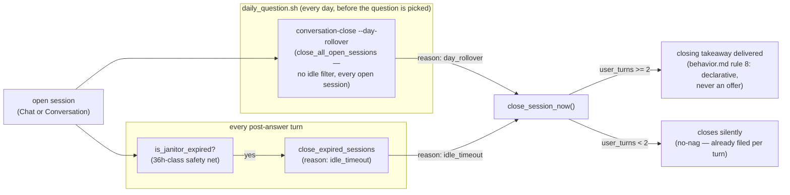

# Conversations & the Day Model

## 1. What it does & what it's for

Two different things happen to you on an ordinary day. In the morning,
the daily question arrives; you answer it in a couple of lines, the
system responds with a specific receipt and one cued follow-up, you
answer that too, and after a third light exchange the reply simply lands
and stops — no "want to keep going?", no announcement that this is
wrapping up, just a settled closing line. That's a **Chat**: short,
system-initiated, arc-carded, built around the one question of the day.
Later that same evening, something unrelated is on your mind — a memory
your commute jogged loose, nothing to do with this morning's question —
and you just start typing. The system opens a longer session, runs the
full interviewer arc instead of the compressed three-exchange shape, and
when it eventually closes, it closes with a narrative takeaway instead of
a light one. That's a **Conversation**. You never have to know which mode
you're in; you never have to tell the system when either one is over —
you just stop typing, or the day itself ends and the boundary catches
every open thread on its own.

That "the day itself ends" part is the mechanism this page is really
about. Before the day model, whether a session was still "open" was a
per-mode idle-timer question — did enough silent minutes pass? That broke
in an obvious way: a Chat you meant to finish tomorrow morning would
either linger open for hours past when it should have, or get cut off by
a timer mid-thought. Now the day itself owns the boundary: every open
session — Chat or Conversation — closes at the daily rollover, right
before the day's new question is even picked, regardless of how recently
you were typing. The idle timers still exist, but only as a generous
safety net for a session abandoned outright, never as the everyday close
trigger.

That's the job of this feature: give the author two session shapes suited
to two different kinds of exchange, and give both of them one shared,
predictable closing rhythm — the day — instead of a timer that has to
guess when you're really done.

## 2. The nouns

This page relies entirely on the ratified nomenclature already defined
once in the [Glossary](glossary.md) — **[Interaction](glossary.md)**,
**[Chat](glossary.md)**, **[Conversation](glossary.md)**,
**[Arc card](glossary.md)**, and **[Session](glossary.md)** — rather than
redefining any of them here. What this page adds is the machinery
underneath those definitions:

**The Conversation Interaction** is the [Interaction](glossary.md) that
governs both Chat and Conversation mode — one behavior contract
(`interactions/conversation/prompt/behavior.md`), one context recipe
(`context/manifest.md`), one set of lifecycle knobs
(`interaction.yaml`), covering both `mode: "chat"` and `mode:
"conversation"` sessions. A **session document**
(`state/conversations/<session_id>.json`) is the durable record of one
bounded run — its `mode`, `channel`, ordered `turns`, and eventual `close`
block. `session_id` is dated by construction: `conv-YYYYMMDD-HHMMSS-<6
hex>` (UTC), so filenames sort chronologically and the date a session
opened is legible from its id alone without opening the file.

**Close reasons** are one of four fixed values
(`VALID_CLOSE_REASONS`): `done` (an explicit close), `idle_timeout` (the
janitor sweep, below), `exit_taken` (the user took a declined/exit path),
and `day_rollover` — the mechanism this page centers on.

**The janitor** is a mode-independent, 36-hour-class safety sweep for
sessions nobody ever properly closed — abandoned, not merely idle. It is
explicitly *not* a user-facing idle timer anymore (see §3); it exists so
an orphaned session can't accumulate forever, nothing more.

**Day rollover** is the deterministic event, run once per day as a
pre-question step, that closes **every** currently-open session —
Chat or Conversation, however recently active — with `close_reason:
"day_rollover"`. It is the real close lifecycle for ordinary sessions;
the janitor is only its backstop.

**Turn shape** (`decide_turn_shape()`) is the deterministic decision,
computed fresh for every turn, of whether *this* turn carries the
system's own initiative (a cued follow-up question) or is a pure
receiving turn with no question. It has three positions — `opening`,
`mid_arc`, `past_target` — walked in §4.

Shared vocabulary this page relies on without redefining:
**[The Loop](glossary.md)** is defined in the
[Glossary](glossary.md); the declarative-close doctrine this page
describes mechanically is the *behavior* half of one rule —
`interactions/conversation/prompt/behavior.md`'s rule 8 — which this page
references rather than embeds (per `docs/index.md`'s own distinction: an
Interaction page embeds its behavior.md because the documentation *is*
the prompt there; this page is the mechanism half, not the prompt itself).

## 3. How it works

**Turn shape decides initiative, per turn, deterministically.** Every
turn `decide_turn_shape()` runs against the session's own turn count and
the `knob.chat_target_exchanges` knob (§4) — no AI call needed for this
part. This is what makes the "~3 exchanges" framing in `behavior.md`'s
Defaults section true in practice: the budget silently governs whether
*the system* asks another question, never whether the user can keep
going. Past the target, the turn simply receives and pays out with no
question attached — there is deliberately no separate "offer to stop"
turn type (pure-chat wave, issue #139): reply-is-consent means the budget
needs no announcement, and behavior.md rule 8 forbids narrating the
ending anyway.

**The day owns the close, not a timer (design §D, "Chats-per-Focus",
2026-08-12).** Before this design, `chat_idle_timeout_minutes` /
`conversation_idle_timeout_minutes` were real user-facing idle timers —
short enough (originally roughly 2h chat / 30m conversation, per the
functions' own now-superseded parameter defaults) to actually end a
session mid-day. The `day-rollover-close` change (issue #136, v161)
replaced that with two independent mechanisms:

1. **`daily_question.sh`'s pre-question step** calls
   `conversation-close --day-rollover` — after the wiki compile, before
   `ask.py` picks the day's question — closing every open session with no
   idle filter at all. The day boundary itself is the trigger.
   `is_prior_local_day` (the platform's parity spec) is *the* day
   boundary check; the OSS shell step is this same event's canonical
   source.
2. **The idle knobs were raised to day-scale** (1440 minutes = 24 hours)
   and demoted to a different job: no longer "close this session," but
   "is this still the current open session for continuation purposes" —
   a generous ceiling, never a UX trigger.

The **janitor** (`is_janitor_expired`, `knob.janitor_idle_hours`) is the
actual safety net day rollover doesn't replace: a mode-independent sweep
for a session abandoned outright — device lost, app closed mid-thought,
whatever never comes back to trigger its own day boundary. It runs at the
top of every post-answer turn and via `conversation-close --expired`, and
it is explicitly *not* user-facing — nobody experiences the janitor as a
close, the way they might once have experienced an idle timeout.



**Closing itself is one function regardless of what triggered it** —
`close_session_now()` runs identically whether the reason is `done`,
`idle_timeout`, `exit_taken`, or `day_rollover`; only the `reason` string
differs. What it always does: decides whether a takeaway is warranted
(§4), files engagement signals back to the quality profile (see
[Quality & Engagement Profile](quality-profile.md#3-how-it-works)), and —
if the session's turns produced a classifier-grade extraction — supersedes
whatever template candidates were standing in for it (issue #117's
`candidate_ideas` → `superseded` handoff, covered from the candidate side
by [Question Candidates §2](question-candidates.md#2-the-nouns)).

## 4. The algorithm

### Turn shape

```
user_turns = count of turns with role == "user" already in the session
target     = knob.chat_target_exchanges

position         = "opening"   if user_turns <= 1
                    "mid_arc"   if 1 < user_turns < target
                    "past_target" otherwise

question_allowed = (a follow-up was planned) AND (user_turns < target)
```

computed by `decide_turn_shape()`. With the shipped default
(`knob.chat_target_exchanges: 3`, read from `interactions/conversation/interaction.yaml`
— a YAML lifecycle knob, not a `system/` Python module attribute, so it
falls outside this harness's `module.CONSTANT` parity grammar exactly
like the band cutoffs `question-candidates.md`/`focuses.md` note for
their own function-literal numbers; verified here by direct reading of
the shipped `interaction.yaml`), the progression across one Chat's
exchanges is:

| `user_turns` (before this turn) | `position` | `question_allowed`? |
|---|---|---|
| 0 | `opening` | yes |
| 1 | `opening` | yes |
| 2 | `mid_arc` | yes (2 < 3) |
| 3 | `past_target` | no (3 < 3 is false) |
| 4+ | `past_target` | no |

The exchange budget governs *our* initiative only — a user who keeps
typing past `user_turns == 3` keeps getting received and paid out
(register-matched, receipted) turns indefinitely; the system simply stops
introducing new questions of its own. Nothing about the session closes at
this point — that's a separate, later, declarative event.

### The day-rollover close

`close_all_open_sessions()` (the day-rollover engine) takes no idle
filter at all — every session `find_open_sessions()` returns, gets closed
with `reason: "day_rollover"`, full stop. This is a deliberate contrast
with `close_expired_sessions()` (the janitor path), which filters through
`is_janitor_expired()` first:

```
is_janitor_expired = (now - last_activity) >= janitor_idle_hours   # default 36
```

Both paths converge on the same `close_session_now()` takeaway
criterion, regardless of which one triggered the close:

```
takeaway delivered  if user_turns >= 2
closes silently     otherwise (no-nag: whatever was said is already filed per turn)
```

`user_turns >= 2` is a literal inside `close_session_now()`, not a named
module constant — cross-runtime confirmed (the commit that shipped it
notes the hosted platform's own engine enforces the identical rule) but,
per this site's convention for load-bearing function-literal numbers,
verified here by direct reading rather than a parity annotation; this
page's PR adds it to the running list on
[lifehug#160](https://github.com/lifehug/lifehug/issues/160).

Two scalar constants in `conversation.py` *are* plain Python module
attributes and do carry real parity annotations: the session schema
version is
1 <!-- parity: conversation.SESSION_VERSION = 1 -->, the arc-card
container schema version is
1 <!-- parity: conversation.ARC_CARDS_VERSION = 1 -->, and the
context-assembly budget truncation approximates
4 <!-- parity: conversation.CHARS_PER_TOKEN = 4 --> characters per token
(a contract-pinned approximation, not a tokenizer call — cheap and
deterministic on purpose, since context assembly runs on every turn).

### The shipped lifecycle knobs

All read from `interactions/conversation/interaction.yaml` at runtime
(`load_interaction_manifest()`), none of them Python module scalars and
so none parity-annotatable by this harness — quoted here from the shipped
file directly, current as of the 2026-08-12 day-scale revision:

| Knob | Value | What it governs |
|---|---|---|
| `knob.chat_target_exchanges` | 3 | Turn-shape target, above |
| `knob.chat_idle_timeout_minutes` | 1440 (24h) | Continuation-check ceiling only — not a close trigger |
| `knob.conversation_idle_timeout_minutes` | 1440 (24h) | Same, for Conversation mode |
| `knob.conversation_turn_cap_exchanges` | 25 | Hard cap on a single Conversation's exchange count |
| `knob.janitor_idle_hours` | 36 | The actual abandoned-session safety net |
| `knob.grief_deferral_days` | 60 | Fresh-upheaval deferral window (behavior.md rule 5) |
| `knob.router_confidence_threshold` | 0.7 | Router intent-confidence floor |

Both idle-timeout knobs read identically at 1440 minutes — the "day-scale"
name is literal: they're wide enough that day rollover always closes a
session first in ordinary use, leaving the idle knobs to matter only as a
continuation-check ceiling, exactly as §3 describes.

### Worked example

An author opens the app at 8am, answers the daily question, and the
system asks one cued follow-up. They answer that too, then go quiet for
the rest of the day.

1. **Turn 1** — `user_turns = 0` before this turn → `opening`,
   `question_allowed = true` (0 < 3). The system's follow-up is asked.
2. **Turn 2** — `user_turns = 1` → still `opening` (`user_turns <= 1`),
   `question_allowed = true` (1 < 3). One more cued follow-up.
3. The author answers turn 2's follow-up (now `user_turns = 2`) and stops
   typing. No third exchange happens today.
4. **That night, `daily_question.sh` runs its pre-question step** before
   tomorrow's question is picked: `conversation-close --day-rollover`
   finds this session still `status: "open"` (nothing about it hit the
   janitor's 36-hour bar — it's been active all day) and closes it with
   `reason: "day_rollover"` regardless.
5. **Takeaway decision** — `user_turns = 2`, and `2 >= 2`: a closing
   takeaway is generated and delivered — a specific appreciation, a
   continuity line, a named hook for next time, ending on the peak with
   no trailing question (behavior.md rule 8's shape) — even though the
   author never explicitly said they were done. Had the author only
   answered turn 1 and gone quiet (`user_turns = 1`), the same rollover
   would have closed the session **silently**: `1 >= 2` is false, and a
   one-turn session has nothing worth a takeaway on top of what's already
   durably filed.
6. **Tomorrow** — a new question, a new day-scoped session. The old
   session's takeaway, if any, is durable history; nothing about today's
   open thread carries an implicit continuation the author has to
   consciously close first.

## 5. In the loop

**What feeds it:** every user message, in either mode, plus whatever the
weekly/monthly loops pre-planned into an [Arc card](glossary.md) for the
day's question — a Chat's opening framing and follow-up intents are
never improvised live; a Conversation not tied to a specific queued
question runs the interviewer arc directly.

**What it feeds:** the quality/engagement profile (every close writes
engagement signals — see [Quality & Engagement Profile](quality-profile.md)),
the candidate buffer (a closing session's classifier-grade extraction can
supersede template candidates — see
[Question Candidates](question-candidates.md#2-the-nouns)), and,
separately, whatever entity hints a session surfaces for the weekly
classification pass to pick up.

**How it self-improves:** nothing about the day-model mechanism itself
adapts — it's deterministic on purpose, the same shape every day. What
improves turn over turn is upstream of this page: the arc cards a Chat
executes are planned fresh every week from the freshest timeline gaps,
neighborhood siblings, and quality/engagement signals (see
[Neighborhoods §5](neighborhoods.md#5-in-the-loop) and
[Quality & Engagement Profile §5](quality-profile.md#5-in-the-loop)), so
the *content* a session runs against gets better even though the
open/close mechanism this page documents stays fixed.

**Classification (Convergence Principle):** the day model is
infrastructure the Interaction pattern's floor depends on, not itself a
separate floor/accelerator choice — every session, in either mode, closes
predictably regardless of whether the author ever manually says "done."
The mechanism has no accelerator half of its own; the *content* layered
on top of it (personalized arc cards, quality-profile-informed pacing) is
where the accelerators this page's siblings describe actually live.

## 6. Where it lives

| Concern | Location |
|---|---|
| Session documents | `state/conversations/<session_id>.json` |
| Arc card container | `state/arc_cards.json` |
| Session CRUD | `conversation.py` — `open_session()`, `load_session()`, `list_sessions()`, `append_turn()`, `close_session()` |
| Manifest + context assembly | `conversation.py` — `load_interaction_manifest()`, `assemble_context()` |
| Turn shape | `conversation_delivery.decide_turn_shape()` |
| Day rollover | `conversation_delivery.find_open_sessions()`, `close_all_open_sessions()` |
| Idle janitor | `conversation_delivery.is_janitor_expired()`, `find_expired_open_sessions()`, `close_expired_sessions()` |
| Unified close | `conversation_delivery.close_session_now()`, `_deliver_closing()` |
| Behavior contract (embedded, not this page) | `interactions/conversation/prompt/behavior.md` — rule 8 is the declarative-close doctrine this page's mechanism serves |
| Lifecycle knobs | `interactions/conversation/interaction.yaml` |
| CLI | `lifehug.py conversation-open \| conversation-status \| conversation-record-turn \| conversation-close [--expired \| --day-rollover [--dry-run] \| --session-id ID --reason R] \| conversation-turn-retry \| conversation-turn-prompt \| conversation-router-prompt \| conversation-arc-prompt \| conversation-closing-prompt \| conversation-lint` |
| Daily wiring | `daily_question.sh` — day-rollover pre-question step (`conversation-close --day-rollover`), non-fatal on failure (`record_learning_failure`) |
| Guard tests | `tests/test_v150_conversation_store.py`, `tests/test_conversation_delivery.py`, `tests/test_conversation_close.py`, `tests/test_conversation_router.py` (repo-verify exact names before citing in a PR) |

**Change-safely notes.** `close_session_now()` is the one function every
close path (`done`, `idle_timeout`, `exit_taken`, `day_rollover`) must
route through — a future close trigger that bypasses it would silently
skip engagement filing and candidate supersession. `is_janitor_expired`
and day rollover are independent checks reading the same
`_last_activity()` helper but different thresholds; a future change to
one must not assume it subsumes the other — day rollover has no idle
filter at all, by design. `VALID_CLOSE_REASONS` in `conversation.py` and
its mirrored validation in `jobs.py` must stay in lockstep — a new close
reason added to one without the other fails the job-enqueue path, not the
direct call.

**The hosted platform's N-tabs twin.** The platform ports this same
day-scoped session model into its Today surface as **N day-scoped tabs**
— one tab per day-scoped session, with an explicit-binding "+" affordance
for opening a new one — rather than the OSS single-thread-per-day CLI
model. See
[`lifehug-platform` PR #464](https://github.com/lifehug/lifehug-platform/pull/464)
(review-loop: Today session tabs) for the twin; the day-rollover close
semantics this page documents are the shared parity spec both runtimes
implement against.

## 7. Decisions

- [ADR 0006 — The Convergence Principle](https://github.com/lifehug/lifehug/blob/main/docs/adr/0006-convergence-principle.md) — the classification §5 applies to this page's mechanism.
- [ADR 0007 — The Question-Judgment Interaction](https://github.com/lifehug/lifehug/blob/main/docs/adr/0007-question-judgment-interaction.md) — the Interaction pattern this page's Conversation Interaction shares in shape, not in behavior.
- `interactions/conversation/README.md` — the full owner-ratified nomenclature (§2), the four research phases behind the behavior contract (§3), and the Phase 1–3 owner rulings §3/§4 of this page draw on (the ~3-exchange target governs system initiative only; nourishment over engagement; zero-friction measurement).
- The day-rollover close design: issue #136 (v161, "day-rollover session close, Chats-per-Focus design §D") and issue #139 ("pure-chat close" — declarative closes, no exit-offer ceremony, v162) — the two changes this page's §3 walks in sequence.
- The hosted platform's N-tabs twin and review-loop contracts: [`lifehug-platform` PR #464](https://github.com/lifehug/lifehug-platform/pull/464), [docs/BUILDING.md](https://github.com/lifehug/lifehug-platform/blob/main/docs/BUILDING.md), [docs/REVIEWING.md](https://github.com/lifehug/lifehug-platform/blob/main/docs/REVIEWING.md) (external repo — platform orchestrates this package, never forks it).
