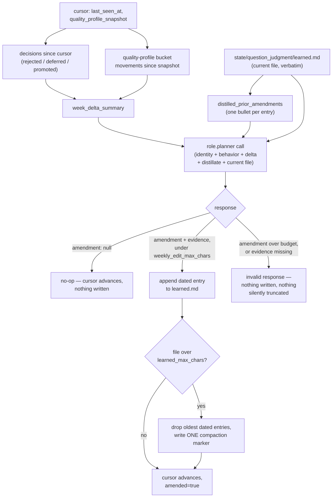

# Decisions & Learning

## 1. What it does & what it's for

Every week, the owner (or any user) makes real decisions on the review
surface: promote this candidate, dismiss that one, defer this other one,
sometimes with a reason typed alongside. Before
[ADR 0009](https://github.com/lifehug/lifehug/blob/main/docs/adr/0009-decisions-feed-the-loop.md),
every one of those decisions was recorded and then never read again by
anything — worse, the reason text a human typed while dismissing a
candidate physically overwrote the *generator's own* provenance text on
the same field, so a candidate's history could show why it was proposed
*or* why it was rejected, never both. This page is the mechanism that
fixed that: the owner's decisions are now a real, bounded, auditable
input to next week's judgment rubric, and the two kinds of "reason" a
candidate can carry are two different fields that can never collide
again.

The main use case: an owner dismisses three candidates in one week, each
because they were vague, self-directed "why" questions the owner clearly
doesn't want more of. They never write a rule anywhere. The following
Monday, `weekly_maintenance.sh`'s `judgment_update` step reads that
week's dismissals, notices the pattern, and — if the evidence genuinely
supports it — writes one short, dated, evidence-cited paragraph to
`state/question_judgment/learned.md`. From then on, every future
candidate-generation call reads that paragraph alongside the rubric
itself, and the *next* generated batch is a little less likely to propose
another vague self-directed "why" question. The owner never opened a
settings page or wrote a rule; they just made ordinary promote/dismiss
decisions, and the system noticed the pattern in them.

## 2. The nouns

**`decision_reason`** — the field an owner's promote/dismiss/defer text
writes to (`question_candidates.update_candidate()`), introduced by ADR
0009's field-overwrite fix. The generator's own **`reason`** field (set
once, at candidate-creation time, by `classify_story.py`,
`research_expand.py`, or `harvest_wiki_questions`) is never touched again
after creation. The CLI flag stays `--reason` for backward compatibility
— only which field it writes to changed. **No migration**: candidate
records where the historical collision already happened (a decision's
text sitting in `reason`, the true provenance lost) are left exactly as
they are; there is nothing to recover, and a plausible-looking
back-filled provenance string would be worse than an honest gap.

**Owner Judgment Signals** — the prompt block
`owner_judgment_signals_block()` renders from
`build_decision_context(limit=15)`: the most recent human decisions
(`DISMISSED`/`DEFERRED`/`PROMOTED`, newest first, `auto_promoted` rows
excluded by construction — a different status value, not an extra
filter), each with its text truncated to 120 characters and its
`decision_reason` (or a `promoted_by` note when no reason was given).
Injected into **both** `classify_story.build_prompt` and
`research_expand.build_expansion_prompt`, via the same loader seam [The
Interaction Pattern](interactions/) established for the judgment rubric
itself. Empty history omits the block entirely — never an empty heading.
The instruction is deliberately about the *pattern* ("candidates matching
the pattern of recent dismissals must not be re-proposed"), not a literal
blocklist — the existing near-duplicate Jaccard machinery
([Question Candidates](question-candidates.md) §4) already suppresses
exact re-proposals; this teaches the generator the shape of what the
owner doesn't want.

**The cursor** — `state/question_judgment/last_edit.json`: a timestamp,
running counts, and a snapshot of the quality profile's per-story-function
multipliers at the last edit. This is what makes each week's **delta**
well-defined: decisions whose `updated_at` is after the cursor's
`last_seen_at`, plus how far the multipliers have moved since the
snapshot.

**The distillate** — a short, one-bullet-per-entry summary of every prior
`learned.md` amendment, assembled separately from the raw file itself.
The weekly RUBRIC-EDIT template takes both as distinct inputs — the
distillate so the model doesn't repeat or contradict a prior amendment,
the raw file so it can see exactly what's already written.

**The no-op edit** — a `{"amendment": null, "reason": "..."}` response,
or an empty delta short-circuited before any model call is made at all.
This is a first-class, expected outcome, not a failure — most weeks
should produce no amendment.

Shared vocabulary this page relies on without redefining:
**[Question-Judgment interaction](interactions/question-judgment.md)**'s
`prompt/behavior.md` rubric, priority vocabulary, and penalty vocabulary
are defined on that page; this page covers only the learning mechanism
layered on top of it.

## 3. How it works: the weekly rubric-edit runtime

`question_judgment.run_weekly_edit()` is the accelerator engine [ADR
0007](https://github.com/lifehug/lifehug/blob/main/docs/adr/0007-question-judgment-interaction.md)
declared and [ADR 0009](https://github.com/lifehug/lifehug/blob/main/docs/adr/0009-decisions-feed-the-loop.md)
wired. Run weekly, immediately after `quality_update` and before
`auto_promote` (see [The Loop](the-loop.md) §4) — that ordering matters
both ways: this week's freshest quality-profile snapshot is what the
delta compares against, and this run's own edit does *not* affect this
run's classification, since `classify-story` already ran earlier in the
same weekly pass (or independently, mid-week, via manual/keyless
ingest). The amendment a run produces is read by *next* week's
generation prompts — an accepted, one-run lag, not a defect, mirroring
[Focus Autopilot](focuses.md)'s own one-run lag for the same reason
(re-running an earlier step after a later one writes new state is out of
scope for the weekly rhythm).

**Two committed evals fixtures** exist for this mechanism specifically
(`interactions/question_judgment/evals/goldens/`): a JUDGE-mode
structural/lint fixture (no JUDGE runtime exists yet, per [Question
Judgment](interactions/question-judgment.md) §2's "said honestly" note),
and a RUBRIC-EDIT fixture that `tests/test_decisions_feed_loop.py`
exercises end-to-end through `run_weekly_edit(from_response=...)`,
proving the bounded-amendment/evidence-line/compaction contract against a
real call shape, not just a schema check.

**File-cap compaction stays mechanical.** On overflow, the runtime drops
the *oldest* dated entries and writes exactly one bare
`## YYYY-MM-DD (compacted YYYY-MM-DD: N earlier amendments folded)`
marker in their place — it never tries to summarize what it dropped. The
RUBRIC-EDIT prompt is told to fold going forward (the distillate sees the
compaction marker like any other entry); the code only ever mechanically
drops.

**Keyless machines never invent an amendment.** The `--emit-task`/
`--from-response` convention (`system/entity_roster.py`'s pattern) is the
only path when no model is available in-process — there is no
deterministic fallback that writes a plausible-looking amendment. A
keyless week with no completed agent task simply carries the open task
forward, exactly like every other keyless learning step in this system.

**`--recalibrate`** swaps the weekly delta for the FULL decision ledger
(the quarterly deep pass `knob.recalibration_cadence` names) but is
otherwise the identical apply/validate/compact path. It is a **manual
command only** — no scheduler wiring exists for the quarterly cadence as
of this page.

## 4. The algorithm

### The two hard caps

A non-null RUBRIC-EDIT response MUST carry an `evidence` line and MUST
fit under
600 <!-- parity: question_judgment.WEEKLY_EDIT_MAX_CHARS_DEFAULT = 600 -->
characters (`knob.weekly_edit_max_chars`) — either failure is an
**invalid** response (nothing written, nothing silently truncated), never
a judgment call the runtime resolves on the model's behalf. The
`state/question_judgment/learned.md` file itself is bounded to
8000 <!-- parity: question_judgment.LEARNED_MAX_CHARS_DEFAULT = 8000 -->
characters total (`knob.learned_max_chars`) — the trigger for the
oldest-entries-drop compaction §3 describes.

### Worked example

Take a plausible week: the owner dismissed two candidates
("Why do you always avoid conflict at work?" and "Why do you keep
putting off calling your sister?"), both self-directed "why" questions
about a recurring emotional pattern — exactly the shape [Question
Judgment](interactions/question-judgment.md)'s rule 8 already flags as a
hard fail (`self_directed_why`) when it reaches deterministic scoring,
but these two slipped through generation before that check ever ran.

1. **Delta assembly.** The cursor's `last_seen_at` selects both
   dismissals (`updated_at` after the cursor) plus any quality-profile
   bucket movement since the last snapshot — say, none this week.
   `week_delta_summary` reads: "Decisions since last edit (2): DISMISSED
   'Why do you always avoid conflict at work?' — matches pattern of
   avoidant self-directed why. DISMISSED 'Why do you keep putting off
   calling your sister?' — same pattern."
2. **Distillate + current file.** Say `learned.md` is empty (a fresh
   vault) — the distillate reads "No prior amendments yet."
3. **The call.** `role.planner` (high capability tier) receives identity
   → behavior → the RUBRIC-EDIT turn-instructions template with its
   `{week_delta_summary}`, `{distilled_prior_amendments}`, and
   `{current_learned_file}` slots filled.
4. **A defensible response.** Two dismissals sharing one specific pattern
   is a genuine, cited signal — the model returns a non-null amendment,
   something under 600 characters, with an `evidence` line citing both
   candidate texts.
5. **Apply.** `_apply_response()` checks the char budget and the evidence
   line, both pass, and appends `## <today>\n\n<amendment>\n\nEvidence:
   <evidence>\n` to `learned.md`. The file is well under its 8000-char
   cap, so no compaction runs.
6. **Cursor advances.** `last_seen_at` moves to now, `last_edit_at`
   records the amendment, and the quality-profile snapshot updates —
   next week's delta starts clean from here.
7. **Next week's generation** — not this week's — reads the new
   `learned.md` entry alongside the rubric, and is measurably less likely
   to generate a third self-directed "why" candidate about a recurring
   emotion. If instead the model had returned `{"amendment": null,
   "reason": "two dismissals is not yet a pattern worth a permanent
   rubric note"}`, nothing would be written and only the cursor would
   advance — an equally valid, and more common, outcome.

## 5. In the loop

**What feeds it:** the owner's promote/dismiss/defer decisions
(`question_candidates.json`'s `status`/`decision_reason`/`promoted_by`
history) and `quality_profile.py`'s weekly-aggregated bucket multipliers
— two genuinely independent signals folded into one delta. **What it
feeds:** `state/question_judgment/learned.md`, read by
`load_judgment_rubric()` into every future `classify_story`/
`research_expand` generation call — see [Question
Judgment](interactions/question-judgment.md) §5. **How it self-improves:**
this *is* the self-improvement mechanism for the judgment rubric — there
is no further meta-layer above it; the quarterly `--recalibrate` pass is
the one built-in check against drift the weekly increments might
individually miss, by re-examining the full ledger at once rather than
only the latest delta.

**Classification (Convergence Principle):** this entire mechanism is the
**accelerator** half of the pair [ADR 0006](https://github.com/lifehug/lifehug/blob/main/docs/adr/0006-convergence-principle.md)
names outright for this interaction — [Question
Judgment](interactions/question-judgment.md)'s rubric-injection-at-
generation-time is the floor (every candidate generation call reads the
full rubric unattended); this weekly pass is what turns an owner's actual
decisions into signal the loop *consumes*, never a dependency the floor
needs. A vault whose owner never reviews a single candidate still gets
well-judged generation forever, from the floor alone; a vault whose owner
does review gets the same convergence, faster, and more specifically
tuned to what that owner actually wants.

## 6. What is deliberately not learned

Two things this mechanism could plausibly have covered, and doesn't —
both worth stating explicitly, because a reader who's seen this page's
question-candidate learning loop might reasonably expect the same
pattern to repeat elsewhere in the system, and it doesn't.

**Focus recommendation weights are not calibrated on owner decisions.**
`recommend_focuses._score()`'s four weights (mention count ×1.0, unique
answers ×2.0, cross-categories ×3.0, emotional weight ×1.5 — see
[Focuses & the Autopilot](focuses.md) §4) are literal constants with no
decision-consuming counterpart to what this page describes for
candidates. This isn't an oversight this page is quietly correcting —
[lifehug#148](https://github.com/lifehug/lifehug/issues/148), the tracked
follow-up for calibrating even the *candidate* score
(`unified_quality_score()`) on the decision ledger, is explicit that
doing so needs "enough decision-ledger volume across at least one real
vault to observe an actual pattern" before it's even implementable — and
that issue is scoped to candidates, which accumulate a promote/dismiss
decision most weeks. Focus recommendations are rarer by an order of
magnitude: [Focuses & the Autopilot](focuses.md) §3/§4 shows the ideas
supply itself refreshing only monthly, autopilot approving at most one
idea per month, and a real vault dismissing a Focus idea only
occasionally. At that volume, four numeric weights recalibrated against a
handful of decisions a month would be fitting noise, not signal — the
single-owner scale this whole repo is built for (see `docs/BUILDING.md`
§2) makes this the honest, current state of the record rather than a
decided-against proposal: no ADR or issue proposes calibrating Focus
scoring weights on decisions, and this page does not recommend filing
one until real usage volume exists to justify it, exactly as
[lifehug#148](https://github.com/lifehug/lifehug/issues/148) already
argues for the candidate case that *does* have enough volume to
investigate.

**Reasons on Focus-adjacent decisions are removed by owner ruling, not
merely absent.** This is a different, stronger claim than "not yet
built" — [ADR 0010](https://github.com/lifehug/lifehug/blob/main/docs/adr/0010-focus-duplicate-curation.md)'s
"No reason context, anywhere" section states outright that the platform
removed the dismiss-reason field entirely, and the [Focus-Curation
interaction](interactions/focus-curation.md)'s own verdict schema
carries no reason/evidence/notes field either — a verdict with a fourth
key is malformed, not more thorough. This mirrors, and is narrower than,
this very page's own posture for `question_judgment`'s learned-amendments
file (§2's "no reason capture" convention is shared vocabulary across
both interactions), but for focus curation there is no learning file at
all to protect — only the settled-decision ledger described on that
interaction's own page. The owner has separately directed (platform issue
`lifehug-platform#469`) that dismiss/decision reasons eventually become
part of an ordinary conversation rather than a form field — this
system's current "no reason capture" posture across both interactions is
consistent with that direction, not a contradiction of it: nothing here
builds a reason-text field that would need to be un-built later.

## 6b. The loop learns about arcs too (v196)

The same weekly step, the same mechanism, a second subject. Questions
learn from the owner's **decisions**; arcs learn from what they actually
**yielded** — and that yield is read off data the vault already has, so
nothing new is written down to make it computable. For every arc-card
intent kind (`scene_slot`, `timeline_gap`, `sit_with`,
`neighborhood_sibling`, `studio_slot`,
`demonstrated_knowledge_summary`), `question_judgment.arc_yield()` walks
the session documents in `state/conversations/` and counts the sessions
whose card carried that kind, the filed answers those sessions produced,
the timeline placements, and the new entity mentions. A session carrying
three kinds counts toward all three — co-attribution is stated in the
block, because a difference between kinds is a *signal*, not a
measurement.

The rubric-edit call may then return an `arc_amendment` with its own
`arc_evidence`, under the same character budget and the same expectation
that most weeks the honest answer is `null`. It is appended, dated, to
`state/question_judgment/arc_learned.md` and compacted by the same
function, and `arc_planner.build_plan_prompt` composes it after the
verbatim `plan/arc-templates.md` as `## Arc judgment signals` — exactly
how `load_judgment_rubric` composes `learned.md` after the framework
rubric. The learned text never touches the framework file itself:
`update.py` would overwrite it on the next upgrade and
`tests/test_exact_file_git.py` pins its bytes.

One rule is written into the template rather than left to judgment: **a
whisper is never penalized.** Raising the timeline where it fits is not
a cost to be traded off.

## 7. Where it lives

| Concern | Location |
|---|---|
| The field-overwrite fix | `question_candidates.update_candidate()` — `decision_reason` kwarg |
| Owner Judgment Signals assembly | `question_judgment.build_decision_context()`, `owner_judgment_signals_block()` |
| The weekly rubric-edit runtime | `question_judgment.run_weekly_edit()` |
| Cursor state | `state/question_judgment/last_edit.json` |
| Learned-amendments file | `state/question_judgment/learned.md` (vault data, registered as `question_judgment_learned` in `system/vault_contract.json` — never a framework file) |
| Arc-yield pass (v196) | `question_judgment.arc_yield()`, `format_arc_yield()`, `_apply_arc_amendment()` |
| Learned ARC amendments | `state/question_judgment/arc_learned.md`, composed into the weekly arc-plan prompt as `## Arc judgment signals` by `arc_planner.arc_judgment_signals()` |
| RUBRIC-EDIT turn template | `interactions/question_judgment/prompt/turn-instructions.md` (`## Mode: RUBRIC-EDIT`) |
| CLI | `lifehug.py judgment-update [--dry-run \| --emit-task PATH \| --from-response PATH \| --recalibrate \| --model NAME]` |
| Weekly wiring | `weekly_maintenance.sh` — `judgment_update`, immediately after `quality_update` and before `auto_promote` (see [The Loop](the-loop.md) §4) |
| Guard tests | `tests/test_decisions_feed_loop.py`, `tests/test_question_judgment.py` (repo-verify exact names before citing in a PR) |

**Change-safely notes.** Any future write to a candidate's decision text
goes through `decision_reason`, never `reason` — a PR that re-introduces
a write to `reason` after candidate creation is a regression of [ADR
0009](https://github.com/lifehug/lifehug/blob/main/docs/adr/0009-decisions-feed-the-loop.md),
not a legitimate shortcut. Any future generation path that wants owner
decision signal calls `build_decision_context()` — one authoritative
assembly, not a re-derived query against `question_candidates.json`. Any
future writer to `state/question_judgment/learned.md` goes through
`run_weekly_edit()`'s validate/compact path, not a direct append. There
is deliberately no deterministic fallback that invents a rubric amendment
when no model is available, and folding decision signal into
`unified_quality_score()`'s numeric scoring is tracked but undecided
([lifehug#148](https://github.com/lifehug/lifehug/issues/148)) rather
than foreclosed — see §6.

## 8. Decisions

- [ADR 0009 — Decisions Feed The Loop](https://github.com/lifehug/lifehug/blob/main/docs/adr/0009-decisions-feed-the-loop.md) — this page's central artifact: the field-overwrite fix, the Owner Judgment Signals block, the weekly RUBRIC-EDIT runtime, the one-run lag, and the no-migration call.
- [ADR 0007 — The Question-Judgment Interaction](https://github.com/lifehug/lifehug/blob/main/docs/adr/0007-question-judgment-interaction.md) — declared the RUBRIC-EDIT slot this page's mechanism wires; the tier guide (`role.planner: high`) this page's calls use.
- [ADR 0006 — The Convergence Principle](https://github.com/lifehug/lifehug/blob/main/docs/adr/0006-convergence-principle.md) — names this mechanism outright as a concrete accelerator instance; full treatment in [The Mission & the Convergence Principle](mission.md).
- [ADR 0010 — Focus Duplicate Curation](https://github.com/lifehug/lifehug/blob/main/docs/adr/0010-focus-duplicate-curation.md) — the "no reason context, anywhere" ruling §6 cites for Focus-adjacent decisions.
- [lifehug#148](https://github.com/lifehug/lifehug/issues/148) — the tracked, undecided follow-up for calibrating candidate scoring on the decision ledger; §6's basis for why Focus scoring isn't proposed for the same treatment yet.
