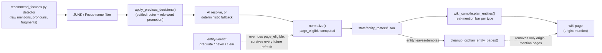

# Entities & Graduation

## Candidate research

Entity Candidate can preserve exact user-grounded research for an active typed
roster entry. Completion creates a source only: qualification, page
eligibility, Focus mapping, and owner verdicts remain unchanged until their
separate lifecycle authorities act.

## 1. What it does & what it's for

Say you've mentioned your childhood next-door neighbor, "Mrs. Alvarez," in
four different answers over the past year — sometimes by name, sometimes
as "the old woman next door," always with real texture (she taught you to
bake, she yelled at you for cutting through her yard, she left flowers on
your porch the week your dog died). You never asked for a wiki page about
her. You never will. And yet, one month from now, the monthly roster
refresh reads every answer that mentions her, notices the pronoun and the
name are the same person, folds the variants into one clean entity, judges
that she clears the bar for a real individual worth a page, and the next
compile builds `wiki/people/mrs-alvarez.md` automatically — sourced,
dated, cross-linked to the answers she came from. If instead you *already*
know Mrs. Alvarez matters — maybe you're mid-conversation with the system
about her and don't want to wait for a second mention to clear the
automatic bar — you can say so directly: `entity-verdict person
mrs-alvarez graduate` fast-forwards her page into existence right now, and
the system will never second-guess that decision on a future refresh, even
if a later AI pass would have judged her borderline. And if the roster
keeps proposing some junk fragment — a stray pronoun, a mis-parsed
phrase — as a "person" worth a page, `entity-verdict ... never` shuts it
up for good without erasing the underlying detection machinery.

That's the job of this feature: grow the wiki's cast of people, places,
periods, and objects automatically from what you've already said, and give
you two narrow, permanent overrides — graduate now, or never a page — for
the cases where automatic judgment isn't what you want.

## 2. The nouns

An **entity** is the current product/code term for any node-worthy
subject the wiki can build a page for — a
**[Node](glossary.md)** in the life graph. This page covers four of the
five roster-curated entity types: **person**, **place**, **period**, and
**object** — the fifth, **theme**, shares the same roster/verdict
machinery but its own AI-curated-keyword mechanics (v97) are a Loop detail
this page mentions only in passing; see the top-level README's
Nomenclature section for its full definition.

**The roster** (`state/entity_rosters/<type>.json`) is the settled,
curated list for one entity type — the output of `entity_roster.py`'s
resolution step. Each entry carries `name`, `slug`, `aliases`, `qualifies`
(does this meet the type's bar for being a real thing of that type at
all), `maps_to_focus` (is this already a [Focus](glossary.md) rather than
a bare mention-graduated entity), `score`/`unique_answers` (carried over
from the raw detector stats), `page_eligible` (the computed verdict this
page's §4 derives), and — only when the owner has spoken — `owner_verdict`.
**The roster is the settled-identity store** (ADR 0012's framing, reused
by ADR 0013): there is no parallel ledger anywhere for entity identity or
graduation decisions.

**Candidate research** is a separate immutable source about one still-pending
roster entry (ADR 0020), never a roster verdict. Exact raw user-turn spans must
cover the entity usefulness rubric and include concrete material; the author
must explicitly confirm the exact ready assessment. Model summaries and
generated seed questions are not evidence. The source preserves identity and
state revisions so a rename, mapping, verdict, graduation, or tombstone is
revalidated rather than silently redirected.
The evidence minimum is 2 spans for person and object candidates, and 3 spans
for place, period, and theme candidates; every type also needs concrete material.

**Qualifying** is the type-specific bar for "is this a real thing of this
type at all," independent of frequency: a person must be a real, distinct,
identifiable individual (not a pronoun, role, or place); a place must be a
real named location; a period a real life era; a theme a genuine recurring
subject; an object must be judged **symbolic** — carrying real meaning in
the author's story (the cleats he couldn't afford, the stained orange
shorts) — never a mundane prop, and never gated by frequency at all.

**JUNK** and **ROLE_WORDS** are two fixed exclusion lists `entity_roster.py`
filters candidates against before they ever reach a prompt or a
deterministic fallback. `JUNK` is pronouns, fragments, and detector
artifacts ("You", "Something", "The Outside") that are never real entities
regardless of type. `ROLE_WORDS` is person-only: generic kinship/relation
labels ("mom", "boss", "grandma", "coach") that never earn their *own*
page as a bare role — they either fold into a proper name (below) or stay
unqualified.

**Settled decisions and the fold.** Every roster refresh re-reads the raw
detector candidates and asks the AI (or a conservative deterministic
fallback with no model) to resolve them fresh — but a *previous* roster's
identity decisions are never simply overwritten. `apply_previous_decisions()`
folds each new raw entry back onto whichever previous entry it matches
(by name, slug, or alias), so a name that was correctly merged last month
stays merged this month even if the AI's fresh pass would have split it
differently. **Role-word promotion** is the one place a previous decision
*is* allowed to change: if last month's canonical entry was a bare role
word ("Grandma") and this month's material supplies that same person's
actual name, the proper name wins as the new canonical `name` and the role
word demotes to an alias — a role word is a placeholder, never a settled
identity, so the moment a real name is available it should win, even
though the general rule is "never re-split, never rename."

**`owner_verdict`** (ADR 0013) is the one kind of decision stronger than
anything above: a permanent fact on a roster entry that neither the AI nor
`apply_previous_decisions()`'s ordinary folding can ever remove, override,
or drop — see §4.

Shared vocabulary this page relies on without redefining:
**[Node](glossary.md)**, **[Node Type](glossary.md)**,
**[Focus](glossary.md)**, and **[The Loop](glossary.md)** are defined once
in the [Glossary](glossary.md).

## 3. How it works

Resolution and graduation are two separate steps, on the same monthly
clock but different scripts.

**Resolution** (`entity_roster.py --type <t> --resolve`, or the AI/keyless
paths behind it) reads the raw detector candidates
(`recommend_focuses.py`'s pattern-watcher — the same stats feed
[Focuses](focuses.md#3-how-it-works) reads for its own recommendation
scoring), filters out `JUNK` and pre-existing Focus names, folds them
through the previous roster's settled decisions, and either calls the AI
with a type-specific prompt (`build_prompt()`) or falls back to a
conservative deterministic pass with no alias merging beyond what the
fold already carried forward. Objects have no detector at all — the AI
reads excerpted answer bodies directly (`answer_excerpts()`) and proposes
symbolic candidates from the text itself, since "is this object
meaningful" isn't a pattern a frequency-based detector can find.
`normalize()` then computes each entry's `page_eligible` (§4) and writes
the roster.

**Graduation** happens at compile time, not at resolution time —
`wiki_compile.plan_entities()` walks every `page_eligible`, unmapped
roster entry, counts its **real mentions** (answers/sources that actually
name it, not the roster's own detection stats) against a type-specific
minimum (§4), and only builds a page once that bar clears. This split
matters: an entity can be `page_eligible` on the roster for months before
it ever earns enough real, citable mentions to justify a page — resolution
judges "is this worth a page at all," compile judges "do we actually have
enough material to write one yet."

**Cleanup runs on every compile too.** When an entity leaves the roster
entirely, gets remapped to a Focus, or is demoted below its type's
threshold, `cleanup_orphan_entity_pages()` removes its previously-compiled
page — but only pages whose frontmatter says `origin: mention` (a
Focus-owned or hand-authored page is structurally untouchable), and only
for a type whose roster file actually exists and has entries (no roster
signal is read as "never delete," never as "delete everything"). Deletion
is safe because these are compiled artifacts in a git repo, not source —
recoverable by definition.



## 4. The algorithm

### Base eligibility (before any owner verdict)

`base_page_eligible()` is the one authoritative formula — both
`normalize()` and `entity_verdict.py`'s `clear` recompute call it, so
there is never a second copy of this rule to drift out of sync:

```
person:                qualifies AND maps_to_focus is None AND score >= min_score AND answers >= min_answers
place/period/object/theme:  qualifies AND maps_to_focus is None
```

People are the noisiest raw detections (pronouns, fragments, partial
names constantly misfire), so they alone carry a score/answer-count bar
on top of the AI's `qualifies` judgment. The other four types trust the
AI's (or, keyless, the conservative deterministic fallback's) `qualifies`
call directly — the real "needs a few mentions" bar for those types is
enforced downstream, at compile time, against actual citable material,
not against the roster's own noisy detection stats.

**Default thresholds**, per type (`THRESHOLDS`, overridable per-vault via
`config.yaml`'s `<type>_page_min_score` / `<type>_page_min_answers`):

| Type | `min_score` | `min_answers` |
|---|---|---|
| `person` | 8.0 | 2 |
| `place` | 6.0 | 2 |
| `period` | 6.0 | 2 |
| `object` | 0.0 | 1 |
| `theme` | 6.0 | 2 |

`THRESHOLDS` is a module-level dict, not an individually parity-annotatable
scalar under this site's `module.CONSTANT = scalar` grammar — like
`focuses.md`'s treatment of `roadmap.TIER_TARGETS`, this table is verified
by direct reading. Only `person`'s pair is actually consumed by
`base_page_eligible()`'s gate above; the other rows exist for
config-override plumbing and are read by nothing in the base-eligibility
formula itself — object's `(0.0, 1)` pair is a visible tell that objects
are never score-gated at all, consistent with "judged by resonance, not
frequency."

### Real-mention bars at compile time

`wiki_compile.plan_entities()` requires this many real mentions
(answers/sources that actually name the entity or one of its aliases)
before a page-eligible entity earns its page:

| Type | Minimum real mentions |
|---|---|
| `person` | 1 |
| `place` | 2 |
| `period` | 2 |
| `object` | 1 |

`_ENTITY_MIN_MENTIONS` is likewise a module-level dict — verified by
reading, not parity-annotated. `RELATIONSHIP_MIN_MENTION_ANSWERS` (a
separate, scalar module constant governing the dyadic relationship-edge
path, not the node-graduation path this page covers) is
2 <!-- parity: wiki_compile.RELATIONSHIP_MIN_MENTION_ANSWERS = 2 -->.

### Owner verdicts (ADR 0013)

`entity-verdict <type> <slug> graduate|never|clear` writes one of two
permanent facts onto a roster entry, enforced in both `normalize()` (fresh
computation) and `apply_previous_decisions()` (folding across refreshes):

- **`graduate`** — `page_eligible` forced `true`, regardless of
  score/answer thresholds. **Refused outright** if the entity is already
  `maps_to_focus`-mapped (a mapped entity already has a home; the CLI
  raises before writing anything). Compile's real-mention bar drops to
  **>= 1** for a graduated entity, whatever its type's normal bar is —
  but **the floor under that is absolute: zero real mentions still means
  no page**, verdict or not. A page always needs at least one real
  source; `graduate` fast-forwards past a frequency bar, never past
  having no material at all.
- **`never`** — `page_eligible` forced `false`, permanently. This is
  entirely about the *page*, never the *identity*: the entity **stays on
  the roster**, attribution and alias folding continue exactly as before,
  so a future mention of the same person still resolves to the same
  canonical entry. It simply never gets a standalone page, and the
  candidates lane stops proposing it.
- **`clear`** — returns to fully automatic: drops `owner_verdict` and
  recomputes `page_eligible` via the same `base_page_eligible()` formula
  above, as if no verdict had ever been set.

**Survival across refreshes.** A verdict is folded onto its entry by
`apply_previous_decisions()` on every subsequent refresh — including one
whose raw AI output tries to re-qualify or re-disqualify the entity, and
including a refresh that **drops the entity from its candidate list
entirely** (a low- or zero-scoring owner-graduated entity may not even
reach the prompt). In that last case, the previous entry — verdict intact
— is carried forward into the new roster regardless, because the roster
*is* the settled-identity store and a verdict is never contingent on one
refresh's raw output happening to mention the entity again.

### Worked example (synthetic — invented names, never real vault data)

Take a fictional author whose grandmother is referred to two different
ways across their answers: sometimes as "Grandma," sometimes by her name,
"Nell Whitcombe."

1. **Month 1 resolution** — the raw detector surfaces both `"Grandma"`
   (12 mentions, several answers) and `"Nell Whitcombe"` (3 mentions) as
   separate person candidates. The AI recognizes they're the same
   individual and returns one entry: `name: "Grandma"` (the more frequent
   form), `aliases: ["Nell Whitcombe"]`. `normalize()` checks
   `base_page_eligible`: `qualifies=true`, unmapped, `score=9.2 >= 8.0`,
   `unique_answers=6 >= 2` → `page_eligible: true`.
2. **Compile** — `plan_entities()` counts real mentions across both the
   name and its alias: well over the person bar of `1`. A page is built:
   `wiki/people/grandma.md`.
3. **Month 2 resolution** — the author has since answered a question that
   uses "Nell Whitcombe" prominently. `apply_previous_decisions()` matches
   the new raw entry to the previous entry (via the shared alias key),
   and **role-word promotion fires**: the previous canonical name,
   `"Grandma"`, is a bare kinship word (`"grandma"` is in `ROLE_WORDS`),
   and the raw material supplies a proper name for the same person — so
   the proper name wins. The folded entry's canonical `name` becomes
   `"Nell Whitcombe"`, with `"Grandma"` demoted into `aliases`.
4. **Compile again** — the entity's `slug` changes (`grandma` →
   `nell-whitcombe`). The next `cleanup_orphan_entity_pages()` pass finds
   `wiki/people/grandma.md` is `origin: mention` and no longer among the
   roster's page-eligible slugs, and removes it; `plan_entities()` builds
   `wiki/people/nell-whitcombe.md` in its place, carrying every mention
   under either name.
5. **The owner steps in** — before month 2's refresh even runs, suppose
   the author already knows Nell Whitcombe matters and doesn't want to
   wait: `entity-verdict person grandma graduate` (the slug at the time)
   would have forced `page_eligible: true` immediately, and — per the
   survival rule above — that verdict rides along through the role-word
   promotion in step 3 onto the renamed `nell-whitcombe` slot, because
   `apply_previous_decisions()` folds `owner_verdict` onto the matched
   slot regardless of what else changes about the entry.

That's the mechanism in miniature: identity resolution (fold, role-word
promotion) and page eligibility (score/mentions, or an owner verdict) are
two independent layers, and an owner's settled call rides safely through
whatever the identity layer does underneath it.

## 5. In the loop

**What feeds it:** `recommend_focuses.py`'s raw detector stats (every
answer, source, and classification record — the same raw material
[Focuses](focuses.md#5-in-the-loop) reads independently for its own
recommendation scoring), plus, for objects, excerpted answer bodies read
directly.

**What it feeds:** compiled wiki pages (`wiki/people/`, `wiki/places/`,
`wiki/periods/`, `wiki/objects/`) and, downstream, everything that reads
those pages — research-expansion prompts, artifact drafting, the entity's
own future mention resolution (a page-worthy entity's canonical name and
aliases are exactly what `_entity_keys()` matches future raw detections
against).

A completed `entity_candidate` research source supplies citable material only
after the matching roster entry independently becomes page-eligible. This
works for person, place, period, object, and theme, including the types whose
ordinary real-mention bar is higher than one source: the completed research
already proved its own per-type multi-span minimum. It never sets
`page_eligible`, `qualifies`, `maps_to_focus`, or `owner_verdict`, so automatic
graduation and the owner's accelerate/veto pair remain unchanged.

**How it self-improves:** every monthly refresh sees a strictly settled
starting point (the previous roster's folded identities and any owner
verdicts) rather than starting from raw detections cold — so identity
resolution gets *more* stable over time, not noisier, even as the raw
detector keeps surfacing the same ambiguous fragments every month.

**Classification (Convergence Principle):** automatic graduation from
mentions is this feature's **floor** — ADR 0013 says so explicitly: "the
floor was never the gap." A vault where the owner never touches
`entity-verdict` still grows a full cast of people, places, periods, and
objects, purely from answering. `entity-verdict graduate`/`never` is the
**accelerator/veto pair** — mirroring focus-duplicate-curation's
promote-override (ADR 0010) and focus-autopilot's dismiss-forever (ADR
0011), the same shape this system already uses twice elsewhere: real
leverage over *when* a page appears or *whether* a junk entity keeps
getting proposed, never a dependency the automatic path needs to keep
working.

## 6. Where it lives

| Concern | Location |
|---|---|
| Roster store (one file per type) | `state/entity_rosters/<type>.json` |
| Resolution | `entity_roster.py` — `load_candidates()`, `build_prompt()`, `normalize()`, `deterministic()`, `apply_previous_decisions()` |
| Base eligibility formula (shared by `normalize()` and `entity_verdict.py`) | `entity_roster.base_page_eligible()` |
| Owner verdicts (ADR 0013) | `entity_verdict.py` — `apply_verdict()`; CLI `entity-verdict <type> <slug> graduate\|never\|clear [--json]` |
| Graduation (mention bars, page build) | `wiki_compile.plan_entities()` |
| Candidate-research evidence/source authority | `candidate_research.py`, `sources/candidate-research/entity_candidate/` |
| Orphan-page cleanup/demotion | `wiki_compile.cleanup_orphan_entity_pages()` |
| Theme-specific keyword curation (v97, out of this page's core scope) | `wiki_compile.theme_keyword_map()` |
| CLI | `lifehug.py entity-roster --type <t> [--resolve\|--emit-task PATH\|--from-response PATH\|--show] [--min-score\|--min-answers]`, `entity-verdict <type> <slug> graduate\|never\|clear` |
| Monthly wiring | `monthly_research.sh` — entity-roster refresh (all five types) runs after `focus-autopilot` and before the final `compile`, so a newly-approved Focus's mapping and this run's roster decisions both land in the same recompile |
| Guard tests | `tests/test_entity_owner_verdicts.py`, `tests/test_wiki_compile.py`, `tests/test_v97_theme_roster.py`, `tests/walkthrough_entity_verdicts.py` (repo-verify exact names before citing in a PR) |

**Change-safely notes.** `base_page_eligible()` is the one place
person/place/period/object/theme eligibility is computed — any future
graduation-rule change belongs there, never re-derived inline in
`normalize()` or `entity_verdict.py`'s `clear`. Any future roster-level
owner override should reuse the settled-decision mechanism ADR 0013
establishes (a verdict field on the roster record, enforced in
`normalize()`/`apply_previous_decisions()`) rather than a parallel ledger
— the same "roster IS the settled-identity store" framing ADR 0012
already set for Focus merges. `_entity_keys()` is the one authoritative
name/slug/alias-matching definition (recurring-defect doctrine) — it
delegates to `lifehug_core.normalized_focus_key()`, the same function
`roadmap.py`'s Focus-creation doors and `recommend_focuses.py`'s roster
fold use, so this module never grows a second copy of that normalization.

**The platform twin.** The hosted platform's Review page carries the same
graduate-now/not-a-page actions on its entity-candidates lane, wired
against this exact CLI and roster shape — see
[`lifehug-platform` PR #474](https://github.com/lifehug/lifehug-platform/pull/474)
(review-loop: entity lane) and the platform's review-loop contracts in
[docs/BUILDING.md](https://github.com/lifehug/lifehug-platform/blob/main/docs/BUILDING.md) /
[docs/REVIEWING.md](https://github.com/lifehug/lifehug-platform/blob/main/docs/REVIEWING.md)
(external repo — the platform orchestrates this package, never forks it).

## 7. Decisions

- [ADR 0006 — The Convergence Principle](https://github.com/lifehug/lifehug/blob/main/docs/adr/0006-convergence-principle.md) — the floor/accelerator classification §5 applies.
- [ADR 0010 — Focus Duplicate Curation](https://github.com/lifehug/lifehug/blob/main/docs/adr/0010-focus-duplicate-curation.md) — the promote-override precedent §5 names as the shape ADR 0013 mirrors.
- [ADR 0011 — Focus Autopilot](https://github.com/lifehug/lifehug/blob/main/docs/adr/0011-focus-autopilot.md) — the dismiss-forever precedent §5 names.
- [ADR 0012 — focus-merge](https://github.com/lifehug/lifehug/blob/main/docs/adr/0012-focus-merge.md) — "the roster IS the settled-identity store" framing this page's §6 change-safely note reuses.
- [ADR 0013 — Entity owner verdicts](https://github.com/lifehug/lifehug/blob/main/docs/adr/0013-entity-owner-verdicts.md) — the graduate/never/clear mechanism §4 documents in full, including the ≥1-mention safeguard on `graduate`.
- The hosted platform's review-loop contracts and entity-lane twin: [`lifehug-platform` PR #474](https://github.com/lifehug/lifehug-platform/pull/474), [docs/BUILDING.md](https://github.com/lifehug/lifehug-platform/blob/main/docs/BUILDING.md), [docs/REVIEWING.md](https://github.com/lifehug/lifehug-platform/blob/main/docs/REVIEWING.md) (external repo — platform orchestrates this package, never forks it).
