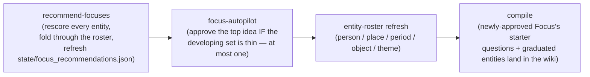

# Focuses & the Autopilot

## 1. What it does & what it's for

Say you never open the wiki viewer. You just answer the daily question,
day after day, and across a few months you keep mentioning your Uncle
Mike — sometimes by name, sometimes as "my uncle" — in three different
answers, in two different categories, always with real feeling attached
("I still miss him," "he was the one who taught me to fish"). Nothing
about your daily experience changes: you're just answering questions.
But underneath, `recommend_focuses.py` has been watching every answer,
source, and classification for exactly this pattern, and it has scored
Uncle Mike high enough to be a genuinely strong idea for a dedicated
[Focus](glossary.md) — a person worth its own questions, its own arc,
eventually a letter or a chapter. Because you never open the Review lane
to approve it yourself, the monthly autopilot does it for you: it
scaffolds a new question-bank category for Uncle Mike, registers him in
your roadmap, and (when a model is available) generates a first batch of
starter questions — all without you lifting a finger beyond the answers
you were already giving. If you *do* open the Review lane, approving a
pending idea manually works exactly the same way, any time, and a
dismissal is a permanent veto the autopilot can never override.

That's the job of this feature: turn the patterns already visible in what
you've said into new, deliberately-pursued threads of the story — for an
engaged user who reviews ideas by hand, and just as reliably for a
passive one who never does.

## 2. The nouns

A **[Focus](glossary.md)** is the unit of intent — anything you're
building toward, with a **tier** (`basic`/`standard`/`extreme`, setting
its default target depth of 8/20/50 answers) and a target category (or
categories) in the question bank. See the [Glossary](glossary.md) for the
full definition; this page covers how new Focuses come to exist and how
their progress is judged.

A **recommendation** (an "idea" or "pending idea" in this page's prose) is
a single scored row in `state/focus_recommendations.json` — an entity
(`person`/`place`/`period`/`theme`) the pattern-watcher has noticed,
carrying its `score`, `evidence_strength` band, the evidence snippets that
justify it, and a `status` (`pending`, `approved`, or dismissed/expired,
tracked separately). A recommendation only becomes a Focus through
**approval** (§4) — never automatically materialized just for existing.

**Candidate research** is source-building work about one still-pending
recommendation (ADR 0020). It is deliberately not approval: exact slices of
the author's raw turns are assessed against the closed Focus usefulness rubric,
then written only after the author confirms that exact ready assessment.
Model summaries are never evidence; generated seed questions are labeled
non-evidence. The immutable source waits under `sources/candidate-research/`
until the ordinary manual/autopilot approval path creates the Focus.
Readiness requires at least 3 substantive evidence spans, including concrete
material, plus at least 2 generated seed questions labeled non-evidence.

**Evidence strength** is a three-band label on a recommendation's score:
`weak`, `moderate`, or `strong` (§4 gives the exact cutoffs). It's
informational — the number that actually gates approval is the floor
(§4), not the band label.

**Saturation** is how full a Focus is relative to its target depth —
`answered ÷ target_depth`, computed live by `roadmap.focus_fill()`, never
stored. A **verdict** (`progress.py`) turns saturation into a label:
`EARLY` (still needs more answers), `DEVELOPING` (building material),
`READY` (ready to draft), or `SATURATED` (at/above target — maintenance
territory). The **developing set** is the specific subset of Focuses the
autopilot cares about: active, non-primary, and below the `READY`
threshold (§4) — a deliberately narrower question than the verdict alone
answers (see §4's note on why it's not identical to the completion gate's
own definition).

**The autopilot** is `recommend_focuses.focus_autopilot()` — the
mechanism that approves a pending idea on its own when the developing set
is thinner than a target, described fully in §4.

**Dedupe** happens in three independent layers, applied in that order,
each catching what the layer before it structurally cannot (ADR 0010):
**door guards** (deterministic — every Focus-creation path refuses an
exact/case/prefix-variant name collision against an *existing* Focus),
the **roster fold** (deterministic — settled alias knowledge from the
monthly-curated entity rosters merges two pending ideas the roster already
knows are one entity, before either is even scored), and **the
Focus-Curation Interaction** ("JUDGE" — the residue neither deterministic
layer resolves: near-name pairs like "Betty Jo" vs. "Betty Jo Taylor" that
have no settled roster alias yet). Said honestly: the JUDGE layer is the
only one of the three with **no deterministic fallback at all** — it
requires an actual model call (in-process, or via the keyless
`--emit-task`/`--from-response` loop a human or agent completes by hand).
Absent AI, a near-name pair simply sits apart correctly rather than being
merged on a guess; the roster fold is the floor.

**`focus-merge`** (ADR 0012) is the separate, owner-initiated verb that
heals *existing* duplicate Focuses the three dedupe layers above didn't
prevent — never automatic, and out of scope for this page beyond the
mention (§4 covers its shape briefly; the transaction itself is a page of
its own territory).

Shared vocabulary this page relies on without redefining:
**[Entity](glossary.md)**, **[Interaction](glossary.md)**, and
**[The Loop](glossary.md)** / **[In the Loop](glossary.md)** are defined
once in the [Glossary](glossary.md); the [Question Candidates](question-candidates.md)
page covers the candidate/promotion vocabulary this page's starter
questions flow into.

## 3. How it works

Idea generation, scoring, and approval are three separate steps, on two
different clocks.

**Idea extraction and scoring** (`recommend_focuses.recommend()`) reads
every answer, manual source, and classification record; regex-extracts
people (after relationship words like "mom"/"dad"/"boss"), places, time
periods, and theme-keyword hits; and folds each hit's stats — mention
count, which answers, which categories, and a window-based emotional-word
weight — into one score per entity (§4's formula). Before scoring, those
raw stats are folded through the roster-fold dedupe layer, and anything
that already has a Focus or a compiled wiki page is dropped outright — a
recommendation only proposes genuinely new territory.

**Approval** (`approve_recommendation()`) is the one path that actually
creates a Focus: it scaffolds a new question-bank category, registers the
Focus in the roadmap, and — when a model is available — generates and
promotes a first batch of starter questions via `research_expand.py`
(falling back to a keyless emit-task when no model is in-process, never a
silent no-op). Manual approval (CLI or the viewer's Review lane) and
autopilot approval are the *same function call* with different
provenance — no parallel scaffold path exists for either.

**The monthly cadence** (ADR 0011, amended 2026-08-15): recommendation
refresh, autopilot approval, entity-roster refresh, and recompile all run
in one fixed order inside `monthly_research.sh`, so each step sees the
freshest output of the one before it:



This single-clock design replaced a weekly autopilot call that mostly
re-read a static list — the ideas supply itself only refreshes monthly,
so a faster autopilot clock bought nothing. `weekly_maintenance.sh` still
runs `recommend_focuses`' *sibling* steps that have nothing to do with
Focus creation (candidate auto-promotion, the question-judgment rubric
edit) on its own weekly cadence — see the
[Question Candidates](question-candidates.md) page for that loop.

**Rot control.** A *pending* recommendation that sits below the floor
(§4) for the expiry window (§4) auto-dismisses, tagged with a structured
`dismissed_by: "expiry"` marker — distinct from an owner's manual
dismissal, which is a permanent veto the same recommendation can never
recover from even if its score later improves. An expiry-dismissed idea
*can* be re-proposed later, but only once fresh evidence genuinely clears
the floor again — reappearing at the same weak score doesn't reset the
clock.

## 4. The algorithm

### Idea scoring

```
score = mention_count × 1.0 + unique_answers × 2.0 + cross_categories × 3.0 + emotional_weight × 1.5
```

computed by `recommend_focuses._score()`. These four weights (`1.0`,
`2.0`, `3.0`, `1.5`) are literal values inside that one function, not
named module constants — like this page's sibling
[Question Candidates](question-candidates.md#4-the-algorithm) page notes
for its own craft-penalty table, an annotation naming a constant that
doesn't exist would fail `tests/test_handbook_parity.py` rather than
protect it, so these four numbers are quoted here from direct code
reading. The intent behind the weights, in order: raw repetition counts
least; being mentioned in *multiple distinct answers* counts double;
showing up across *multiple different question categories* — i.e. this
entity keeps surfacing no matter what you're being asked about — counts
most; and emotional charge (a nearby hit from a fixed emotion-word list,
within an 80-character window of the mention) counts one and a half times
raw mentions.

**Evidence-strength bands**, also literal values inside
`recommend_focuses._evidence_strength()`: **strong** at `15` or above,
**moderate** from `8` up to `15`, **weak** below `8`.

**The ready floor** — the number that actually matters for both manual
"ready to start" eligibility and autopilot eligibility — is a real named
constant:
8.0 <!-- parity: recommend_focuses.FOCUS_READY_SCORE_FLOOR = 8.0 -->.
It isn't a coincidence that this equals the `moderate` band's own cutoff —
the constant's docstring is explicit that the floor is *reused* from
`_evidence_strength()`'s cutoff rather than being a second, competing
threshold.

**Rot-control expiry**: a pending recommendation below the floor for
6 <!-- parity: recommend_focuses.FOCUS_RECOMMENDATION_EXPIRY_WEEKS = 6 -->
weeks auto-dismisses.

### The autopilot

`focus_autopilot(target=None, dry_run=False, *, catch_up=False)`:

```
while len(developing) + len(taken) < target:
    idea = highest-scoring pending recommendation at/above the floor
    if no such idea, or the per-run cap is spent: stop
    approve it (via approve_recommendation(), approved_by="auto")
```

- **Target** —
  3 <!-- parity: recommend_focuses.AUTOPILOT_TARGET_DEVELOPING = 3 -->,
  the owner-ratified "keep this many Focuses in active development"
  number, overridable per-vault via `config.yaml`'s
  `focus_autopilot_target` (an explicit `--target` flag always wins over
  both).
- **Developing** = active (`phase` is not `"maintenance"`), non-primary,
  and saturation strictly below
  0.70 <!-- parity: progress.READY = 0.70 --> (the `READY` verdict cutoff,
  §4's next subsection). This deliberately does **not** carry the
  completion gate's own extra exemption for a Focus with zero pending
  questions ("exhausted, not unfinished") — the developing *set* is
  answering a different question, "how many Focuses are currently in
  active growth," where an exhausted-but-unsaturated Focus still counts.
- **Floor** — the same
  8.0 <!-- parity: recommend_focuses.FOCUS_READY_SCORE_FLOOR = 8.0 -->
  reused from idea scoring above, never a second threshold.
- **Per-run cap** —
  1 <!-- parity: recommend_focuses.AUTOPILOT_MAX_PER_RUN = 1 -->, gentle
  by default: the target is reached over successive monthly runs, never
  in one burst. `--catch-up` (manual CLI only, never wired into the
  scheduled run) raises the effective cap to `target` for an
  everything-answered, idle-queue catch-up in one pass.
- **Cadence** — **monthly**, per
  [ADR 0011's amendment](https://github.com/lifehug/lifehug/blob/main/docs/adr/0011-focus-autopilot.md#amendment-2026-08-15-owner-ratified--issue-154):
  the algorithm shipped weekly in the original ADR, then moved to monthly
  once the owner reasoned that Focus creation is rare and high-weight
  while the ideas supply itself only refreshes monthly — one clock now
  rules the whole Focus lifecycle (§3's pipeline diagram).
- **Idempotent by construction** — no cursor file. A real approval
  scaffolds a Focus that itself immediately counts toward `developing`
  the moment the roadmap is re-read, so a second run the same month
  naturally sees a thinner gap (or an empty pending list) purely from
  durable state.
- `dry_run=True` computes and returns the identical decision — which idea
  it would approve and why — without writing anything.

### Tiers, saturation, and verdicts

| Tier | Target depth |
|---|---|
| `basic` | 8 answers |
| `standard` | 20 answers |
| `extreme` | 50 answers |

(`roadmap.TIER_TARGETS` — a dict, not individually parity-annotatable
under this site's `module.CONSTANT = scalar` grammar, but verified
directly against the code, not remembered.)

`progress.verdict(saturation)` maps a Focus's live saturation ratio to a
label:

| Verdict | Saturation |
|---|---|
| `EARLY` | below 0.40 <!-- parity: progress.DEVELOPING = 0.40 --> |
| `DEVELOPING` | 0.40 up to 0.70 <!-- parity: progress.READY = 0.70 --> |
| `READY` | 0.70 and above (and not yet saturated) |
| `SATURATED` | saturation ≥ 1.0 |

### Worked example

Take a plausible pattern the extractor has been accumulating for "Uncle
Mike" across a few months of answers:

- `mention_count = 6` (six separate hits across answers, sources, and one
  classification record)
- `unique_answers = 3` (three distinct answer files reference him)
- `cross_categories = 2` (he comes up under two different question-bank
  categories — not just the one you'd expect)
- `emotional_weight = 2.5` (a handful of nearby emotion-word hits —
  "miss," "loved," "proud" — each contributing to the window score)

```
score = 6 × 1.0 + 3 × 2.0 + 2 × 3.0 + 2.5 × 1.5
      = 6 + 6 + 6 + 3.75
      = 21.75
```

**Evidence strength**: `21.75 ≥ 15` → **strong**. **Floor eligibility**:
`21.75 ≥ 8.0` → this recommendation is eligible for `ready_to_start`
(once the completion gate — §5 note — is open) and is a genuine autopilot
candidate. If, that same month, your developing set has room (fewer than
3 Focuses currently active/unsaturated/non-primary) and this is the
highest-scoring pending idea, `focus_autopilot()` approves it on its own:
a new "Uncle Mike" category is scaffolded, the Focus lands in your
roadmap at `standard` tier by default (20-answer target — the size
heuristic derives from how many questions the category already carries,
`tier_for_size()`), and starter questions are generated and promoted
straight into the bank, ready for next week's planner.

## 5. In the loop

**What feeds it:** every answer, manual source, and weekly classification
record — the same raw material that feeds candidate generation
([Question Candidates](question-candidates.md)) also feeds idea
extraction here, read independently by `_build_entity_stats()`.

**What it feeds:** the roadmap (a new Focus, or an existing one's category
list), the question bank (starter questions), and downstream, the weekly
planner's Focus-weighted queue — a Focus the autopilot just created is
immediately eligible for next week's question selection.

When a pending recommendation already has a completed candidate-research
source, later approval also gives the compiler immediate citable material. A
new Focus with no dedicated answers therefore renders from the author's exact
research spans instead of the empty-Focus placeholder. The research source
does not call `approve_recommendation()`, scaffold a category, or promote its
generated seed questions; approval/autopilot remains the only creation door.

The independently registered [Focus Candidate
Interaction](interactions/focus-candidate.md) is the conversational collection
surface for this source. Play is read-only; it gathers eight useful dimensions
through exact user spans, asks the highest-value natural gap, and requires a
distinct confirmation before delegating to the candidate-research authority.
Its completion still leaves the recommendation pending.

**How it self-improves:** the roster fold means idea extraction gets
*more* accurate over time without any change to the extraction regexes
themselves — as the monthly entity-roster curation resolves more aliases,
fewer duplicate ideas are ever proposed in the first place, which is a
form of self-improvement this page's dedupe layers (§2, §3) produce as a
side effect of an entirely separate monthly process.

**Classification (Convergence Principle):** the autopilot itself is what
retired this feature's own **floor** gap. Before ADR 0011, Focus creation
was approval-only — "never created without you" — which ADR 0006 named
outright as a stage that silently required a human to make progress. The
autopilot is now the floor: a passive user who never opens the Review
lane still gets new Focuses, gated only by a target count and a score
floor, at a gentle one-per-month pace. Manual approval remains the
**accelerator** — it works identically, any time, unlimited, and a
dismissal is a permanent veto the autopilot can never override — the
Convergence Principle's promise that manual signal speeds up the same
convergence without ever becoming a dependency.

*Adjacent note on scope:* Focus **creation** (this page) is autonomous by
design. A related but distinct mechanism, the **completion gate**
(`focus_start_gate()`), separately decides whether starting something new
is "allowed" *this week* given your existing unfinished Focuses — every
active, non-primary Focus that still has pending questions must be
`READY` or `SATURATED` first. It shares vocabulary with the developing-set
definition in §4 (both lean on `roadmap.focus_fill()` and
`progress.verdict()`) but is not the same gate: the completion gate
additionally exempts a Focus with zero pending questions as "exhausted,
not unfinished," which §4's developing-set definition deliberately does
not.

## 6. Where it lives

| Concern | Location |
|---|---|
| Recommendation state | `state/focus_recommendations.json` |
| Roadmap (Focuses, tiers, saturation is derived live) | `state/roadmap.json` |
| Idea extraction + scoring | `recommend_focuses._build_entity_stats()`, `_score()`, `_evidence_strength()` |
| Roster-fold dedupe | `recommend_focuses._fold_stats_through_roster()` |
| Door-guard dedupe | `lifehug_core.normalized_focus_key()`, `roadmap.focus_new()`, `roadmap.derive_focuses()` |
| Focus-Curation Interaction (JUDGE dedupe) | `interactions/focus_curation/`, `focus_curation.py` |
| Duplicate detection/report (zero-write) | `focus_dupes.py` (`focus-dupes --report`) |
| Duplicate healing (owner-initiated) | `focus_merge.py` (`focus-merge <survivor> <loser>`) |
| Approval + scaffolding | `recommend_focuses.approve_recommendation()`, `roadmap.focus_new()` |
| Candidate-research evidence/source authority | `candidate_research.py`, `sources/candidate-research/focus_candidate/` |
| Focus Candidate Interaction | `interactions/focus_candidate/`, `focus_candidate.py` |
| Autopilot | `recommend_focuses.focus_autopilot()`, `resolve_autopilot_target()` |
| Saturation / verdicts | `roadmap.focus_fill()`, `progress.verdict()` |
| CLI | `lifehug.py recommend-focuses [--recommend\|--dismiss\|--approve\|--autopilot [--dry-run\|--catch-up]\|--target N]`, `roadmap [show\|rebuild\|add\|set\|finish\|new]`, `focus-dupes --report`, `focus-merge <survivor> <loser> [--dry-run]` |
| Monthly wiring | `monthly_research.sh` — `recommend-focuses` → `focus-autopilot` → entity-roster refresh → `compile` |
| Interaction | [`interactions/focus_curation/`](https://github.com/lifehug/lifehug/tree/main/interactions/focus_curation) (ADR 0010) |
| Guard tests | `tests/test_focus_autopilot.py`, `tests/test_focus_dupes.py`, `tests/test_focus_merge.py`, `tests/test_roadmap.py` (repo-verify exact names before citing in a PR) |

**Change-safely notes.** `AUTOPILOT_TARGET_DEVELOPING`,
`FOCUS_READY_SCORE_FLOOR`, and `AUTOPILOT_MAX_PER_RUN` are read live by
every consumer (CLI display, the viewer's Review-lane policy line) — a
restated literal anywhere else is a regression of ADR 0011, not a
legitimate shortcut. Any future Focus-approval path must call
`approve_recommendation()` itself rather than a parallel scaffold — that
is what keeps zombie protection (a Focus with no question category) and
starter-question seeding automatic for autopilot approvals too. Any
future entity/alias-matching code must reuse
`lifehug_core.normalized_focus_key()` / `entity_roster._entity_keys()`
rather than re-deriving a second lowercase/slugify/"the "-strip
definition — that collision class is exactly what ADR 0010 exists to
foreclose.

## 7. Decisions

- [ADR 0006 — The Convergence Principle](https://github.com/lifehug/lifehug/blob/main/docs/adr/0006-convergence-principle.md) — names Focus creation as the original approval-only gap this page's feature closes.
- [ADR 0010 — Focus Duplicate Curation](https://github.com/lifehug/lifehug/blob/main/docs/adr/0010-focus-duplicate-curation.md) — the three-layer dedupe in §2/§3.
- [ADR 0011 — Focus Autopilot](https://github.com/lifehug/lifehug/blob/main/docs/adr/0011-focus-autopilot.md), including its [2026-08-15 monthly-cadence amendment](https://github.com/lifehug/lifehug/blob/main/docs/adr/0011-focus-autopilot.md#amendment-2026-08-15-owner-ratified--issue-154) — the algorithm in §4.
- [ADR 0012 — focus-merge](https://github.com/lifehug/lifehug/blob/main/docs/adr/0012-focus-merge.md) — the owner-initiated healing verb mentioned in §2/§6, out of this page's own scope beyond the pointer.
- The hosted platform's review-loop contracts (parallel PR review, owner closeout, executable walkthroughs) this feature's Review lane and Combine button are built against: [`lifehug-platform` docs/BUILDING.md](https://github.com/lifehug/lifehug-platform/blob/main/docs/BUILDING.md) and [docs/REVIEWING.md](https://github.com/lifehug/lifehug-platform/blob/main/docs/REVIEWING.md) (external repo — the platform orchestrates this package, never forks it).
