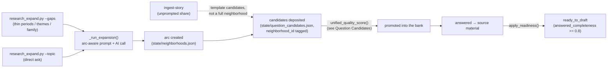

# Neighborhoods

## 1. What it does & what it's for

Say you've been answering daily questions for six months, and your
grandmother's farmhouse comes up constantly — in a story about summers as
a kid, in an aside about a recipe, in a throwaway line about the smell of
the kitchen. Nobody ever asked you a single dedicated question about the
farmhouse itself, but the material is clearly there, scattered and
un-mined. Once a month, `research_expand.py --gaps` (or the monthly cron
running it for you) notices this exact kind of thin spot — a topic that
keeps surfacing but has no concentrated attention — and opens a
**neighborhood**: a purpose-built cluster of 8–12 questions about the
farmhouse specifically, laid out along a narrative arc that starts with
grounding facts and ends with what it all means to you now. You never
design this arc yourself. The system builds the whole cluster in one AI
call, drops every question into the ordinary candidate review buffer
(never straight into your daily queue), and from there the questions
compete for promotion exactly like any other candidate — some might clear
the bar automatically, some might sit for your review, and over the
following weeks you'll start seeing farmhouse questions arrive one at a
time, each one aware of what you've already said, until eventually you
have enough material to actually draft the chapter.

That's the job of this feature: turn a thin, scattered topic into a
deliberately-designed multi-question research thread — aimed at an actual
deliverable (a chapter, a letter, an essay, a post) — instead of leaving
gap-filling to chance.

## 2. The nouns

A **neighborhood** (`state/neighborhoods.json`) is a cluster of 6–12
questions about one topic — a person, place, period, project, theme, or
the author's own self-knowledge — laid out along a **narrative arc** and
aimed at a specific `target_output` (chapter, letter, essay, or post). Its
identifying record carries `id` (`nbhd-<slug>`), `title`, `type` (the
topic type), `target_output`, `source` (the wiki page, answer file, or
bare topic string it was opened from), and the `arc` itself: an ordered
list of slots, one per story-function beat.

**The arc** is the spine — a fixed sequence of story-function slots
(§3/§4) chosen by the topic's type. Each slot starts empty (`question_id:
null, status: "pending"`) and fills in as the expansion prompt generates
real questions; `make_arc()` creates the empty skeleton, and the
neighborhood's `completeness` (legacy name; see below) is the fraction of
slots that have been filled.

**Three readiness numbers, tracked separately** (`neighborhoods.py`'s
`compute_readiness()`), because a neighborhood can be question-ready long
before it's answer-ready:

| Field | Fraction of arc slots that are… |
|---|---|
| `question_arc_completeness` | at least a **candidate** (a generated question exists for that slot) |
| `promoted_completeness` | **promoted** into the question bank (auto or manual — see [Question Candidates](question-candidates.md)) |
| `answered_completeness` | **answered** (the promoted question has a real answer on file) |

`ready_to_draft` is `true` only once `answered_completeness` clears the
threshold in §4 — never merely because every slot generated a candidate.
`readiness_status` collapses all three into one label for display: `empty`
→ `questions_generated` → `promoted` → `answering` → `answer_ready`,
walked in that order by `readiness_status()`.

**Neighborhood-as-supply**, the idea the [Question Candidates](question-candidates.md#2-the-nouns)
page names from the other side: a neighborhood is never itself askable.
It is a generator that deposits its arc's slots into the ordinary
candidate buffer exactly like the weekly classifier or a hand-typed idea
— every neighborhood question lives or dies by the same
`unified_quality_score()` gate as any other candidate, with no
neighborhood-specific bypass.

**The neighborhood-vs-arc-card distinction** (the README pins this
explicitly, because the names are easy to conflate): a **neighborhood**'s
`arc` is a multi-question *research thread* — 6–12 slots, built once by
`research_expand.py`, living for weeks until it's answered out. An
**[Arc card](glossary.md)** is a *single question's* pre-planned opening
plus 2–4 follow-up intents, built weekly by `arc_planner.py` for whatever
question the planner queued next, living for one delivery. They share the
word "arc" and little else. The one place they touch: a neighborhood's
`arc` list is one *input* the weekly arc planner can draw a
`neighborhood_sibling` follow-up intent from — "this question's
neighborhood also asks about X" — but the neighborhood object and the arc
card object are never the same record, never the same file
(`state/neighborhoods.json` vs. `state/arc_cards.json`), and never on the
same clock.

Shared vocabulary this page relies on without redefining:
**[Focus](glossary.md)**, **[Arc card](glossary.md)**, and
**[The Loop](glossary.md)** are defined once in the
[Glossary](glossary.md); **candidate**, **promotion**, and
**auto-promotion** are covered by the
[Question Candidates](question-candidates.md#2-the-nouns) page.

## 3. How it works

Opening, filling, and reading a neighborhood are three different moments.

**Opening — three ways in**, per the README's own framing:

1. **Gap detection** — `research_expand.py --gaps` scans every answer for
   thin spots across three dimensions (§4): life periods with too little
   coverage, emotionally-charged themes with too little coverage, and
   family members mentioned often but with no wiki page yet. It prints a
   human-readable report and a list of suggested `--topic`/`--type`
   commands; nothing is created automatically from `--gaps` alone.
2. **Story ingest** — sharing something unprompted (`ingest-story`) seeds
   template candidates directly (a lighter-weight path than a full
   neighborhood) and, separately, can open or continue a Conversation for
   one immediate turn — see the [Conversations](conversations.md) page.
3. **A direct ask** — `research_expand.py --topic "Faith" --type theme
   --output essay` opens a neighborhood for exactly that topic, on demand.

In every path, `_run_expansion()` does the same work: loads the mission +
whatever existing answers already mention the topic (so the prompt
doesn't repeat material the author already gave), builds an arc-aware
prompt naming the topic's specific arc template (§4), calls the model (or
accepts a keyless agent's `--from-response` file), and deposits every
returned question as a **candidate** tagged with this neighborhood's id —
never directly as an askable question. When the caller passes
`--context-file PATH` (v189), the prompt additionally opens with what the
author said when they started this focus — objective, name, relationship,
whether the person is living, and their verbatim first words — and, for a
person, the `INTERVIEW_BANKS` bank that fits that relationship (the
`remembering` bank whenever `living` is false). The flag is optional and
defaults to off: with no context file the prompt is byte-identical to
v188, so a focus started before the author has answered anything still
seeds from the recommendation's own evidence. A neighborhood is idempotent by
id (`nbhd-<slug>`): re-running `--expand`/`--topic` on an existing
neighborhood refuses unless `--force` is passed, so accidental re-runs
never silently duplicate a whole arc's worth of candidates.

**Reading readiness — always live, never trusted from a stale write.**
`neighborhoods.refresh_all_neighborhood_readiness()` recomputes every
neighborhood's three completeness fractions against the *current*
candidate store and question bank on every compile-adjacent read — a
neighborhood's candidates and promoted questions move independently
(promotion happens through the ordinary weekly auto-promote ladder, not
through this module), so readiness has to be derived fresh rather than
cached from expansion time.

## 4. The algorithm

### The four arc templates

Every neighborhood's arc is one of four fixed six-slot story-function
sequences, chosen by topic type via `arc_for()`:

| Template | Slots (in order) | Dispatched for |
|---|---|---|
| `MEMOIR_ARC` | foundation → scene → tension → turning_point → relationship → meaning | the **default fallback** — `person`, `place`, `project`, `theme`, `event`, and any unrecognized type |
| `SELF_ARC` | self_image → value → fear → contradiction → perception_by_others → growth_edge | `self` |
| `RELATIONSHIP_ARC` | who_they_are → shared_history → tension → what_i_see_in_them → what_i_want_them_to_know → how_they_see_me | `relationship` |
| `PERIOD_ARC` | foundation → meaning → scene → turning_point → tension → meaning | `time_period` |

`ARCS = {"self": SELF_ARC, "relationship": RELATIONSHIP_ARC,
"time_period": PERIOD_ARC}` is the whole dispatch table; `arc_for(topic_type)`
returns `ARCS.get(topic_type, MEMOIR_ARC)`. Worth being precise here
because the top-level README's own diagram compresses this to "three arc
templates" and groups periods under the memoir arc for readability — the
code actually has **four** templates, and `time_period` gets its own,
`PERIOD_ARC`, not `MEMOIR_ARC`. `PERIOD_ARC` is the synthesized six-step
chapter method (v71) — McAdams' name-and-bound, Levinson's life
structure and the Dream, an oral-history typical day with era anchors,
McAdams' five-slot key scenes, Bridges' ending → neutral zone →
beginning transition model, and Butler's evaluative life-review look-back
— which is why it repeats `meaning` as both its second and sixth slot
(the early "what were the pillars of this chapter" reflection and the
later "how do you make peace with it now" reflection are different
questions sharing one story function). These four tuples are ordered
sequences, not scalar constants, so — like `focuses.md`'s treatment of
`roadmap.TIER_TARGETS` — this table is verified by direct reading rather
than a parity annotation.

### Gap detection thresholds

`detect_gaps()` flags a time period or theme as **thin** when its
coverage ratio (answers mentioning any of its keywords, divided by total
answers) falls under
0.30 <!-- parity: research_expand.GAP_COVERAGE_THRESHOLD = 0.30 -->
(30%), and flags a family member as **unfocused** when they're mentioned
at least
3 <!-- parity: research_expand.GAP_PERSON_MENTION_MIN = 3 --> times across
answers but have no wiki page under `wiki/people/` yet. All three checks
are plain keyword matching against fixed lookup tables
(`TIME_PERIOD_KEYWORDS`, `THEME_KEYWORDS`, `FAMILY_KEYWORDS`) — no AI call,
so `--gaps` is free to run as often as you like. The monthly cron
(`monthly_research.sh`'s `select_gap_targets`) additionally gates *whether*
to open any new gap neighborhoods at all behind the planner's expansion-urgency
signal (README: "once your Focuses cross ~60% full") — below a `0.25`
urgency reading it skips gap-opening for the month entirely and lets the
archive deepen instead of widening. That `0.25` gate is a literal inside
`monthly_research.sh`'s embedded Python, reading a constant
(`question_planner.py`'s `expansion_onset` inside `DEFAULT_LANE_POLICY`)
that belongs to the planner, not to this page's own module — verified by
direct reading, out of this page's parity scope.

### Draft-readiness threshold

`ready_to_draft` flips true once `answered_completeness` reaches
0.8 <!-- parity: neighborhoods.READY_TO_DRAFT_THRESHOLD = 0.8 --> —
80% of the arc's slots need a real answer on file, not merely a promoted
question, before the neighborhood is considered ready to hand to an
artifact draft.

### Per-neighborhood promotion cap interplay

A neighborhood can generate up to 12 candidates in one AI call, but the
weekly auto-promotion ladder deliberately never lets one neighborhood
drain its whole arc into the bank in a single run — the same
per-neighborhood cap the [Question Candidates](question-candidates.md#3-how-it-works-the-weekly-lifecycle)
page documents from the candidate side applies here without any
neighborhood-specific exception: normally
1 <!-- parity: question_candidates.PER_NEIGHBORHOOD_CAP = 1 -->
promotion per neighborhood per week, doubled to
2 <!-- parity: question_candidates.PER_NEIGHBORHOOD_CAP_BACKLOG = 2 -->
once the promotable backlog crosses
40 <!-- parity: question_candidates.BACKLOG_PRESSURE_THRESHOLD = 40 -->
candidates. The effect from a neighborhood's own vantage point: a
freshly-opened 10-slot neighborhood fills its `question_arc_completeness`
in one AI call, but its `promoted_completeness` — and therefore its
`answered_completeness` and `ready_to_draft` — climbs gradually, roughly
one arc slot's worth of question-bank presence per week (faster under
backlog pressure), competing on quality score against every other
neighborhood's and every other source's candidates exactly the same way.
This is deliberate: a neighborhood is a *supply* mechanism, never a
fast lane past the ordinary promotion gate.

A human can bypass the weekly trickle directly:
`candidates-promote-neighborhood` (`question_candidates.promote_neighborhood()`)
promotes every currently-promotable candidate from one neighborhood into
one category in a single call — skipping duplicates, never touching the
weekly cap, useful when the author wants to push one neighborhood's whole
arc live at once instead of waiting out the auto-promotion drip.

### Worked example

Take a neighborhood opened via `research_expand.py --topic "The
Farmhouse" --type place --output chapter`:

1. **Arc chosen** — `place` isn't in `ARCS`, so `arc_for()` falls back to
   `MEMOIR_ARC`: 6 empty slots, `foundation` through `meaning`.
2. **Expansion runs** — the AI returns 9 questions covering all 6 arc
   functions (some functions get more than one question); each lands in
   `state/question_candidates.json` tagged `neighborhood_id:
   "nbhd-the-farmhouse"`. `question_arc_completeness` becomes `6/6 = 1.0`
   the moment the first candidate per slot is mapped in — every slot has
   *a* candidate, even though 9 candidates were generated for 6 slots.
3. **Week 1 auto-promotion** — of the 9 candidates, 4 clear the
   `0.82` auto-promote bar (see [Question Candidates §4](question-candidates.md#4-the-algorithm)).
   The per-neighborhood cap admits only 1 (backlog is under 40 this
   week) — the other 3 stay `candidate`, competing again next week.
   `promoted_completeness` ticks up by whatever fraction of the 6 slots
   that one promoted question's function represents.
4. **Weeks 2–5** — one more farmhouse candidate clears the cap each week;
   by week 5, 5 of 6 arc functions have a promoted, answered question.
   `answered_completeness = 5/6 = 0.833`.
5. **Verdict** — `0.833 ≥ 0.8`: `ready_to_draft` flips `true`,
   `readiness_status` reports `answer_ready`. The farmhouse neighborhood
   is now real material for a chapter draft — five weeks after it was
   opened, entirely through the ordinary weekly rhythm, with no single
   week ever flooded by one topic.

## 5. In the loop

**What feeds it:** every existing answer (gap detection reads the whole
corpus), a direct topic request, or an unprompted story ingest; the
quality profile's `top_patterns` (see [Quality & Engagement Profile](quality-profile.md))
personalize the expansion prompt itself when active, and the
question-judgment rubric plus recent owner decisions (ADR 0009) shape
what the AI proposes.

**What it feeds:** the candidate buffer, and through it — via the
ordinary `unified_quality_score()` gate — the question bank and the
weekly planner's queue. A neighborhood that reaches `answer_ready` also
feeds artifact drafting directly: enough real source material exists to
support the `target_output` it was opened for.

**How it self-improves:** nothing about a neighborhood's own arc adapts
over time — the four templates are fixed. What *does* improve is which
topics get opened and how well their questions land: gap detection
re-scans the growing corpus every month, so thin spots close and new ones
surface as the archive deepens; the expansion prompt's personalization
hints and owner-judgment-signals block (shared machinery with
[Question Candidates §5](question-candidates.md#5-in-the-loop)) mean two
neighborhoods opened months apart, on similar topics, get
measurably different prompts as the system learns what this author's
richest answers and rejected candidates actually look like.

**Classification (Convergence Principle):** research expansion is the
system's only stage that costs API money and needs an AI model to run at
all — by design it runs rarely (monthly cron, or on demand), not daily.
It is squarely an **accelerator**: a vault that never opens a single
neighborhood still grows through the classifier's own candidate
generation and the wiki's own compile step (the fully automatic floor
those mechanisms provide), just narrower and slower. Neighborhoods exist
to widen coverage deliberately, on a schedule the owner controls, never
as a dependency the daily loop needs to keep functioning.

## 6. Where it lives

| Concern | Location |
|---|---|
| Neighborhood store | `state/neighborhoods.json` |
| Arc templates + expansion | `research_expand.py` — `MEMOIR_ARC`/`SELF_ARC`/`RELATIONSHIP_ARC`/`PERIOD_ARC`, `arc_for()`, `build_expansion_prompt()`, `_run_expansion()` |
| Gap detection | `research_expand.detect_gaps()`, `build_gaps_prompt()` |
| Readiness (derived, never stored stale) | `neighborhoods.compute_readiness()`, `apply_readiness()`, `refresh_all_neighborhood_readiness()` |
| Candidate deposit | `research_expand.add_candidates_from_ai()` |
| Manual bulk promotion | `question_candidates.promote_neighborhood()` |
| Interview packs (Tier 3, on-demand only) | `research_expand.INTERVIEW_BANKS`, `build_interview_pack()` — a separate, unrelated mechanism: questions the author asks *someone else* directly, ingested back via `ingest-story --witness` |
| CLI | `research_expand.py --expand PATH \| --topic NAME --type T \| --gaps [--dry-run] [--prompt] [--from-response PATH] [--context-file PATH] [--force]`, `lifehug.py candidates-promote-neighborhood` |
| Onboarding context (v189) | `--context-file PATH` holding `{objective?, type?, relationship?, living?, label?, first_answer?}`, normalized by `focus_candidate.normalize_onboarding_context` — see [Focus Candidate](interactions/focus-candidate.md) |
| Monthly wiring | `monthly_research.sh` — gap detection → `select_gap_targets` (expansion-urgency gated) → per-topic `research_expand.py` calls → self-knowledge batch → `recommend-focuses` → `focus-autopilot` → entity-roster refresh → `compile` |
| Guard tests | `tests/test_neighborhood_readiness.py` (repo-verify exact names before citing in a PR) |

**Change-safely notes.** `READY_TO_DRAFT_THRESHOLD` is read live by every
readiness consumer (CLI progress display, artifact-draft eligibility) —
moving it changes when a neighborhood is considered draftable without
touching a single word of its arc. Any future arc template must be added
to `ARCS` and dispatched through `arc_for()` rather than special-cased in
`_run_expansion()` — that dispatch function is the one place topic type
decides arc shape. `promote_neighborhood()` and the weekly auto-promotion
ladder must stay the *only* two paths a neighborhood's candidates reach
the bank through — a parallel promotion path would bypass the
per-neighborhood cap this page's §4 documents and let one topic flood a
week's queue.

## 7. Decisions

- [ADR 0006 — The Convergence Principle](https://github.com/lifehug/lifehug/blob/main/docs/adr/0006-convergence-principle.md) — the accelerator classification §5 applies to research expansion as a whole.
- [ADR 0008 — One published quality score, craft penalties folded in](https://github.com/lifehug/lifehug/blob/main/docs/adr/0008-unified-quality-score.md) — the gate every neighborhood-sourced candidate promotes through, no exception; see [Question Candidates §4](question-candidates.md#4-the-algorithm).
- Issue #118 (arc planner) — the source of the neighborhood-vs-arc-card distinction §2 draws precisely, and of the `neighborhood_sibling` follow-up intent that is the one place the two objects touch.
- The hosted platform's review-loop contracts (parallel PR review, owner closeout, executable walkthroughs) this feature's candidate deposits flow into: [`lifehug-platform` docs/BUILDING.md](https://github.com/lifehug/lifehug-platform/blob/main/docs/BUILDING.md) and [docs/REVIEWING.md](https://github.com/lifehug/lifehug-platform/blob/main/docs/REVIEWING.md) (external repo — platform orchestrates this package, never forks it).
