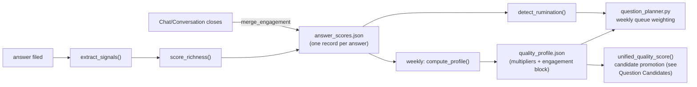

# Quality & Engagement Profile

## 1. What it does & what it's for

Say you've been answering the daily question for two months. You've never
rated a question, never clicked a thumbs-up, never told the system
anything about what you liked. And yet, without your noticing, the
questions arriving in your queue have started to shift: a few more of the
scene-setting, sensory prompts that made you write four paragraphs about
your grandfather's workshop, a few fewer of the abstract "what do you
think about..." prompts that made you write one flat sentence and move
on. Nothing about your daily experience changed except the questions
themselves got quietly better at opening you up.

That's `quality_profile.py`. Every time you answer, `process_answer.py`
extracts a handful of objective signals from the raw text — how long it
is, how many named entities it mentions, how many follow-up threads it
spawned — and folds them into one **richness score** for that answer, filed
silently in `state/answer_scores.json`. Once you've built up enough of
these (§4's activation bar), a weekly aggregation step buckets them by
*kind of question* (its story function — foundation, scene, tension, …)
and computes a **multiplier**: how much richer your answers to that kind of
question have historically been, relative to your own average. The
planner (`question_planner.py`) reads that multiplier back and nudges its
weekly sampling toward the question types that open you up, and away from
the ones that don't. A second, parallel signal — **engagement** — does the
same thing for a different question: not *what* you say, but whether you
keep coming back, on the theory that a question type that keeps pulling
you into a longer exchange is a question type worth asking more of. Both
run with zero friction: no ratings, no surveys, nothing you have to do
except keep answering.

That's the job of this feature: turn your own answering behavior into the
system's only feedback signal, silently, and use it to ask you better
questions over time.

## 2. The nouns

**Richness** is the 0–1 score `score_richness()` computes for one answer —
a weighted blend of objective signals (§4). It measures *what was said*:
length, entity density, how many follow-ups it spawned.

**Engagement** (issue #119) is a structurally parallel but independent
dimension: whether the author stayed conversationally engaged with a
story function, not whether the answer itself was rich. It measures
*whether the author kept coming back* — response speed, whether a Chat's
turns kept expanding rather than trailing off, whether the author brought
the topic up unprompted. Richness and engagement are computed from
different signals, aggregated the same way, and consumed by the planner
for different purposes: richness biases *which* question types to ask,
engagement biases *pacing and framing* only — see §5 for the guardrails
engagement is explicitly kept away from.

**The quality profile** (`state/quality_profile.json`) is the aggregated
output `compute_profile()` writes: a bucketed multiplier table (by story
function, by category, by [Focus](glossary.md)), plus a `top_patterns`
list of natural-language observations and an `engagement` sub-block
carrying the same shape for the parallel dimension. Both the richness
profile and the engagement block share one activation gate (§4) but are
otherwise independent — a vault can have an active richness profile and
an inactive engagement block, or vice versa, depending on which kind of
signal has crossed the bar.

**A multiplier** is the per-bucket output: how a bucket's average score
compares to the global average, clamped (§4) so no single bucket can run
away with the planner's attention. **Global average** is the mean score
across every scored record — the yardstick every multiplier is measured
against.

**The rumination detector** (`detect_rumination()`) is a separate,
richness-adjacent check: a category whose most recent answers show the
brooding signature (repetitive negative self-focus, no forward insight
movement) gets flagged so the planner can cool off that category rather
than deepen it — "depth ≠ repetition."

Shared vocabulary this page relies on without redefining: **[Focus](glossary.md)**
and **[The Loop](glossary.md)** are defined once in the
[Glossary](glossary.md); the story-function vocabulary (foundation, scene,
tension, turning point, relationship, meaning, …) is shared with the
[Question Candidates](question-candidates.md) page, which covers how the
same multiplier feeds `unified_quality_score()`'s candidate-promotion math.

## 3. How it works

Scoring and aggregation run on two different triggers.

**Live scoring, every answer.** `process_answer.py` calls
`extract_signals()` on the answer body the moment it's filed, then
`score_richness()` turns those signals into one number, then
`append_score()` files the record into `state/answer_scores.json` —
idempotent by `question_id`, so a re-run never double-counts. The same
call also seeds the record's `engagement` block with whatever it can
compute at filing time (today: `time_to_answer_hours`, always computable
from frontmatter). Retroactive scoring (`quality-update --score-all`)
runs the same extraction against every previously-answered question that
predates this feature, using a slightly different weight set (§4) because
retroactive scoring has no `wiki_nodes_added` signal to work with.

**Engagement merge, at Chat close.** The other three engagement fields —
`continuation_past_exit`, `turn_length_trajectory`,
`unprompted_inbound` — can only be known once a Chat session actually
closes, so `conversation_delivery.append_engagement` merges them into the
*same* score record later, never overwriting what filing-time already
wrote (`merge_engagement()`'s whole reason for existing — two writers of
one field must compose).

**Weekly aggregation.** `weekly_maintenance.sh`'s `quality_update` step
runs `compute_profile()`, which re-reads every scored record, buckets by
story function / category / Focus, computes each bucket's multiplier
against the global average, runs the rumination detector, and writes the
whole profile back to `state/quality_profile.json`. This is the step
`README §planner multipliers` refers to as "the silent quality profile" —
the planner's next weekly-queue build (`question_planner.py`) reads this
file and applies both multipliers as one factor in its weight formula,
alongside the tier/saturation weighting the [Focuses](focuses.md) page's
sibling planner section covers.



Both the richness profile and the engagement block stay inactive — a
neutral `1.0` multiplier everywhere — until enough records exist (§4);
before that, the planner and the candidate scorer both see an unbiased
system, exactly as if this feature didn't exist yet.

## 4. The algorithm

### Richness score

```
score = Σ weight[key] × min(raw[key] / target[key], 1.0)     for each key with weight > 0
```

computed by `score_richness()`, over the signals `extract_signals()`
pulls from the answer body:

| Key | Live weight | Retroactive weight | Normalization target |
|---|---|---|---|
| `word_count` | 0.40 | 0.40 | 300 words |
| `entity_count` | 0.35 | 0.40 | 5 distinct proper nouns |
| `wiki_nodes_added` | 0.00 | 0.00 | 3 (retired — see below) |
| `followup_count` | 0.25 | 0.20 | 3 follow-ups |

`WEIGHTS_LIVE`, `WEIGHTS_RETRO`, and `TARGETS` are module-level dicts in
`quality_profile.py`, not individually parity-annotatable scalars under
this site's `module.CONSTANT = scalar` grammar (the same non-scalar
treatment `focuses.md` gives `roadmap.TIER_TARGETS`) — the table above is
verified by direct reading of the module, not remembered. `entity_count`
is a simple heuristic: capitalized words not on a skip list
(pronouns, sentence-starters, category jargon), deduplicated so a repeated
name counts once. `wiki_nodes_added` sits at weight `0.00` in both sets —
its docstring explains why: it counted wiki FILE creation per answer,
which almost never happens per-answer, so a 0.25-weight signal sat near
zero and systematically depressed live scores relative to retroactive
ones. The weight stays in the dict (so the shape doesn't have to change
again) but contributes nothing.

Each signal is normalized to `[0, 1]` by dividing by its target and
capping at `1.0` — an answer at or above the target earns full credit for
that signal, more length or entities beyond the target earns nothing
extra. The final score is rounded to 3 decimal places.

### Activation

The profile — both the richness multipliers and the engagement block —
stays inactive until
20 <!-- parity: quality_profile.ACTIVATION_THRESHOLD = 20 -->
answers have been scored. Below that, `compute_profile()` still runs and
writes a profile, but every consumer checks `profile["active"]` (or
`profile["engagement"]["active"]`) first and treats an inactive profile
as "no opinion yet" — every multiplier defaults to a neutral `1.0` rather
than a wild swing from a three-answer sample.

### Multiplier computation

```
multiplier = clamp(bucket_avg / global_avg, MULTIPLIER_FLOOR, MULTIPLIER_CAP)
```

computed by `_multiplier()`, applied identically to richness buckets
(story function, category, Focus) and, once a bucket clears its own
5-record floor (below), engagement buckets. The clamp bounds are
0.7 <!-- parity: quality_profile.MULTIPLIER_FLOOR = 0.7 --> and
1.5 <!-- parity: quality_profile.MULTIPLIER_CAP = 1.5 --> — no bucket can
push the planner's weighting below 70% or above 150% of baseline, however
extreme its sample looks, so one lucky or unlucky run of answers can
never dominate the queue.

**The engagement dimension's own count floor.** A richness bucket earns a
multiplier the moment it has any records at all (with predictably noisy
multipliers at low `n`, which is exactly why the *profile-level*
activation floor above exists). An engagement bucket is stricter: below 5
records, `_aggregate_engagement()` reports the bucket's `avg`/`count` for
visibility but pins its `multiplier` to a neutral `1.0` regardless of what
the raw average says — the same "don't let a thin sample steer anything"
guard `_top_patterns()` already applies to its own natural-language
observations. This `>= 5` floor is a literal inside
`_aggregate_engagement()`, not a named module constant, so it is verified
here by direct reading rather than a parity annotation (this page's PR
adds it to the running list on
[lifehug#160](https://github.com/lifehug/lifehug/issues/160), which
tracks load-bearing literals worth hoisting to named constants).

An engagement record's own component score, before bucketing, is the
unweighted average of whichever of these fired (never a guessed zero for
a signal that didn't fire — `_engagement_component_score()`'s explicit
"absent means None, not zero" rule):

| Component | How it scores |
|---|---|
| `continuation_past_exit` | `1.0` if the user kept going past the Chat's exit point, else `0.0` |
| `turn_length_trajectory` | `expanding` → `1.0`, `flat` → `0.5`, `contracting` → `0.0` |
| `unprompted_inbound` | `1.0` if the author brought the topic up unprompted, else `0.0` |
| `time_to_answer_hours` | linear between the fast/slow window below, clamped to `[0, 1]` |

The response-latency window (`_TIME_TO_ANSWER_FAST_HOURS` /
`_TIME_TO_ANSWER_SLOW_HOURS`) is also module-level in `quality_profile.py`
but underscore-private and, per the site's scalar-annotation grammar,
still eligible — a reply inside
4.0 <!-- parity: quality_profile._TIME_TO_ANSWER_FAST_HOURS = 4.0 --> hours
earns full responsiveness credit, one that takes
168.0 <!-- parity: quality_profile._TIME_TO_ANSWER_SLOW_HOURS = 168.0 -->
hours (a week) or slower earns none, linear in between — deliberately
generous, since the daily question is asked once a day and same-day-ish
replies are the norm, not the exception.

### The rumination detector

`detect_rumination()` flags a category when its most recent
3 <!-- parity: quality_profile.RUMINATION_WINDOW = 3 -->
answers **all three** hold at once:

1. Every one of the 3 has a negative-affect word rate at or above
   0.02 <!-- parity: quality_profile.RUMINATION_NEGATIVE_MIN = 0.02 -->
   (≥2% of words drawn from a fixed negative-affect list — sad, afraid,
   ashamed, hopeless, …).
2. Every one of the 3 has a first-person word rate at or above
   0.08 <!-- parity: quality_profile.RUMINATION_I_RATE_MIN = 0.08 -->
   (≥8% "I"/"me"/"my"/"myself"-family words).
3. Insight is flat or falling: the most recent answer's insight-word rate
   is no higher than the oldest of the 3's.

All three conditions are Pennebaker/Nolen-Hoeksema-derived (rising
insight + causal density across a theme predicts productive processing;
flat insight with high negative and high self-focus is the brooding
signature) — coarse LIWC-lite word-list matching, not a model call, so it
runs for free on every weekly aggregation. A flagged category doesn't
block the planner from asking about it again; §5 covers how the signal
actually gets used.

### Worked example

Take one answer, scored end to end. The author answers a `foundation`
question about their childhood home with 340 words, mentioning 6 distinct
named people/places, and it spawns 2 follow-up candidates:

1. **Extract signals** — `word_count=340`, `entity_count=6`,
   `wiki_nodes_added=0` (live path), `followup_count=2`.
2. **Normalize each against its target, live weights:**
   - `word_count`: `min(340/300, 1.0) = 1.0` → `0.40 × 1.0 = 0.400`
   - `entity_count`: `min(6/5, 1.0) = 1.0` → `0.35 × 1.0 = 0.350`
   - `wiki_nodes_added`: weight `0.00` → skipped entirely
   - `followup_count`: `min(2/3, 1.0) = 0.667` → `0.25 × 0.667 = 0.167`
3. **Sum and round**: `0.400 + 0.350 + 0.167 = 0.917`, rounded to `3`
   places → richness score **`0.917`**.
4. **File it** — `append_score()` writes `{question_id, category,
   story_function: "foundation", focus, signals, richness_score: 0.917}`
   into `state/answer_scores.json`, seeded with whatever
   `time_to_answer_hours` frontmatter allows.
5. **A week later**, `quality-update` runs. Say `foundation` questions
   across the vault are now averaging `0.78` richness against a global
   average of `0.70` (profile active — the vault has cleared 20 scored
   answers): `multiplier = clamp(0.78 / 0.70, 0.7, 1.5) = clamp(1.114,
   ...) = 1.114`. Every `foundation`-tagged candidate and every planner
   weight for a `foundation` question now carries a **×1.114** boost —
   about 11% more pull than an average question type, purely because this
   author's `foundation` answers have historically run richer than their
   own baseline.

That's the whole loop in miniature: one number, filed once, silently
nudges next week's questions toward the kind that already worked.

## 5. In the loop

**What feeds it:** every filed answer (live) and every pre-existing
answer (retroactive, on demand), plus each Chat/Conversation's close-time
engagement fields.

**What it feeds:** two downstream consumers, reading the same profile for
different purposes —

- `question_planner.py`'s weekly queue build applies the richness
  multiplier and the engagement multiplier as two of the several factors
  in its per-question weight (README's "quality multiplier" /
  "engagement multiplier" bullets in
  [How the planner decides what to ask](https://github.com/lifehug/lifehug#how-the-planner-decides-what-to-ask)).
  **Guardrail (owner-ratified, issue #119):** the engagement multiplier is
  explicitly scoped to pacing/framing only — it never touches the
  self-knowledge floor, the per-Focus escalation gate, or the rumination
  cooldown. "Drain is not negative": a hard, heavy thread can score as
  engaged as a light one; only rumination (going in circles, no forward
  movement) backs a category off, and that back-off comes from the
  rumination detector above, not from a low engagement score.
- `question_candidates.unified_quality_score()` reads the same
  story-function multiplier to compute a candidate's
  `story_function_multiplier` term — see the
  [Question Candidates](question-candidates.md#4-the-algorithm) page's
  worked example, which walks a candidate through this exact multiplier.

**How it self-improves:** every new answer makes next week's multipliers
a slightly better model of what actually works for this specific author —
no rule is hand-tuned, no threshold is edited; the only inputs are answers
the author was already going to give. The rumination detector adds a
second, independent brake: a category can be historically "rich" by the
multiplier's math and still get cooled off if its most recent answers show
the brooding signature, so richness alone never overrides the
brooding check.

**Classification (Convergence Principle):** this feature is an
**accelerator**, not the floor. The daily/weekly loop functions correctly
with every multiplier pinned at a neutral `1.0` — a fresh vault under the
20-answer activation bar gets an unbiased planner, not a broken one. Once
active, the profile makes the *same* underlying loop measurably better at
opening the author up, but nothing about question delivery, candidate
promotion, or wiki compilation depends on it ever activating.

## 6. Where it lives

| Concern | Location |
|---|---|
| Per-answer scores | `state/answer_scores.json` |
| Aggregated profile (multipliers + engagement block) | `state/quality_profile.json` |
| Signal extraction | `quality_profile.extract_signals()` |
| Richness scoring | `quality_profile.score_richness()` |
| Score filing (live) | `quality_profile.append_score()`, called from `process_answer.py` |
| Engagement merge (Chat close) | `quality_profile.merge_engagement()`, called from `conversation_delivery.append_engagement()` |
| Aggregation | `quality_profile.compute_profile()`, `_aggregate()`, `_aggregate_engagement()`, `_multiplier()` |
| Rumination detector | `quality_profile.detect_rumination()` |
| Retroactive scoring | `quality_profile.score_all_retroactive()` |
| CLI | `lifehug.py quality-update`, `quality-stats`; `python3 system/quality_profile.py --update \| --score-all \| --show` |
| Weekly wiring | `weekly_maintenance.sh` — `quality_update` runs before `judgment_update`, so the week's freshest multiplier movement feeds that same run's rubric-edit signal (see [Question Candidates](question-candidates.md#6-where-it-lives)) |
| Consumers | `question_planner.py` (weekly queue weighting), `question_candidates.unified_quality_score()` (candidate promotion), `research_expand.py` (personalization hints in the expansion prompt) |
| Guard tests | `tests/test_v69_signal.py`, `tests/test_unified_quality_score.py`, `tests/test_v121_answer_ack_delivery.py`, `tests/test_decisions_feed_loop.py` (repo-verify exact names before citing in a PR — no single `test_quality_profile.py` file exists; coverage is spread across the modules that consume the profile) |

**Change-safely notes.** `ACTIVATION_THRESHOLD` gates both the richness
profile and the engagement block from one constant — do not introduce a
second activation number for engagement without a clear reason, since the
whole point is that both dimensions earn trust on the same schedule.
`MULTIPLIER_FLOOR`/`MULTIPLIER_CAP` are read live by every consumer;
moving them changes both the planner's queue shape and candidate
promotion odds in the same commit. The `_aggregate_engagement()` `>= 5`
count floor and the `word_count < 8`-style function-literal weights this
page documents by direct reading (not parity) are exactly the class of
number [lifehug#160](https://github.com/lifehug/lifehug/issues/160)
proposes hoisting to named constants — this page's PR adds its own
findings to that list in the PR body rather than editing the issue.

## 7. Decisions

- [ADR 0006 — The Convergence Principle](https://github.com/lifehug/lifehug/blob/main/docs/adr/0006-convergence-principle.md) — the floor/accelerator classification §5 applies.
- [ADR 0008 — One published quality score, craft penalties folded in](https://github.com/lifehug/lifehug/blob/main/docs/adr/0008-unified-quality-score.md) — how this page's story-function multiplier becomes one term of `unified_quality_score()`; see [Question Candidates §4](question-candidates.md#4-the-algorithm).
- Issue #119 (engagement dimension) — the design decisions this page's §5 guardrail quotes: engagement biases pacing/framing only, never the self-knowledge floor, the escalation gate, or the rumination cooldown; "drain is not negative."
- [lifehug#160](https://github.com/lifehug/lifehug/issues/160) — hoist function-literal algorithm numbers (including this page's `_aggregate_engagement()` count floor) to named module constants; not yet implemented as of this page.
- The hosted platform's review-loop contracts (parallel PR review, owner closeout, executable walkthroughs) this feature's downstream consumers are built against: [`lifehug-platform` docs/BUILDING.md](https://github.com/lifehug/lifehug-platform/blob/main/docs/BUILDING.md) and [docs/REVIEWING.md](https://github.com/lifehug/lifehug-platform/blob/main/docs/REVIEWING.md) (external repo — platform orchestrates this package, never forks it).
