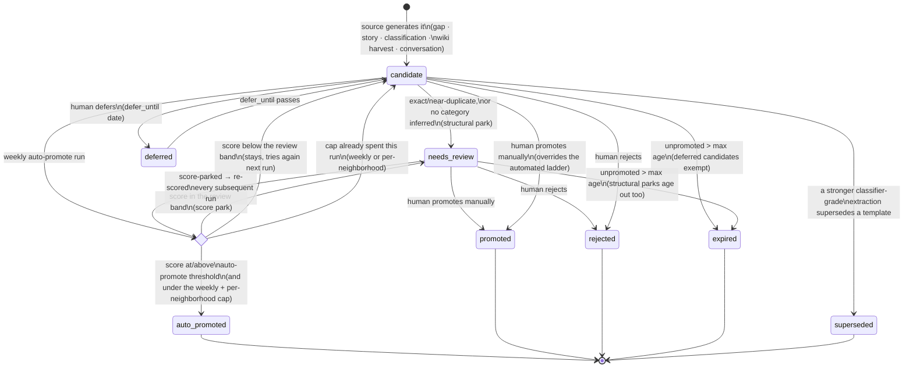
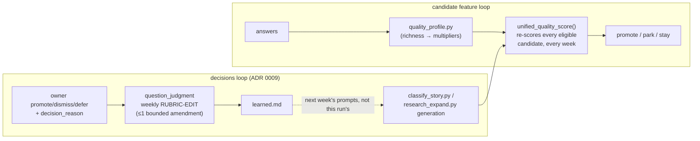

# Question Candidates

## 1. What it does & what it's for

Lifehug never asks you a question the moment it's thought of. Every
follow-up idea the system generates — from the weekly source classifier,
the monthly research expander, the wiki's own "Open Questions" sections, a
conversation's closing takeaways, even a hand-typed idea — lands first in a
**review buffer**, not the daily prompt. That buffer is what this page is
about.

Here's the ordinary path one idea takes. You answer today's question about
your first job, and in passing you mention that your first boss "was like a
second father to me." The weekly classifier reads that answer, notices the
relationship claim has no supporting scene behind it, and drops a candidate
into the buffer: *"Tell me about one specific day your boss treated you like
family instead of an employee."* You never see this happen. A few days
later, `weekly_maintenance.sh` runs its auto-promotion pass, scores that
candidate, finds it clears the bar, and inserts it into the question bank
as a real, numbered question — it will reach you the next time the planner
has room for that category. If the same candidate had scored a little
lower — vaguer phrasing, no cited source, a near-duplicate of something you
already answered — it would instead sit, visibly, in your wiki viewer's
Review lane, waiting for you to promote, dismiss, or defer it yourself.
Either way, the idea is never silently lost, and you never have to open a
review screen for the system to keep asking you better questions.

That's the job of this feature: let the system propose freely, without
ever putting an unreviewed idea in front of you as a daily question, and
guarantee that a genuinely good idea reaches the bank whether or not you
personally look at it.

## 2. The nouns

A **candidate** is a proposed question sitting in the review buffer
(`state/question_candidates.json`) — not yet a real, askable question. It
becomes one only by **promotion**: either a human running
`candidates-promote`, or the system's own **auto-promotion** during weekly
maintenance. Every candidate carries a `kind` (what generated it — a
classification, a research neighborhood, a wiki open question, …), a
`source_path`, a `priority`, a `story_function`, and — once scored — a
stamped `quality` block (score, components, timestamp; see §4).

**Status.** A candidate's `status` is one of the values below (the module's
full `VALID_STATUSES` vocabulary):

| Status | Meaning |
|---|---|
| `candidate` | The default — proposed, unreviewed, still competing. |
| `accepted` | A human said yes but hasn't picked a target category yet — still promotable. |
| `deferred` | Explicitly parked with a `defer_until` date (e.g. right after a fresh loss — "not yet"); exempt from expiry until that date passes. |
| `needs_review` | **Parked** — see below. |
| `promoted` | Inserted into the question bank by a human. Terminal — cannot move to any other status. |
| `auto_promoted` | Inserted into the bank by the weekly auto-promotion run. Also terminal. |
| `rejected` | A human said no. |
| `expired` | Aged out unpromoted (§3) — kept for audit, no longer competes. |
| `superseded` | A template candidate whose source later earned a stronger, classifier-grade extraction of the same material — kept, never deleted, but excluded from promotion. |

**Park** means a candidate is moved to `needs_review`: not rejected, not
promoted, waiting for a human's eye. A candidate parks for one of two kinds
of reason — a **score reason** (its unified score landed in the review
band, §4) or a **structural reason** (an exact/near-duplicate, or no
category could be inferred for it). This distinction matters for
resurfacing: score-parked candidates are re-scored on every subsequent
auto-promotion run (the quality profile shifts weekly, so a near-miss can
clear the bar later without a human touching it — the *floor* half of the
[Convergence Principle](https://github.com/lifehug/lifehug/blob/main/docs/adr/0006-convergence-principle.md));
structurally-parked candidates wait for a human, because no amount of
re-scoring resolves "this needs a category" or "this duplicates something
else."

**Promotion** is the act of turning a candidate into a real, numbered
question-bank entry. Manual, weekly-auto, and neighborhood promotion all use
one authority (`candidate_promotion.py`). It binds the exact candidate,
category, and placement revisions, writes a structured provenance marker, and
returns the canonical question id and Git commit. The marker and Git history —
not the candidate-store projection — prove the durable result, so an exact
retry returns the same result with `changed:false` and never adds a duplicate.
Conflicting text, category, or revisions stop without guessing.
**Auto-promotion** is promotion the system performs
itself, unattended, during `weekly_maintenance.sh` — the no-human path the
Convergence Principle requires this stage to have.

A **neighborhood** is the other object candidates are born from as
often as they're born from a single answer: a cluster of 6–12 questions
along a narrative arc, aimed at one deliverable. **Neighborhood-as-supply**
is the idea that a neighborhood is not itself askable — it is a generator
that deposits its slots into the candidate buffer exactly like any other
source, and its own readiness status (`questions_generated` →
`promoted` → `answering` → `answer_ready`) is derived by walking the same
candidate → promoted-question → answered-source lifecycle this page
describes, one arc slot at a time. A neighborhood can be fully
question-ready long before it's answer-ready — `progress` only calls it
draft-ready once enough of its slots have real answers behind them, never
merely because its candidates were generated.

Shared vocabulary this page relies on without redefining: **[Focus](glossary.md)**,
**[Entity](glossary.md)**, **[Interaction](glossary.md)**, and
**[The Loop](glossary.md)** are all defined once in the
[Glossary](glossary.md).

## 3. How it works: the weekly lifecycle

Every eligible candidate is re-scored on every `candidates-auto-promote`
run (the weekly maintenance job's `auto_promote` step, run after
classification, the quality-profile update, and the question-judgment
rubric edit — so it always sees the freshest inputs). "Eligible" means
`status` is `candidate`, `accepted`, or `deferred` (the `PROMOTABLE_STATUSES`
set) — or `needs_review` with a score-based parking reason, which is
resurfaceable.



The three numbers that drive this diagram: the auto-promote threshold is
0.82 <!-- parity: question_candidates.AUTO_PROMOTE_THRESHOLD = 0.82 -->,
the review band starts at
0.70 <!-- parity: question_candidates.NEEDS_REVIEW_THRESHOLD = 0.70 -->
(so `0.70 ≤ score < 0.82` parks, below `0.70` simply stays a candidate),
and the max unpromoted age before expiry is
45 <!-- parity: question_candidates.CANDIDATE_MAX_AGE_DAYS = 45 --> days
(§4 derives the score; the numbers aren't inlined into the diagram itself
because Mermaid's state-diagram syntax reads a bare `-->` as an arrow
token, which an HTML comment's own `-->` would collide with).

Two mechanisms keep this from ever silently jamming:

- **Deferred exemption.** A candidate with `defer_until` set in the future
  is invisible to both the promotion ladder and the 45-day expiry clock —
  a human explicitly said "wait," and the system honors that literally
  rather than aging the idea out from under them.
- **Structural vs. score parks resurface differently.** Only parks whose
  `needs_review_reason` contains `"score"` or `"quality"` are re-scored
  automatically (`RESURFACEABLE_REVIEW_REASONS`); a `missing_category` or
  `near_duplicate` park waits for a real decision, because re-running the
  same score computation can't resolve either.

Structural parks run first, every week, in this fixed order: exact
duplicate (skipped outright — it's already in the bank), near-duplicate by
token-Jaccard overlap (parked), missing category (parked). Only candidates
that survive all three reach the score gate. Within the score gate, a
weekly cap (`dynamic_weekly_cap`, scaling from 1 promotion when the bank
has over 120 unanswered questions up to 4 when it has fewer than 40, with a
backlog-drain override that can push it as high as 8) and a per-neighborhood
cap (normally 1, doubled to 2 once the promotable backlog crosses 40 —
`PER_NEIGHBORHOOD_CAP` <!-- parity: question_candidates.PER_NEIGHBORHOOD_CAP = 1 -->
/ `PER_NEIGHBORHOOD_CAP_BACKLOG` <!-- parity: question_candidates.PER_NEIGHBORHOOD_CAP_BACKLOG = 2 -->,
`BACKLOG_PRESSURE_THRESHOLD` <!-- parity: question_candidates.BACKLOG_PRESSURE_THRESHOLD = 40 -->)
keep one prolific source or one loud topic from eating the whole week's
promotions. The weekly-cap band cutoffs themselves (120 / 80 / 40 unanswered,
mapping to caps of 1 / 2 / 3 / 4) are literal values inside
`dynamic_weekly_cap()`, not named module constants — quoted here from the
function body directly (see §4's note on why this page doesn't force a
parity annotation onto a number with nothing to check it against).

## 4. The algorithm

### The unified quality score (ADR 0008)

Every candidate's promotability collapses to one number:

```
score = clamp(priority × story_function_multiplier − penalty_total, 0, 1)
```

computed by `question_candidates.unified_quality_score()`. Before
[ADR 0008](https://github.com/lifehug/lifehug/blob/main/docs/adr/0008-unified-quality-score.md),
this was two disconnected numbers with two separate gates; now craft flaws
drag the same score down instead of tripping a parallel check, and the
result is stamped onto the candidate (`candidate["quality"]`) additively
and idempotently — a run that changes nothing about a candidate's inputs
never re-timestamps it.

**`priority`** (0.0–1.0) comes from whatever generated the candidate — the
classifier, the research expander, or (once seated) the
[question-judgment interaction](https://github.com/lifehug/lifehug/blob/main/interactions/question_judgment/prompt/behavior.md),
whose priority vocabulary runs 0.4 (nice-to-have) to 0.95 (critical gap).

**`story_function_multiplier`** comes from `quality_profile.py`'s weekly
aggregation: once at least
20 <!-- parity: quality_profile.ACTIVATION_THRESHOLD = 20 --> answers have
been scored for richness, each story function (scene, tension, foundation,
…) gets a multiplier — how much richer answers to that *kind* of question
have historically been versus the global average — clamped to
[0.7 <!-- parity: quality_profile.MULTIPLIER_FLOOR = 0.7 -->,
1.5 <!-- parity: quality_profile.MULTIPLIER_CAP = 1.5 -->]. Before
activation (or when a candidate's story function has no bucket yet), the
multiplier is simply 1.0.

**`penalty_total`** is the sum of `check_quality()`'s tripped flags — the
craft checker, unchanged by ADR 0008, is still the *one* place these
weights are defined (recurring-defect doctrine: nothing else re-lists this
table):

| Flag | Trips when… | Penalty |
|---|---|---|
| `yes_no_wording` | Opens with did/do/have/were/was/is/are/can/could/would/should + you | −0.25 |
| `self_directed_why` | "Why do/did/are/were/can't/… you feel/keep/always/…" — self-directed why | −0.20 |
| `too_broad` | Matches a too-broad shape ("tell me about …", "what do you think about…") | −0.20 |
| `no_scene_or_stakes_path` | No scene marker, no emotion marker, *and* no basic interrogative present | −0.15 |
| `no_source_citation` | No `source_path` behind the candidate | −0.10 |
| `too_short` | Under 5 words | −0.15 |
| `possibly_vague` | 5–7 words (borderline length) | −0.05 |
| `duplicate_of_<id>` | Normalized text exactly matches an existing bank question | −0.50 |

These eight weights are literal values inside `check_quality()` — there is
no `PENALTY_WEIGHTS` module constant to point `tests/test_handbook_parity.py`
at, so this table is verified by direct code reading rather than a parity
annotation (an annotation naming a constant that doesn't exist would fail
the very test it's supposed to pass). They are also restated, name-for-name,
in the [question-judgment interaction's behavior contract](https://github.com/lifehug/lifehug/blob/main/interactions/question_judgment/prompt/behavior.md#penalty-vocabulary)
— one vocabulary, two readers (a deterministic checker and a seated model).

The two bands that decide a candidate's fate: **auto-promote** at or above
0.82 <!-- parity: question_candidates.AUTO_PROMOTE_THRESHOLD = 0.82 -->,
**park as `needs_review`** from
0.70 <!-- parity: question_candidates.NEEDS_REVIEW_THRESHOLD = 0.70 --> up
to that, and simply **stay a candidate** below 0.70 — no separate craft
gate, per ADR 0008.

### Duplicate detection

A near-duplicate is caught semantically, not just by exact text match:
`near_duplicate_of()` computes token-Jaccard overlap (after stripping stop
words) between a candidate and every bank/candidate text, and treats
anything at or above
0.75 <!-- parity: question_candidates.NEAR_DUPLICATE_JACCARD = 0.75 --> as
the same question. This is what catches three differently-worded variants
of "what did you promise yourself you'd do differently" without any AI
call.

### Expiry

A candidate that sits unpromoted (status `candidate`, `accepted`, or
`needs_review`) for more than
45 <!-- parity: question_candidates.CANDIDATE_MAX_AGE_DAYS = 45 --> days
expires — the record stays for audit, it simply stops competing. Deferred
candidates are exempt for as long as their `defer_until` date is in the
future.

### Worked example

Take a plausible generated candidate:

> *"What was your father like?"* — story function `foundation`, priority
> `0.80` (a `question_judgment` JUDGE verdict in the "high-value" band:
> concrete evidence, but not the last missing key scene), source cited.

Walking `unified_quality_score()` step by step:

1. **Priority** — `0.80`, taken as-is from the generator.
2. **Multiplier** — the quality profile's `foundation` bucket is running
   above the global average this week: `×1.08`.
   `0.80 × 1.08 = 0.864`.
3. **Craft check** — `check_quality()` runs against the text. It isn't
   yes/no, isn't self-directed-why, doesn't match a too-broad regex, and
   *does* contain a bare interrogative ("what"), so it clears
   `no_scene_or_stakes_path`. But it's exactly 5 words —
   `word_count < 8` — so it trips `possibly_vague`: **−0.05**.
4. **Combine** — `0.864 − 0.05 = 0.814`, rounded to `0.814`.
5. **Clamp** — already inside `[0, 1]`, so the score is `0.814`, displayed
   as `0.81`.
6. **Verdict** — `0.70 ≤ 0.81 < 0.82`: this candidate **parks as
   `needs_review`**, one hundredth short of auto-promotion, with the
   reason string `"score 0.81 below threshold 0.82 (possibly_vague)"`.
   Without that single five-word phrasing choice, the same evidence would
   have cleared the bar and gone straight into the bank unattended.

That's the mechanism in miniature: a single borderline craft flag is
exactly enough to move a candidate from "the system asks this on its own"
to "a human sees this in the Review lane" — never enough to reject a
genuinely well-evidenced idea outright.

## 5. In the loop



**What feeds it:** the weekly source classifier, the monthly research
expander, wiki-harvested open questions, and (via `extracted.candidate_ideas`)
a closing Conversation. **What it feeds:** the question bank, and through it
the weekly planner queue — a promoted candidate is invisible until the
planner actually selects it for a Focus that needs it. **How it
self-improves:** two independent feedback paths converge on the same score.
`quality_profile.py`'s richness multipliers shift weekly as new answers are
scored, which moves `unified_quality_score()`'s output for every candidate
of that story function without anyone editing a rule. Separately, the
owner's actual promote/dismiss/defer decisions (ADR 0009) become an "Owner
Judgment Signals" block injected into the classifier's and research
expander's own generation prompts — teaching the *pattern* of what gets
rejected, not a literal blocklist — and, once a week, at most one bounded,
evidence-cited amendment to the question-judgment rubric's learned
amendments file. Both paths are accelerators in the Convergence Principle's
sense: real, and multiplicative, but never a dependency — a vault where no
human ever opens the Review lane still promotes its best candidates every
single week.

**Classification:** this feature is the **floor** of the Convergence
Principle. Auto-promotion runs unattended, every week, with a deterministic
no-human path all the way from "a source exists" to "a question is in the
bank" — a candidate that would otherwise die in a park either resurfaces on
its own (score reasons) or waits behind a real affordance (`candidates-review`
/ the viewer's Review lane), never behind nothing at all. Manual review,
promotion, and the decisions-feed-the-loop signal are the **accelerator**:
they speed up which good ideas surface sooner, they never gate whether the
system keeps improving its own questions.

## 6. Where it lives

| Concern | Location |
|---|---|
| Candidate store | `state/question_candidates.json` |
| Quality profile (multipliers) | `state/quality_profile.json` |
| Core scoring | `question_candidates.unified_quality_score()`, `check_quality()` |
| Auto-promotion ladder | `question_candidates.auto_promote_candidates()` |
| Expiry | `question_candidates.expire_stale_candidates()` |
| Near-duplicate detection | `question_candidates.near_duplicate_of()` |
| Wiki → candidate harvest | `question_candidates.harvest_wiki_questions()` |
| Quality-profile aggregation | `quality_profile.compute_profile()` |
| Question-judgment rubric (JUDGE priority/penalty vocabulary) | `interactions/question_judgment/prompt/behavior.md`, `question_judgment.py` |
| Owner decisions → generation prompts | `question_judgment.build_decision_context()`, `owner_judgment_signals_block()` |
| Promotion authority | `candidate_promotion.build_candidate_promotion_request()`, `resolve_candidate_promotion()` (ADR 0019) |
| CLI | `lifehug.py candidates-list \| candidates-review \| candidates-update \| candidates-promote \| candidates-promotion-receipt ... --json \| candidates-promote-neighborhood \| candidates-stats \| candidates-auto-promote [--dry-run]` |
| Weekly wiring | `weekly_maintenance.sh` — `quality_update` → `judgment_update` → `timeline_retire` → `wiki_harvest` → `mirror_compile` → `auto_promote` → `planner_queue` → `arc_plan` |
| Interaction | [`interactions/question_judgment/`](https://github.com/lifehug/lifehug/tree/main/interactions/question_judgment) (ADR 0007) |
| Guard tests | `tests/test_unified_quality_score.py`, `tests/test_decisions_feed_loop.py`, `tests/test_question_candidates.py` (repo-verify exact names before citing in a PR — this table names the concern, not a promise of one file per row) |

**Change-safely notes.** The two threshold constants
(`AUTO_PROMOTE_THRESHOLD`, `NEEDS_REVIEW_THRESHOLD`) and
`CANDIDATE_MAX_AGE_DAYS` / `NEAR_DUPLICATE_JACCARD` are read live everywhere
they matter — moving one only requires editing `question_candidates.py`
and this page's parity annotations together (`tests/test_handbook_parity.py`
fails otherwise). The craft-penalty weight table lives in exactly one
function, `check_quality()`; a change there must be mirrored by hand into
`interactions/question_judgment/prompt/behavior.md`'s penalty vocabulary
table (nothing enforces that mirror automatically — it's a documented,
not a tested, invariant). Never write to `candidate["reason"]` after
candidate creation — that field is the generator's own provenance; owner
decisions belong in `candidate["decision_reason"]` (ADR 0009's
field-overwrite fix).

## 7. Decisions

- [ADR 0006 — The Convergence Principle](https://github.com/lifehug/lifehug/blob/main/docs/adr/0006-convergence-principle.md) — the floor/accelerator classification this page's §5 applies.
- [ADR 0007 — The Question-Judgment Interaction](https://github.com/lifehug/lifehug/blob/main/docs/adr/0007-question-judgment-interaction.md) — the priority/penalty vocabulary §4 quotes, and the JUDGE/RUBRIC-EDIT split §5 describes; see also the interaction's own [behavior contract](https://github.com/lifehug/lifehug/blob/main/interactions/question_judgment/prompt/behavior.md).
- [ADR 0008 — One published quality score, craft penalties folded in](https://github.com/lifehug/lifehug/blob/main/docs/adr/0008-unified-quality-score.md) — the formula in §4.
- [ADR 0009 — Decisions Feed The Loop](https://github.com/lifehug/lifehug/blob/main/docs/adr/0009-decisions-feed-the-loop.md) — the `decision_reason` field, owner judgment signals, and the weekly rubric-edit runtime.
- [ADR 0019 — Git-tree candidate promotion receipts](../adr/0019-candidate-promotion-receipts.md) — the one mutation authority, structured marker, replay, and receipt contract.
- The hosted platform's review-loop contracts (parallel PR review, owner closeout, executable walkthroughs) that this feature's Review lane is built against: [`lifehug-platform` docs/BUILDING.md](https://github.com/lifehug/lifehug-platform/blob/main/docs/BUILDING.md) and [docs/REVIEWING.md](https://github.com/lifehug/lifehug-platform/blob/main/docs/REVIEWING.md) (external repo — platform orchestrates this package, never forks it).
