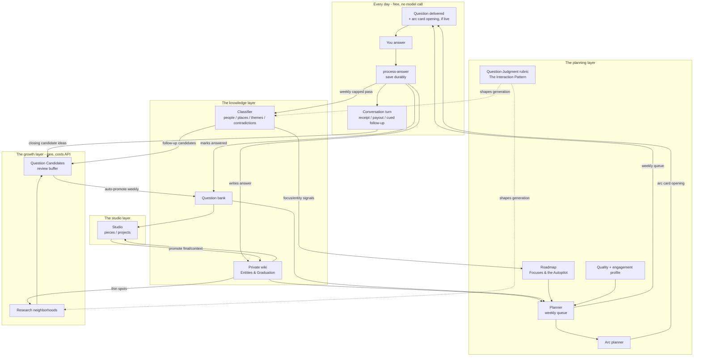

# The Loop

## 1. What it does & what it's for

This is the site's hub page. Every other handbook page describes one
stage of a single cycle; this page is the cycle itself, drawn whole, so a
reader can land on any one page and still see where it sits relative to
everything else.

The mental model, in one sentence: **daily answers become durable
sources, sources become a private wiki and structured signals, signals
become better questions, and better questions deepen the life story.**
Nothing about that sentence requires the person to do anything except
answer — which is exactly the [Convergence Principle](mission.md)'s floor
claim, restated here as the shape of the whole system rather than one
stage of it. The main use case for this page: a reader (or a
contributor) wants to know "where does X plug in?" for any given
mechanism — this page's diagram and clock tables are the map they check
before diving into that mechanism's own dedicated page.

## 2. The nouns

The **Loop** itself is defined once in the [Glossary](glossary.md): the
canonical continuous-learning cycle — capture source → compile wiki →
lint/repair source truth → classify/score signals → promote candidates
and plan the queue → ask a better question → create artifacts → feed
final artifacts back as source. This page draws that cycle as a diagram
and names its literal schedule; it does not redefine it.

Three more terms from the Glossary this page organizes everything else
around: **[In the Loop, Loop-adjacent, and Out of the Loop](glossary.md)**
— the taxonomy §4 below applies with real examples. And the **three
clocks**: **daily** (free, no model call), **weekly** (keyless-capable,
capped API use), and **monthly** (the bigger model-backed growth pass) —
plus, running independently of all three, **per-answer events** (the
instant `process-answer` save-and-score) and **session close** (the idle-
swept compile+commit that ends a Chat or Conversation). README calls this
"three clocks plus per-answer events," and that phrasing is precise: the
events aren't a fourth clock, they're continuous, event-triggered work
the clocks don't gate.

## 3. How it works: the full cycle

*Simplified from the [top-level README's own diagram](https://github.com/lifehug/lifehug#readme)
(the "big picture" section) to the level this handbook covers; the
README's version additionally draws the Mirror and per-turn extraction
edges. Node labels name the handbook page that owns that stage where one
exists — see the link list below for the exact mapping, since Mermaid
node text can't reliably carry markdown links in this renderer.*

**Stage → page map** (every node above, left to right, top to bottom):

- Daily loop, Conversation turn → [The Interaction Pattern](interactions/) → [Conversation](interactions/conversation.md)
- Private wiki → Entities & Graduation *(planned — see [index](index.md))*
- Classifier → Entities & Graduation *(planned)*; its follow-up output → [Question Candidates](question-candidates.md)
- Question bank, Candidates, auto-promote → [Question Candidates](question-candidates.md)
- Planner, Roadmap → [Focuses & the Autopilot](focuses.md)
- Quality + engagement profile → Quality & Engagement Profile *(planned)*
- Arc planner → [The Interaction Pattern](interactions/) (arc cards are this pattern's planned-turn mechanism)
- Question-Judgment rubric → [The Interaction Pattern](interactions/) → [Question Judgment](interactions/question-judgment.md)
- Research neighborhoods → [Question Candidates](question-candidates.md) §2 ("neighborhood-as-supply")
- Studio → not yet covered by this handbook; see the [top-level README](https://github.com/lifehug/lifehug#readme)

Two edges worth reading carefully: the dotted `JJ -.->` lines mean the
question-judgment rubric doesn't generate anything itself — it's context
both the classifier and the research expander read while generating,
per [ADR 0007](https://github.com/lifehug/lifehug/blob/main/docs/adr/0007-question-judgment-interaction.md).
And the Studio's `-->|promote final/context| W` edge is the loop's literal
closure: a finished piece can become source material for the next pass
through the classifier, which is why "the Loop" is a loop and not a
pipeline.

## 4. The three clocks — current step order (v174)

Every step below is read directly from `system/weekly_maintenance.sh` and
`system/monthly_research.sh` as they exist today, not paraphrased from
README prose — the shell scripts are the actual schedule.

### Daily — free, no model call

`system/daily_question.sh`: commit pending data → compile the wiki →
`ask.py` picks today's question → attach the pre-planned arc card
opening if one is live (`arc-card --daily-text`, a pure file read — no
AI on this path) → send + pin on Telegram → confirm delivered. Handles
pass-completion prompts too.

### Weekly — keyless-capable, capped API use

`system/weekly_maintenance.sh`, in this literal order:

1. `compile --no-ai`
2. `source-lint` (then `source-lint --fix` if any finding is
   auto-fixable)
3. `classify-story --classify-all --unclassified --limit 5` (keyless:
   emits classification agent tasks instead)
4. `quality-update` — the quality/engagement profile aggregation
5. `judgment-update` — the question-judgment weekly RUBRIC-EDIT, **at
   most one** bounded amendment ([Decisions & Learning](decisions-and-learning.md))
6. `timeline-retire` — pins the classifier's fresh extractions have
   superseded
7. Wiki-question harvest (`harvest_wiki_questions()`, capped at 3/week)
8. `mirror-compile` — synthesizes `wiki/self/mirror.md` (keyless: emits a
   synthesis task)
9. `candidates-auto-promote` — the dynamic-cap promotion pass ([Question
   Candidates](question-candidates.md) §3)
10. `planner-queue` — builds next week's delivery queue
11. `arc-plan` — plans this week's arc cards, directly after the queue so
    cards expire with it
12. `research_expand.py --gaps --dry-run` (a preview only — no
    neighborhoods open on the weekly clock), `progress`, learning-failure
    summary, pending Focus-recommendation surface, `doctor` health check,
    report + Telegram summary

Focus-autopilot is **not** a weekly step — moved to monthly by [ADR
0011's amendment](https://github.com/lifehug/lifehug/blob/main/docs/adr/0011-focus-autopilot.md#amendment-2026-08-15-owner-ratified--issue-154).

### Monthly — the bigger, model-backed growth pass

`system/monthly_research.sh`, in this literal order:

1. `compile` (with AI, if available)
2. `research_expand.py --gaps` — detects thin periods/themes/family
   coverage
3. Opens up to `LIFEHUG_MONTHLY_GAP_LIMIT` (default 2) new gap
   neighborhoods, skipped entirely when the planner's own expansion
   urgency signal is under 0.25 that month
4. Opens one self-knowledge neighborhood (default topic: "Who I am
   becoming")
5. `recommend-focuses --min-score 15` — refreshes
   `state/focus_recommendations.json`
6. `focus-autopilot` — approves the single highest-scoring pending idea,
   if the developing set is thin (see [Focuses & the Autopilot](focuses.md)
   §4), run directly after the recommendations refresh for the freshest
   pending list
7. Entity-roster refresh, one pass per type: `person`, `place`, `period`,
   `object`, `theme` (keyless: emits per-type resolution tasks — never a
   deterministic fallback, since that once wiped a roster clean)
8. `compile` again — so newly-approved Focuses and freshly-graduated
   entities land in the same run's wiki
9. `perennials --generate-due` — re-inserts perennial questions ~a year
   after their last answer, 10Q-style
10. `arc-thread-offers --limit 1` — at most one system-initiated
    Conversation thread offer, deterministic, quarter-quieted once
    offered
11. Echo-style resurfacing — one answer ≥90 days old, sent back with a
    reflection question
12. `progress`, report + Telegram summary

### Per-answer events (not a clock)

`process-answer` (and `ingest-story`) fire synchronously on every answer:
save, score, and open/continue exactly one Conversation turn. The
session's actual **close** — one coalesced wiki compile, one commit — is
decoupled and swept later by `compile_and_commit.sh`'s hourly
`conversation-close --expired` tick (idle timeout ~2h for a Chat, ~30m
for a Conversation). This is why README calls it "three clocks *plus*
per-answer events" rather than a fourth clock: it's continuously live,
not scheduled.

## 5. In the loop, adjacent, and out — worked examples

The [Glossary](glossary.md) defines all three terms; this section grounds
each one in a real, current example rather than restating the
definitions.

**In the Loop.** `candidates-auto-promote` (weekly step 9 above): runs on
a schedule with no human required, and its output — a promoted question
— is read by the planner queue the very next step. `focus_autopilot()`
(monthly step 6): same shape, gated only by a target and a score floor.
Both qualify because they're reached by a scheduled entrypoint *and*
their output changes future behavior downstream.

**Loop-adjacent.** `research_expand.py --gaps --dry-run` (weekly step 12,
and previewed again inside the monthly dry-run path): it computes and
prints exactly what the monthly clock would open, but writes nothing —
useful inspection, but nothing it produces is consumed until the monthly
clock's real (non-dry-run) pass actually runs. `focus-dupes --report`
([Focuses & the Autopilot](focuses.md) §6) is the same shape by design: a
zero-write damage list a human (or a future `focus-merge` run) reads and
acts on by hand.

**Out of the Loop.** The clearest current example is named directly in
the README's own diagram footnote: `extracted.facts` and
`extracted.entities` are captured per Conversation turn into the session
document, but neither has a downstream consumer today.
`extracted.entities` is documented to eventually surface as
`close.entity_hints` for a future weekly-classification hint surface that
doesn't exist yet; `extracted.facts` is stored and otherwise inert. Both
are real code paths producing real data — they are simply not read by
anything a scheduled or manual Loop entrypoint reaches, which is the
Glossary's exact test for "Out of the Loop." Per the Glossary's own
caution, mission-critical work shouldn't stay here — these two fields are
tracked precisely because they're headed for one of the other two
categories, not left here as a resting state.

## 6. Where it lives

| Concern | Location |
|---|---|
| Daily entrypoint | `system/daily_question.sh` |
| Weekly entrypoint | `system/weekly_maintenance.sh` |
| Monthly entrypoint | `system/monthly_research.sh` |
| Per-answer entrypoint | `system/process_answer.py`, `system/ingest_story.py` |
| Session close sweep | `system/compile_and_commit.sh` (`conversation-close --expired`, hourly) |
| Dry-run previews | `LIFEHUG_DAILY_DRY_RUN=1`, `LIFEHUG_WEEKLY_DRY_RUN=1`, `LIFEHUG_MONTHLY_DRY_RUN=1` env vars on the three shell entrypoints |
| The canonical diagram this page adapts | the top-level [README](https://github.com/lifehug/lifehug#readme), "The big picture" section |
| Nomenclature this page relies on | `README.md`'s Nomenclature section, mirrored in the [Glossary](glossary.md) |
| Single-writer queue underneath every scheduled + browser mutation | `system/jobs.py` (`state/jobs/`) |
| Guard tests | `tests/test_ingest_and_planner.py`, `tests/test_v68_loop.py`, `tests/test_neighborhood_readiness.py` (repo-verify exact names before citing in a PR) |

**Change-safely notes.** The weekly and monthly step orders in §4 are
transcribed directly from the two shell scripts, not from README prose —
if the two ever disagree, the shell script is the runtime truth and this
page (or the README) has drifted. The `arc_plan` step's own comment in
`weekly_maintenance.sh` states a binding parity spec for the hosted
platform (`StepSpec("arcs", "arc_plan", llm=True)`): any cap, gate, or
fallback the platform needs must appear in the OSS shell step first — a
platform-side gate absent from here is a parity merge-blocker on that
repo's PRs, not a legitimate platform-only addition.

## 7. Decisions

- [ADR 0006 — The Convergence Principle](https://github.com/lifehug/lifehug/blob/main/docs/adr/0006-convergence-principle.md) — the reason every clock's stages have the floor/accelerator shape this page's diagram implies; full treatment in [The Mission & the Convergence Principle](mission.md).
- [ADR 0011 — Focus Autopilot](https://github.com/lifehug/lifehug/blob/main/docs/adr/0011-focus-autopilot.md), amended 2026-08-15 — moved focus-autopilot from the weekly clock to the monthly clock, reflected in §4 above.
- [ADR 0002 — The Interaction pattern](https://github.com/lifehug/lifehug/blob/main/docs/adr/0002-interaction-pattern.md), amended for the arc-card contract — the daily loop's AI-free property (§4's daily section) is enforced by the seam's shape, not convention: the daily attach is a pure file read.
- [ADR 0009 — Decisions Feed The Loop](https://github.com/lifehug/lifehug/blob/main/docs/adr/0009-decisions-feed-the-loop.md) — the ordering rule behind weekly steps 4→5 (`quality_update` before `judgment_update`, so the rubric edit sees the freshest profile snapshot); full treatment in [Decisions & Learning](decisions-and-learning.md).
